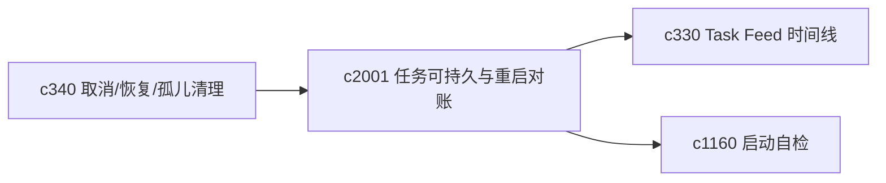
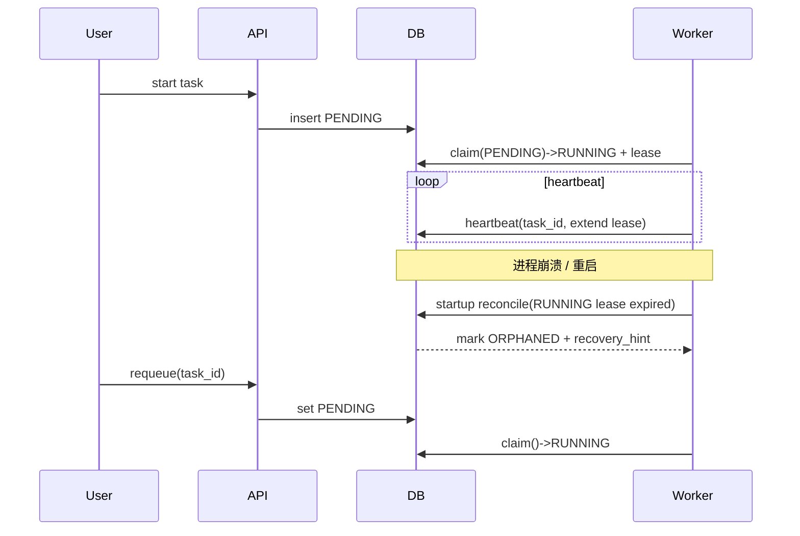

## Why

当前任务系统把状态写进了数据库，但真正的“队列”还在进程内（例如 `asyncio.PriorityQueue`）。这会带来一个很现实的问题：服务一旦重启，DB 里还躺着 `PENDING/RUNNING` 的任务，worker 却没有任何“继续跑它们”的依据。用户看到的是“任务还在”，系统表现出来的却像“它忘了这件事”。

长任务越多，这种不确定性越伤体验：你不敢放心点“生成”，也不敢相信“稍后再来它还在”。我想把它从“能跑”升级成“可恢复、可对账、可解释”。

## What Changes

- 引入 **task lease / heartbeat**：`RUNNING` 任务必须带 `worker_id`、`lease_expires_at`（可选 `last_heartbeat_at`）。lease 超时即判定 worker 丢失。
- 调度从“内存队列”迁移为“DB 可拉取队列”：worker 通过 DB 抢占 `PENDING` 任务（claim + lease），重启后仍可继续处理未完成任务。
- 明确 **retry policy**：区分 retryable / non-retryable 失败；记录 `attempt`、`max_attempts`、`next_retry_at`，避免无限重试或无脑整条重跑。
- 增加 **restart reconciliation**：启动时扫描 `RUNNING` 且 lease 过期的任务，统一落为 `ORPHANED/FAILED`（带原因码与恢复建议），并支持“重新排队 / 从检查点继续”（对齐 `c340` 的取消/恢复语义）。
- 把上述状态与动作接入 task feed/time line（对齐 `c330`），并让启动自检能提示“有多少任务处在可恢复或异常状态”（对齐 `c1160`）。

## Capabilities

### New Capabilities

- `task-runtime-durability-and-restart-reconciliation`: 定义任务租约、重启对账、DB 调度与重试策略。

### Modified Capabilities

- `background-jobs-and-task-runtime`: 需要支持 lease、抢占、对账与 retry。
- `task-cancellation-resumption-and-orphan-cleanup`: 取消/恢复语义需要覆盖“worker 丢失”这类被动中断。（`c340`）
- `task-feed-compaction-and-event-timeline`: 时间线需要能解释“为什么停了 / 为什么被回收”。（`c330`）
- `operational-baseline-checklists-and-startup-self-test`: 启动自检需要能读出“可恢复任务”和“异常任务”概览。（`c1160`）

## Impact

- Backend：Task 表字段扩展（lease、attempt、heartbeat 等）、worker 运行模型调整、启动对账逻辑、任务事件写入与查询接口。
- Frontend：任务列表/详情增加“可恢复/需确认/worker 丢失”提示与动作入口；必要时把 retry/attempt 信息展示出来。
- Risk：需要避免把仍在运行的任务误判为 orphan；lease 参数与对账阈值要保守，并且要能解释“为什么这么判”。

## Dependency Sketch

