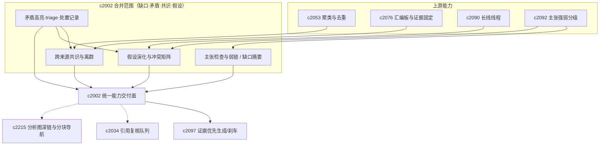

## Why

证据审阅真正费力的往往不是“审不审”，而是**先审哪里最值得**：若正式审阅前就能标出薄弱链路与缺口，整条可信闭环会轻很多。与此同时，**矛盾**不应只藏在分析结果里——用户需要先看见冲突、再留下自己的判断与暂定处理；若缺少轻量后续流，矛盾信号很快变成噪音。当来源变多，用户还会自然关心**主流是否一致、少数离群是否值得复核**；仅有“搜到很多”不足以支撑格局判断。最后，真实研究往往是**假设逐步形成、随证据升级或推翻**的过程，且冲突不总是“来源互打”：需要结构化冲突面（如主张 × 来源），否则假设演化难以操作。

> 合并说明：本提案合并了原 `evidence-contradiction-highlights-and-resolution-notes`、`consensus-outlier-detection-across-sources`、`hypothesis-tracking-and-conflict-matrix` 的全部内容。

## What Changes

1. **声明级支撑与证据缺口**：引入 claim-level 支撑度分析，标出证据充足、薄弱与无证据支撑的段落；生成同步产出 evidence gap 摘要；定义证据链完整度与弱链路检测（缺引用、缺独立来源、缺中间推理、缺时间一致性等），并回接引用复核、主张地图与风险刹车的优先级（辅助决策，不替用户下结论）；为弱支撑提供可执行动作（补来源、限范围重跑、进入审阅模式）；evidence review 可接收 claim check 预分析作为入口。
2. **矛盾高亮与处置记录**：定义 evidence contradiction highlight（来源间与结论间冲突）；支持 resolution note；建立 contradiction triage 最小状态（new / confirmed / dismissed / needs_more_sources）与动作（绑定证据片段、备注、导出为 notebook note）；与补证据联动（`needs_more_sources` 时给出检索词/补源方向，对齐本变更 evidence gap）；UI 提供可排序/筛选的轻量矛盾队列；区分真冲突与口径差异；矛盾与处置可回到 evidence map、briefing 与复盘。
3. **跨来源共识与离群**：定义 cross-source consensus view（共同点、分歧、明显离群）；outlier detection 标出与多数不一致但可能值得复核的内容；支持从共识视图回钻到来源片段、引用与 resolution note；共识综合来源质量、时效与独立性，而非简单投票。
4. **假设追踪与冲突矩阵**：定义 hypothesis object 与 verdict evolution（升级/降级/推翻及原因）；来源变化、证据矛盾与主张强弱可反馈假设状态；假设可挂长线线程、论证骨架与 briefing；定义 conflict matrix（主张 × 来源）与 resolution lanes，支持支持/反驳/模糊关系矩阵视图、按冲突类型分道、跳转到来源片段/矛盾说明/假设演化；保持为判断与修复工具，非复杂审批流。

## Capabilities

### New Capabilities

- `claim-support-analysis`：声明级支撑度检查与 evidence gap 摘要。
- `evidence-chain-completeness-and-weak-link-detection`：证据链完整度与薄弱环检测。
- `evidence-contradiction-highlights-and-resolution-notes`：证据矛盾高亮、处置记录与回链语义。
- `contradiction-triage-workflow`：矛盾条目整理、标注与导出。
- `consensus-outlier-detection-across-sources`：跨来源共识视图、离群识别与分歧回钻。
- `hypothesis-tracking-and-verdict-evolution`：研究假设、判断演化与证据触发更新。
- `source-claim-conflict-matrix-and-resolution-lanes`：主张与来源冲突矩阵与处理分道。

### Modified Capabilities

- `evidence-review-workflow`：吸收 claim check 预分析；支持矛盾点与处置说明。
- `generation-core`：生成完成后 claim support 分析的稳定挂接点。
- `quality-gates-for-generation`：将 evidence gap 纳入质量信号。
- `output-rendering-and-typing`：段落或区块级支撑提示。
- `claim-map-views-and-argument-tracebacks`：展示弱链路与薄弱点定位。（`c2114`）
- `inline-citation-review-queue-and-fix-sweeps`：按弱链路优先级排队。（`c2034`）
- `evidence-first-generation-modes-and-unsafe-claim-brakes`：风险刹车识别证据链断点。（`c2097`）
- `source-coverage-and-evidence-map`：展示矛盾聚集区。
- `publishable-artifacts`：结论摘要可带出处置说明。
- `retrieval-result-clustering-and-duplicate-collapse`：聚类作为共识判断输入。
- `briefing-assembly-board-and-evidence-pinning`：可固定共识或离群证据。
- `claim-strength-grading-and-evidence-weight`：主张强弱回馈假设状态。
- `long-arc-threads-and-milestone-checkpoints`：容纳假设与阶段性判断。
- `analysis-graph-deeplinks-and-chunk-navigation`：triage 一键回证据。（`c2215`）

## Impact

- **Backend**：结果后处理、claim/evidence 映射、质量信号、弱链路与矛盾检测、处置与回链、来源比对与共识摘要、假设与冲突矩阵建模。
- **Frontend**：输出与审阅入口、缺口与弱链路高亮、矛盾队列与处置说明、共识/离群视图、假设时间线与冲突矩阵。
- **Dependencies**：建议放在来源健康之后推进，避免“证据不足”与“来源未处理好”混淆；矛盾线补“看见以后怎么办”；共识线强化 `c2053`、`c2060`、`c2076` 串联；假设线接在 `c2090`、`c2092` 及矛盾能力之后。

## Dependency Sketch

