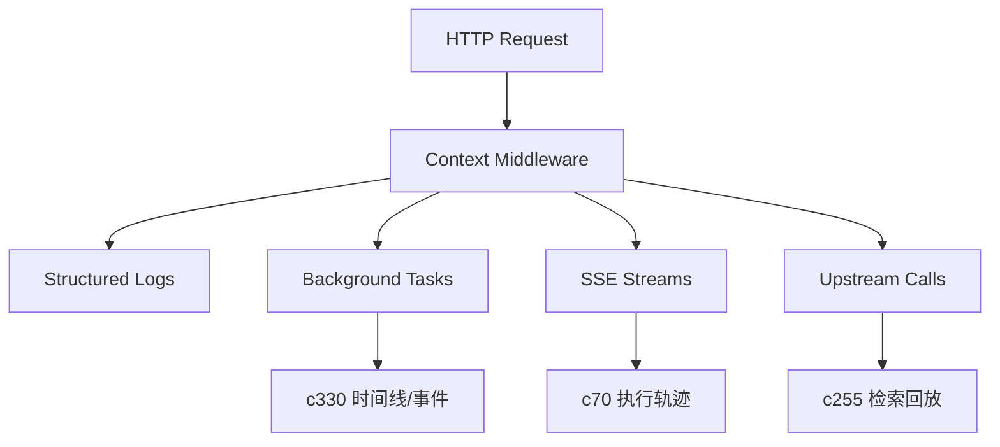

## Why

后端已经有了不少“长链路”：SSE 流（research/QA/slide 进度）、后台任务、检索装配缓存、外部请求（OpenAI / SearxNG / Chroma HTTP / Jina 等）。这些链路一旦出问题，最难的往往不是复现，而是把同一次用户动作的日志、SSE 事件、任务记录对齐。

代码里已经出现了零散的可观察性开关（例如 `CRYSTALITH_OBSERVABILITY_SSE_TIMINGS`），但缺少一个统一的 request context：一次动作到底对应哪个 `correlation_id`、哪条 session、哪次 task/run。没有这根“共同绳子”，排障会越来越靠记忆。

## What Changes

- 定义统一的 `correlation_id`：HTTP 请求、SSE stream、后台 task 必须能共享同一个 `correlation_id`（Header：`X-Correlation-Id`，未提供则生成并回写）。
- 定义 `RequestContext` 的最小字段集合：`correlation_id` + `notebook_id/session_id/task_id/source_id/output_id` 等可选维度；任何日志与事件都从这里取“共同键”，避免各模块自造 key。
- 统一日志注入：结构化日志固定字段名（例如 `ctx.correlation_id`），并约定哪些字段可以出现在 error log / info log（配合敏感信息脱敏）。
- 统一 SSE 与错误响应的关联：SSE 事件 payload 与 `ErrorResponse` 都带 `correlation_id`，前端可以直接复制一串“排障码”。
- 统一外部调用的上下文记录：对 httpx 请求、向量检索、OpenAI 调用记录最小 trace 片段（不追求一步到位上 OTEL，先把“对得上”做出来）。

## Capabilities

### New Capabilities

- `request-context-and-correlation-ids`: 定义跨请求/任务/流式事件的统一上下文与关联 ID 规则。

### Modified Capabilities

- `execution-trace-and-replay-lab`: 执行轨迹需要复用同一套 correlation 语义。（`c70`）
- `retrieval-query-trace-and-search-replay`: 查询轨迹需要能按 correlation 聚合。（`c255`）
- `task-feed-compaction-and-event-timeline`: 事件时间线需要能把同一次动作串起来。（`c330`）
- `sse-event-schema-and-stream-client`: SSE 事件需要把 context 作为一等字段。（见 `c2007`）

## Impact

- Backend：增加/统一 middleware、日志字段约定、SSE 事件包裹层、任务入库字段（可选），并在关键路径补足 context。
- Frontend：请求头透传、错误提示与复制、SSE 订阅关联展示；调试时能一键定位“这一次”。
- Risk：需要明确哪些字段不能写日志（token、cookie、长文本），避免上下文变成泄漏面。

## Dependency Sketch

