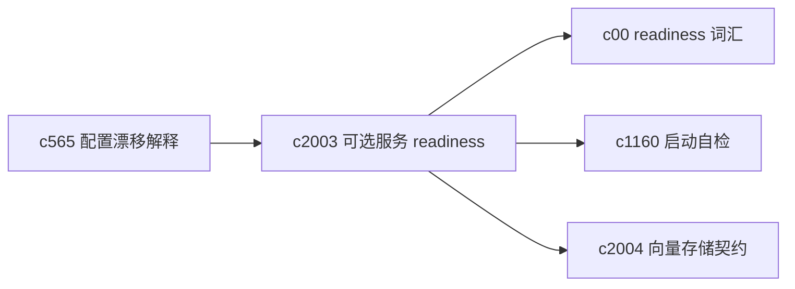
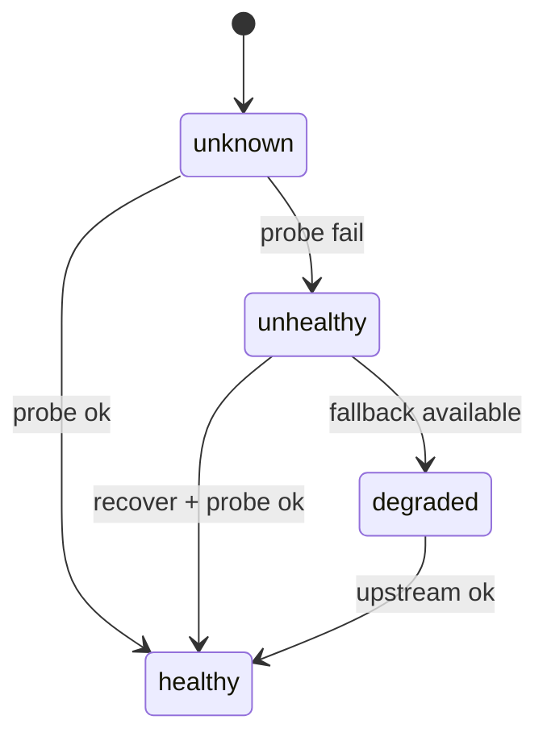

## Why

Crystalith 的核心链路会碰到一组“可选但影响很大”的依赖：Chroma（向量存储）、Redis（缓存）、Ollama（本地模型）、SearxNG（搜索）等。它们不是每个 profile 都必开，但一旦配置了或被某条链路隐式依赖，失败时的体验会很割裂：有时是启动卡住，有时是跑到一半报错，有时是悄悄降级但没人知道。

现在代码里已经有 optional services probe/monitor 的雏形（`/health/dependencies`、后台 probe），但缺少一个统一的 readiness contract：什么时候算 healthy、什么时候算 degraded、怎么给用户一个能执行的恢复动作。

## What Changes

- 把“可选服务”变成一等对象：统一字段（enabled、endpoint candidates、last_probe、status、error_code、hint、next_action、degraded_mode）。
- 统一 probe 策略：探测必须 **非阻塞、可缓存、可限频**，避免每次请求都去探一遍外部服务。
- 把 optional services readiness 接入 `c00` 的 Workspace readiness 词汇：同样用 `ready/degraded/blocked/recoverable`，让 UI 和 API 不再各说各话。
- 提供稳定的查询入口：例如 `GET /optional-services/status` 返回结构化状态，并能被启动自检与诊断页消费。（对齐 `c1160`）
- 把恢复动作说清楚：例如“启动 storage overlay”“切换到 sqlite provider”“禁用 Ollama 自动发现”等，不让用户去猜配置含义。

## Capabilities

### New Capabilities

- `optional-services-readiness-contract`: 定义可选服务状态、探测、降级与恢复动作契约。

### Modified Capabilities

- `workspace-object-model-and-readiness`: Workspace readiness 需要包含可选服务维度。（`c00`）
- `operational-baseline-checklists-and-startup-self-test`: 启动自检需要读取并解释可选服务状态。（`c1160`）
- `config-profile-diff-and-drift-explainer`: 漂移解释需要能指出“为什么这个服务被判定为必需/可选”。（`c565`）
- `vector-store-contract-and-provider-parity`: 向量存储 provider 的 readiness 需要与可选服务统一。（见 `c2004`）

## Impact

- Backend：抽象 probe 与状态缓存、统一 error_code/hint、补 status API、把 readiness 结果挂到 workspace summary。
- Frontend：补“依赖状态卡片/角标/恢复入口”，并把错误提示从“不可用”升级为“不可用 + 下一步怎么做”。
- Risk：需要避免 readiness 变成“强依赖列表”，保持 profile 的自由度；同时要能解释“为什么这次你需要它”。

## Dependency Sketch

