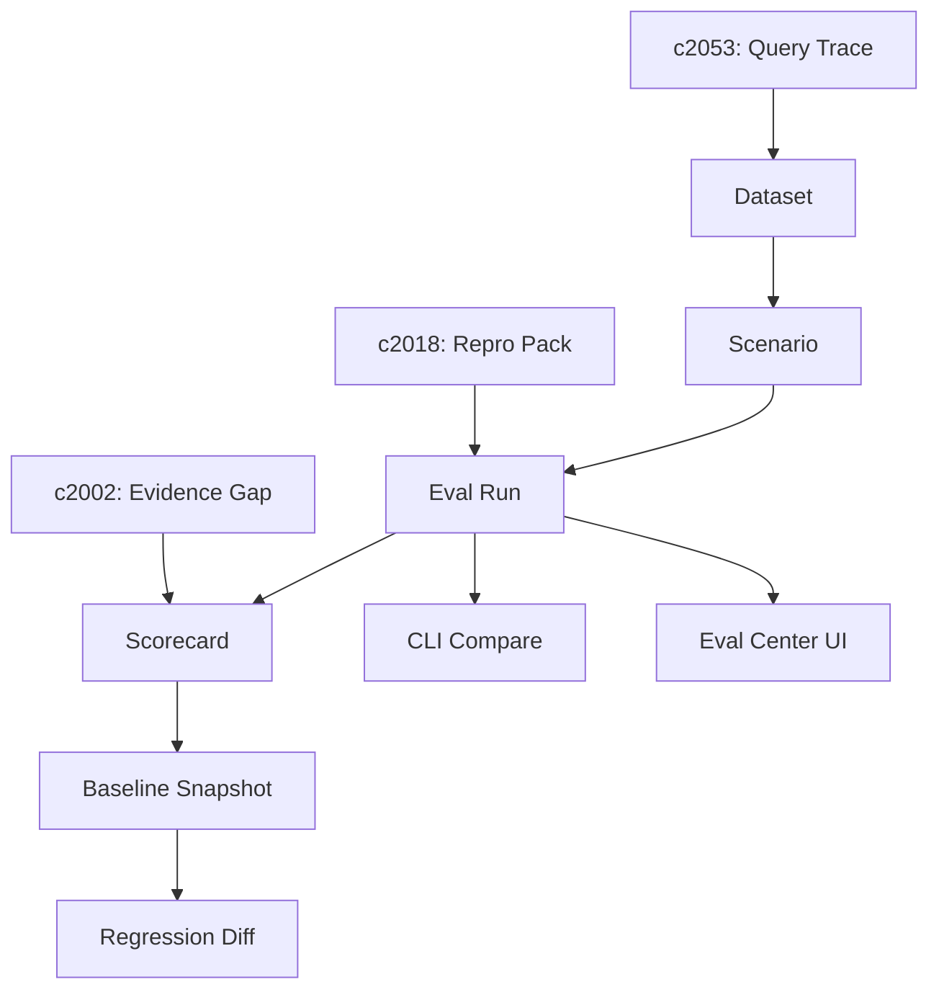

## Why

团队迟早会问一个很实际的问题：这个结果到底算不算好，是这次好，还是一直都好。只有评测脚本还不够，产品里也需要一套看得见、能比较、能追踪的质量面板。

## What Changes

- 定义 Eval 的最小数据模型：dataset（样本集）+ scenario（场景）+ run（一次评测执行）+ scorecard（指标集合）。
- 为每次生成结果引入统一 scorecard（先少、先稳），覆盖覆盖率/引用密度/新鲜度/风险提示等核心指标：
  - 检索：命中率、引用覆盖、重复引用率、证据多样性
  - 生成：结构完整性、事实一致性（可先用规则/弱监督）、失败率
- 把现有 `just llm-eval` 接到这套模型上：输出统一的结果包（可存储、可对比、可回放），并能被后续门禁消费（先 warn，后 gate）。
- 增加工作区级 Eval Center，用来比较不同模型、不同 recipe、不同提示词的输出表现：
  - CLI：对比两次 eval 的 score 差异 + top regressions
  - UI（可选）：展示趋势与典型失败样本，优先服务开发者而不是做报表
- 支持保存 baseline，方便回归检查和版本前后的质量对比。
- 让质量信号既能服务研发，也能服务内容审阅和产品判断。

## Capabilities

### New Capabilities

- `workspace-eval-center`: 定义结果评分、对比视图和基线保存能力。
- `eval-center-minimum`: dataset/scorecard/run 的结构、输出格式与对比入口。

### Modified Capabilities

- `quality-and-regression`: 需要从工程回归扩展到产品可见的质量比较。
- `quality-gates-for-generation`: 需要明确哪些信号进入 scorecard，哪些只用于后台诊断。
- `generation-variants-and-comparison`: 需要支持在产品里比较不同生成路径。
- `generation-observability-and-guardrails`: 需要补足质量、风险和运行时信号的汇聚方式。

## Impact

- Backend：评估信号汇总、结果对比、baseline 存储与检索。
- Frontend：Eval Center、scorecard 展示、过滤和对比交互。
- Dependencies：建议先落地 `c2053` 的 query trace/snapshot（让评测样本更可解释），再配合 `c2018` 的 repro pack 做可复现；并与 `evidence-gap-and-claim-checking` 联动，避免可信度与评估变成两套话语体系。

## Dependency Sketch

