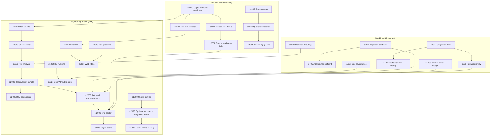

## Why

我们现在不缺提案，甚至可以说提案太多了：既有跨 `c2000`（架构地基）/`c3000`（体验闭环）/`c4000`（新功能）的“产品主线”，也有大量偏工程落地与收口的提案。问题是它们更像一张巨大的菜单——点菜很爽，但很难形成一顿能吃饱的套餐。

这份 change 想做一件朴素的事：把“先做什么、做完算什么、下一步怎么接”说清楚，让后面的提案都能顺着一条路走，不再每次讨论都从头讲边界。

## What Changes

- 引入“Slice（推进切片）”的写法约定：每个 slice 只回答三件事——最小闭环交付、依赖项、退出条件（怎么验证它真的完成了）。
- 把当前的工程型提案收敛成几条可并行推进的主线，并明确它们之间的依赖关系：
  - 基础契约（对象/ID/事件）
  - 运行时与流式（run 生命周期、SSE 事件）
  - 可观察性与诊断（关联 ID、日志/指标/trace、诊断台）
  - 质量与可复现（检索调试、评测中心、repro pack）
  - 体验与性能（错误恢复、性能门禁、背压可视化）
  - 内容与工作流（ingestion、connector 诊断、prompt/template、slides、citations、commands）
- 约定“退出条件”的最低标准：至少包含可执行命令、可见 UI/接口信号、以及失败时的定位线索（例如 correlation_id）。
- 给本仓库的编号策略一个落点：按重要性分段编号——重构 `1000–1999`，架构优化 `2000–2999`，用户体验 `3000–3999`，新功能 `4000+`。同一段内按依赖与推进顺序递增，允许被其它段引用（而不是平行造轮子）。

## Capabilities

### New Capabilities

- `engineering-roadmap-slices`: slice 的结构、依赖表达方式、退出条件模板，以及如何引用其它 changes/specs。

### Modified Capabilities

- `architecture-core`: 增加“slice 作为推进单位”的约定，以及依赖图在仓库内的维护方式。
- `quality-and-regression`: 把“退出条件”落到可执行的质量门禁（至少覆盖 `just llm-eval`、`pnpm run api:sync`、drift check 一类动作）。
- `delivery-and-deployment`: 约定 slice 完成后的必跑清单（例如 schema/openapi/client 的生成与校验）。

## Impact

- Docs：后续 change 会更好找、更好排期；讨论会更聚焦——只围绕“最小闭环”和“退出条件”。
- Execution：这份提案本身不引入实现，但它会把已有提案串成能推进的队列，减少重复劳动。

## Dependency Sketch

