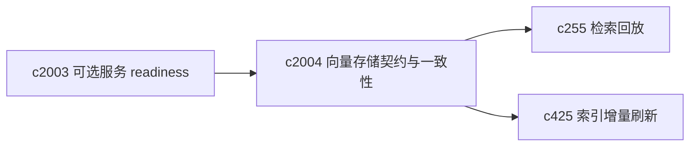
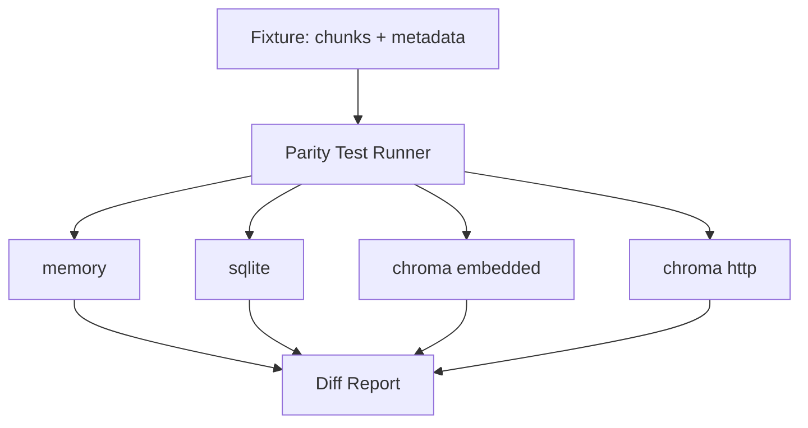

## Why

向量存储是 RAG 的底盘能力。现在项目里已经同时存在多种 provider（memory / sqlite / chroma embedded / chroma HTTP），它们的行为差异越积越多时，会出现一种很难受的现象：本地能跑、换个 profile 就“看起来还能跑但结果变了”，最后大家都不敢切 provider，也不敢做性能优化。

我更想要的是一份“能写进测试里”的契约：哪些操作必须一致、哪些差异必须显式声明、哪些差异会体现在 UI/诊断上。

## What Changes

- 定义 `VectorStore` 的最小契约（而不是只靠接口方法名）：
  - upsert / delete / query 的语义边界与返回结构
  - metadata 的字段规范（至少要能稳定绑定到 source / chunk / created_at）
  - embedding 维度与模型切换时的失败/迁移策略
  - 过滤/排序能力的“可用性声明”（capability flags），避免假装都支持
- 增加 provider parity test suite：同一组 fixture 在所有 provider 上跑，输出一致性差异报告（允许有“声明过的差异”）。
- 明确 config 语义：例如 chroma 的 host/port/path 组合如何判定 embedded vs remote，并把“判定结果”暴露给诊断面（避免靠注释猜）。
- 把 provider readiness 与 `c2003` 的可选服务 readiness 打通：remote chroma 不可用时，是降级为 sqlite，还是直接 blocked，要能配置且可解释。

## Capabilities

### New Capabilities

- `vector-store-contract-and-provider-parity`: 定义向量存储契约、provider 能力声明与一致性测试基线。

### Modified Capabilities

- `retrieval-and-cache`: 检索需要消费 capability flags，并能解释 provider 差异。
- `source-ingestion-core`: ingestion 写入向量存储的元数据需要标准化。
- `optional-services-readiness-contract`: remote provider 的 readiness 需要统一解释。（`c2003`）
- `local-environment-drift-and-dependency-audits`: 环境漂移审计需要覆盖 provider 差异与依赖缺失。（`c1180`）

## Impact

- Backend：向量写入/删除/查询的统一封装、provider 能力声明、契约测试与差异报告。
- Frontend：诊断面与错误提示能解释“当前 provider 是谁、缺什么能力、为什么降级/为什么 blocked”。
- Non-goals：不在这里引入新的向量数据库；先把“已有 provider 的行为”钉住。

## Dependency Sketch

