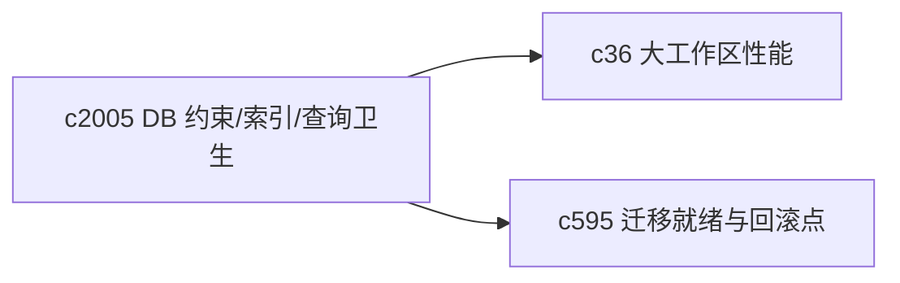
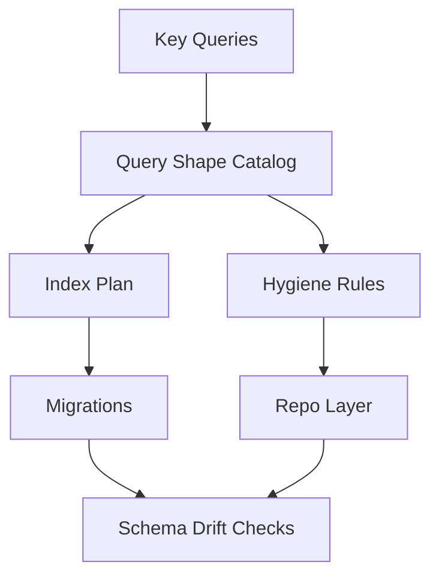

## Why

现在的 DB 模型已经承载了 notebook、session、message、source、task、output 这套核心对象。它们一旦开始长期滚动，最怕两件事：

1) **数据慢慢变脏**（缺少约束/唯一性/一致性检查，最终只能靠“重建/清空”解决）
2) **性能慢慢变钝**（缺 index 或查询方式不稳定，越到后期越难定位）

更糟的是，这类问题通常不是“当场炸”，而是悄悄退化，等你想修时已经牵连一大片。

## What Changes

- 盘点并明确核心不变量（写进 schema + 测试）：
  - 关键唯一性（例如幂等 receipt、外部导入标识、某些 name 的作用域）
  - revision/版本递增规则（例如 session shared_state 的 revision 语义）
  - 关键外键删除策略与 orphan 允许/不允许边界
- 建立“索引与查询形状清单”：列出 Workspace 关键列表页与后台 worker 的查询路径，补齐必要 index，并把“为什么需要”写进迁移说明。
- 统一 repo 查询 hygiene：
  - 避免 N+1（明确哪些关系必须 `selectinload`）
  - 对分页/排序字段做明确约束（避免隐式排序导致不同数据库行为不同）
  - 对 JSON 字段的访问做“能解释的降级”（SQLite vs 其他）
- 把 DB 健康检查接入 `c595` 的迁移就绪报告：迁移前能看见“约束/索引是否漂移”“数据是否已脏到会影响迁移”。

## Capabilities

### New Capabilities

- `database-constraints-indexes-and-query-hygiene`: 定义 DB 不变量、索引清单与查询卫生规范。

### Modified Capabilities

- `data-and-storage`: 需要承载更严格的不变量与索引策略。
- `migration-readiness-report-and-rollback-checkpoints`: 迁移就绪报告需要纳入约束/索引/脏数据风险。（`c595`）
- `large-workspace-performance-and-capacity-management`: 容量与性能诊断需要能引用“索引是否完整”。（`c36`）

## Impact

- Backend：alembic 迁移、repo 查询收口、关键接口的性能基线、以及“脏数据怎么修”的官方路径。
- Frontend：间接受益（列表更快、状态更稳），并能在诊断面解释“这次慢是因为缺索引/数据异常”，而不是只给 spinner。
- Risk：加约束会暴露历史脏数据；需要把修复路径设计成可控的 migration/repair steps。

## Dependency Sketch

