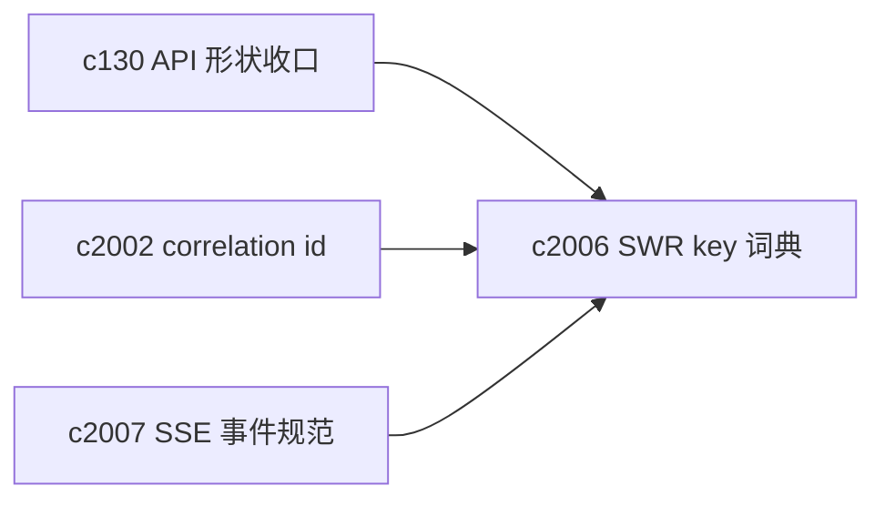
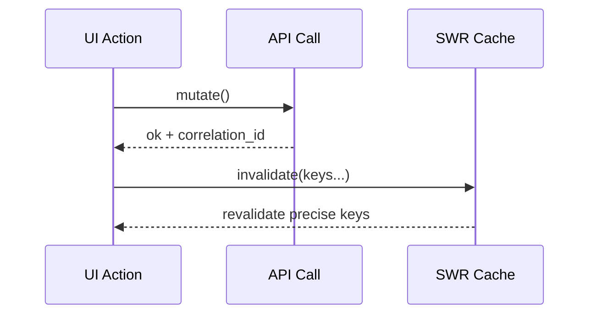

## Why

前端已经在使用 SWR 作为数据层（尤其在 workspace 各面板/各 hook 中）。当功能继续扩展时，最容易出现两类问题：

- **key 形状不统一**：同一个对象的列表/详情/摘要用不同 key，导致你 mutate 了一处，另一处还显示旧数据。
- **无边界的 revalidate**：为了“保险”，很多地方会选择全局 mutate 或宽范围 revalidate，结果是网络抖动、UI 抖动、还更难排查。

这不是“某个 hook 写错了”，而是缺少一个统一的 key 词典和失效策略。

## What Changes

- 建立 SWR key registry：用一组集中定义的 key builder（按 notebook/session/source/output 维度），让 key 可读、可组合、可审查。
- 约定 invalidation 语义：每个 mutation 明确“它会影响哪些 key”，优先做精确失效；只有在明确理由下才允许全局 revalidate。
- 统一 fetcher：把后端 `ErrorResponse` 映射为可显示的错误对象（含 hint/retry_after），并透传 `X-Correlation-Id`（对齐 `c2002`）。
- 为 SSE 场景做约定：当 SSE 推送到来时，优先走“局部缓存更新”，避免把它当成一次完整 refetch。（与 `c2007` 咬合）

## Capabilities

### New Capabilities

- `frontend-swr-key-registry-and-invalidation`: 定义 key 词典、失效策略与统一 fetcher。

### Modified Capabilities

- `workspace-ui-core`: 数据层稳定后，空态/异常态的行为会更可控。
- `api-shape-consolidation-and-generated-client-slimming`: key 词典需要配合 API 形状收口，减少临时适配。（`c130`）
- `request-context-and-correlation-ids`: 前端需要把 correlation id 作为调试一等信息。（`c2002`）
- `sse-event-schema-and-stream-client`: SSE 到来后如何更新缓存，需要与 stream client 统一。（`c2007`）

## Impact

- Frontend：集中定义 key 与 invalidation、减少重复 hook 逻辑、降低“莫名其妙的旧数据”问题。
- Backend：间接收益（请求更少、错误更集中），并能通过 correlation id 更快定位问题。
- Risk：key 迁移会触及很多 hook；需要一套“旧 key 到新 key”的迁移策略与回归点。

## Dependency Sketch

