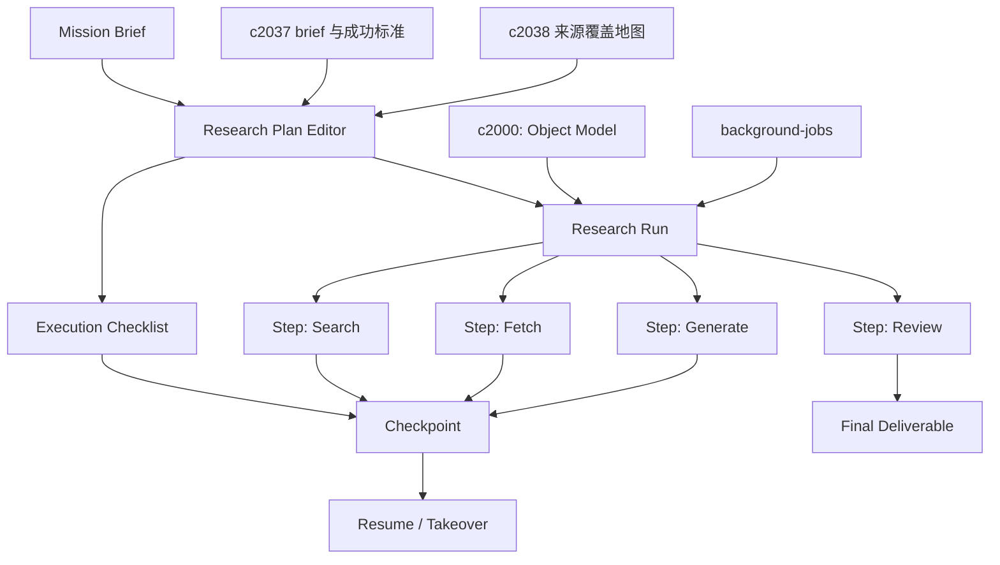

## Why

当前工作流还是偏"人一步步点过去"。这对早期探索没有问题，但一旦任务变长、来源变多、结果要反复比较，用户就会想把它变成一个能暂停、能恢复、能追踪的研究任务。

但 run 能跑，不等于真的好用。很多研究工作卡住，不是因为执行器不够强，而是**计划写不清、阶段交付没对齐、人工检查点没留出来**，最后只剩一串日志和一堆结果，过程并不好接手。

本提案把研究任务的**完整体验**——从计划编辑到多步执行、从检查点到接管恢复、从执行清单到交付对照——统一为一条完整的 research run 链路。

> 合并说明：本提案合并了原 `research-plan-editor-and-execution-checklists`、`observation-runs-and-non-writing-probes` 的全部内容。

## What Changes

### 1. 研究任务核心（agentic research run）

- 引入 mission brief 和 research run，把一次复杂研究拆成可跟踪的多步任务：
  - mission brief 包含目标描述、来源范围、深度预期和交付格式，是 run 的输入契约
  - research run 是一次完整执行实例，包含唯一 ID、关联 brief、步骤列表、当前状态和产出集合
- 每个 run 由有序步骤（step）组成，每步封装一个原子动作（搜索、抓取、比对、生成、审阅），步骤间通过检查点串联
- 检查点（checkpoint）在关键节点自动或手动保存：记录已完成步骤、中间产物和剩余计划，支持从任意检查点恢复而不丢失上下文
- 支持用户在关键节点接管（takeover）：暂停自动执行 → 查看中间状态 → 修改后续计划或手工干预 → 继续执行
- run 完成后生成最终交付物（deliverable），关联到对应 notebook/artifact，并保留完整执行轨迹供回溯和复盘
- 区分 interactive run（用户陪跑）和 background run（后台执行 + 定期汇报），两者共享同一状态机但通知策略不同

### 2. 观察型 run 与续跑触发

- 定义 observation run，目标限定为观察、探测与结构信号，而非直接写作
- 增加 non-writing probe，快速产出覆盖、冲突、薄弱环与时效分布等观察结果
- 可与后续写作/核证 run 衔接
- 定义 uncertainty-triggered follow-up：由不确定性触发的续跑建议
- follow-up 自动收窄目标、来源缺口与上下文策略
- 续跑建议沉淀为正式 seed，并回接问题线程与决策日志
- 默认需用户确认，避免无休止自动续跑

### 3. 研究计划编辑与执行清单

- 增加 research plan editor，让用户先把阶段、问题、方法、来源策略、检查点和责任人写成计划，再发起执行
- 支持 execution checklist，把"该补什么、该确认什么、哪个阶段需要人工点头"从脑子里拿出来
- 允许 run 在阶段之间对照计划推进，明确哪些步骤完成了，哪些是跳过的，哪些需要返工
- 让 brief、coverage map、review 和 delivery milestone 都能引用同一份研究计划

## Capabilities

### New Capabilities

- `agentic-research-runs`: 定义多步研究任务、检查点和恢复语义。
- `observation-runs-and-non-writing-probes`: 观察型执行与非写作探测。
- `uncertainty-triggered-follow-up-runs`: 由不确定性触发的续跑建议。
- `research-plan-and-execution-checklists`: 定义研究计划、阶段检查点、执行清单和人工接管语义。

### Modified Capabilities

- `background-jobs-and-task-runtime`: 需要支持更长生命周期的任务、检查点和按计划阶段组织。
- `generation-core`: 需要明确 run 内部生成步骤与产物的挂接关系。
- `source-aware-generation-modes`: 需要支持任务级来源策略，而不只是单次请求策略。
- `workspace-command-registry`: 需要提供 run 的启动、暂停、恢复、查看和计划级动作入口。
- `workspace-ui-panels`: 需要提供研究计划编辑、阶段视图和清单对照入口。
- `workspace-api-contract`: 需要增加计划对象、阶段状态、清单项和 run 对照接口。

## Impact

- **Backend**：任务状态机、检查点存储、编排器、执行日志、计划模型、阶段状态机和清单项。
- **Frontend**：Run 列表、任务详情、进度视图、接管入口、计划编辑器、阶段面板和清单对照。
- **Dependencies**：建议在 `workspace-object-model-and-readiness-contract` 与前面几层产品闭环先成形之后再拉高优先级。

## Dependency Sketch

