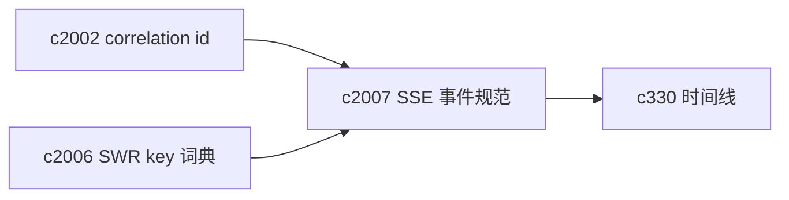
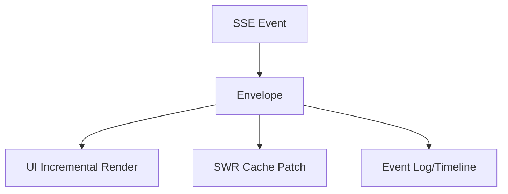

## Why

现在系统里已经有多条 SSE 流：research 进度、QA 流式回答、slides 生成等。前端也已经在用 `EventSource` 做订阅。但随着链路变多，SSE 最容易变成“每条流一套私有协议”：

- event 名字、payload 结构、错误表达各不相同
- 断线重连、backoff、心跳、关闭时机在不同 hook 里重复实现
- 想做统一诊断时发现对不上：这条 SSE 事件到底对应哪个 task/run？

SSE 本该是“同一种流式体验”的公共底座，而不是散落在各功能里的手写 glue。

## What Changes

- 定义统一 SSE event envelope（所有流都包一层）：
  - `event_type`、`ts`、`correlation_id`（对齐 `c2002`）
  - 可选 `task_id/run_id/notebook_id/session_id`
  - `progress`（0-100）与 `stage`（可选）
  - `payload`（业务数据）与 `error`（标准错误对象）
  - 可选 `timings`（对齐 `CRYSTALITH_OBSERVABILITY_SSE_TIMINGS`）
- 提供前端统一的 stream client/hook：
  - 自动重连（带上限与 jitter）
  - 心跳与“静默超时”检测
  - 可中止/可复用（同一资源只开一个连接）
  - 把事件转换为可写入 SWR cache 的增量更新（对齐 `c2006`）
- 让任务/时间线能消费 SSE 事件：SSE 不只是 UI 特效，也进入 “发生了什么” 的可追溯层。（对齐 `c330`）

## Capabilities

### New Capabilities

- `sse-event-schema-and-stream-client`: 定义 SSE 协议收口与前端订阅客户端。

### Modified Capabilities

- `request-context-and-correlation-ids`: SSE 必须携带 correlation id。（`c2002`）
- `task-runtime-durability-and-restart-reconciliation`: 任务生命周期与 SSE 需要能对齐。（`c2001`）
- `task-feed-compaction-and-event-timeline`: 时间线需要能引用 SSE 片段。（`c330`）
- `frontend-swr-key-registry-and-invalidation`: SSE 更新缓存的方式需要统一。（`c2006`）

## Impact

- Backend：统一 SSE 输出封装、标准化 error 事件、可选 timings 输出；并在关键流里补齐 task/run 关联字段。
- Frontend：删除重复的 EventSource 管理代码，收口成一个 stream client；让 SSE 更稳定、更可诊断。
- Risk：统一 envelope 可能触及已有前端逻辑；需要提供兼容窗口或双写策略（短期）。

## Dependency Sketch

