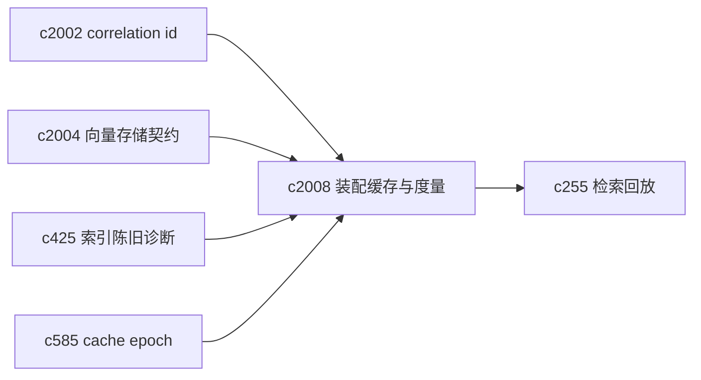
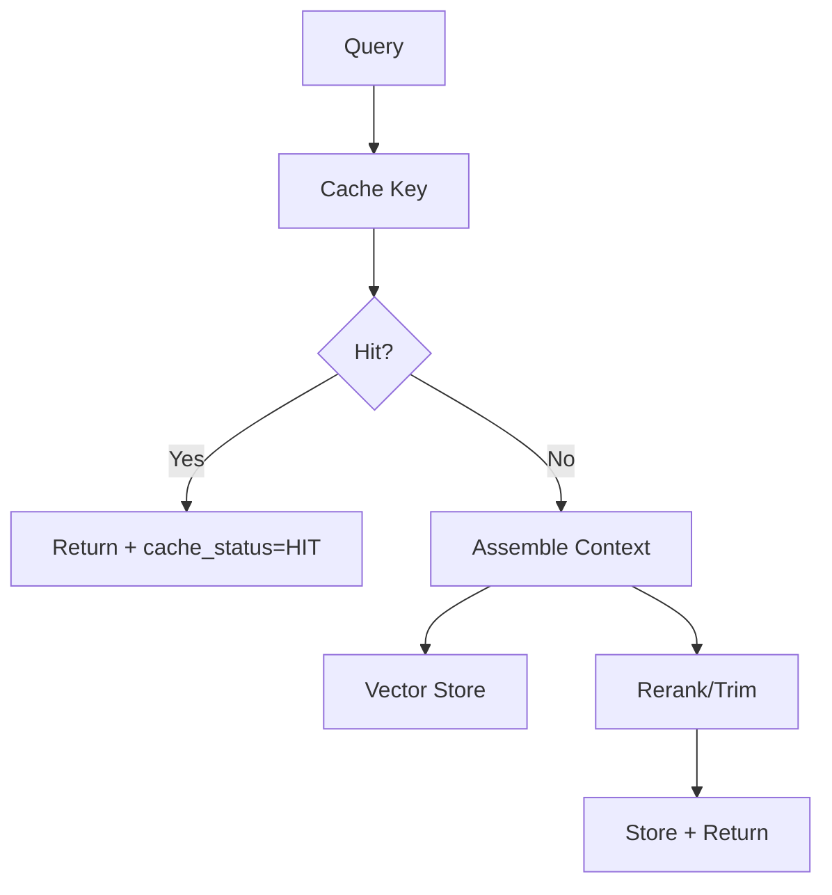

## Why

检索装配（context assembly）是典型的“贵但隐形”的路径：它把 query、来源过滤、向量检索、rerank、片段裁剪、引用锚点等拼成一个可喂给模型的上下文。现在代码里已经有了装配缓存的开关（例如 `CRYSTALITH_RETRIEVAL_ASSEMBLY_CACHE` 和 TTL），说明这条链路确实够重。

但如果缓存只停在“加一个开关”，很快会遇到两个问题：

- **正确性难解释**：这次结果是不是旧的？为什么没失效？
- **性能难量化**：到底省了多少时间？命中率怎样？是不是在某些 query 上反而拖慢？

我希望把它升级成“可诊断、可度量、可控失效”的缓存层，而不是一个玄学开关。

## What Changes

- 定义 retrieval assembly cache 的 key 与命中语义：
  - 输入：`notebook_id` + query + retrieval preset/lens + 关键配置摘要
  - 依赖：来源快照/索引时间（对齐 `c425` 的 staleness 信号）
  - 输出：装配结果 + `cache_status`（HIT/MISS/BYPASS/STALE）+ staleness_reason
- 增加 metrics：
  - hit rate、bypass reason、平均节省时延、最慢 query topN
  - 命中与否写入 `c255` 的 query trace（让“为什么变了”有证据）
- 与 cache epoch 体系对齐：支持按域失效/预览（对齐 `c585`），避免一有问题就一锅端。
- 提供最小 debug 面：在 response header 或 debug endpoint 中暴露 cache_status + correlation_id（对齐 `c2002`），让排障能对齐同一次动作。

## Capabilities

### New Capabilities

- `retrieval-context-assembly-cache-and-metrics`: 定义装配缓存契约、度量与诊断输出。

### Modified Capabilities

- `retrieval-and-cache`: 需要承载装配缓存的 key/失效/度量。
- `retrieval-query-trace-and-search-replay`: 需要记录 cache 命中与 staleness reason。（`c255`）
- `search-index-incremental-refresh-and-staleness-diagnostics`: 索引刷新信号需要可被缓存消费。（`c425`）
- `cache-epoch-inspection-and-invalidation-preview`: 需要覆盖 retrieval assembly 这类关键缓存域。（`c585`）
- `vector-store-contract-and-provider-parity`: provider 差异会直接影响装配缓存正确性。（`c2004`）

## Impact

- Backend：缓存 key 设计、依赖信号接入、度量采集、debug 输出；并把缓存层从“隐藏实现”变成“可解释能力”。
- Frontend：诊断视图能显示 cache_status（可选），并能把 correlation id 一起带走排障。
- Risk：key 设计必须避免把“真正重要的依赖”漏掉，否则命中率高但错得更隐蔽。

## Dependency Sketch

