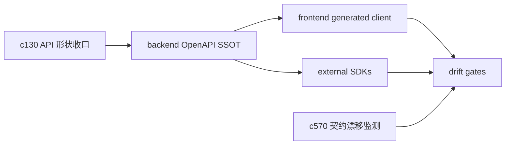

## Why

项目已经同时维护三类“客户端入口”：

- 前端内部的 generated client（`frontend/web/src/api/generated`）
- 对外的 TypeScript SDK（`vendor/crystalith-sdks/typescript`）
- 对外的 Python/Go/Rust SDK（`vendor/crystalith-sdks/*`，Fern 生成）

链路本身已经跑起来了（`just api-export/api-check/api-sync`、`just sdk-gen-*`、`scripts/sdk_release.sh` 也都在），但一旦维护人数变多，最容易出事的不是“不会生成”，而是：

- 生成入口太多，什么时候该跑哪个命令靠经验
- drift gate 覆盖不均（有的语言有 check，有的没有）
- release 过程中失败很难定位（环境差异、Fern 版本、Docker 依赖、submodule 状态）

这条提案的目标不是“再造一套发布系统”，而是把现有链路收成一份更稳、更可复用的工程契约。

## What Changes

- 明确 SSOT 与生成入口（写进 proposal + docs）：
  - OpenAPI SSOT：`backend/py` 导出的 schema（`just api-export` → `frontend/web/openapi.gen.json`）
  - 前端生成入口：`just api-sync` / `cd frontend/web && pnpm run api:generate`
  - SDK 生成入口：`just sdk-gen-python/typescript/go/rust`（内部使用 `scripts/sdk_gen.sh`）
  - drift gate：`just api-check`、`just sdk-version-check`、`just sdk-release-check`、`just check`
- 把“生成一致性”拆成可理解的几类失败（而不是一句 out of date）：
  - schema drift（OpenAPI 变了没导出）
  - generator drift（生成器版本/配置变了）
  - version drift（SDK 版本与 backend 不一致）
  - submodule drift（SDK monorepo 指针没提交/没推送）
- 增加 release playbook 的“干跑/预检/失败定位”层：
  - `sdk-release-preflight` 的输出更像 checklist，而不是只报错
  - 对 Fern/Docker 的依赖做更明确的环境提示（避免把失败藏在生成器里）
- 统一 internal web client 与 external TS SDK 的边界：哪些 API/类型必须一致，哪些允许分叉（避免“两个 TS 客户端，各自解释 OpenAPI”）。

## Capabilities

### New Capabilities

- `sdk-generation-drift-gates-and-release-playbook`: 定义 SDK 生成与发布的工程契约、漂移分类与预检清单。

### Modified Capabilities

- `openapi-and-client-generation`: 需要明确 SSOT、生成入口与 drift gate。
- `openapi-client-contract-drift-watch`: drift watch 的结果需要能回流到发布与预检。（`c570`）
- `api-shape-consolidation-and-generated-client-slimming`: API 形状收口是减少 drift 的根因之一。（`c130`）
- `doc-governance`: 生成产物与文档需要有确定的 drift 检查入口（`just doc-governance-check`）。

## Impact

- Tooling/CI：把现有 `just` 任务与脚本串成更明确的“生成/检查/发布”路径；并补齐不同语言的一致性检查。
- Frontend/SDK：减少“为什么我本地能过、CI 不过”的生成类问题；也减少重复生成导致的无意义 diff。
- Risk：需要避免把 gate 变成摩擦；优先做“可解释的失败”，再谈强阻塞。

## Dependency Sketch

