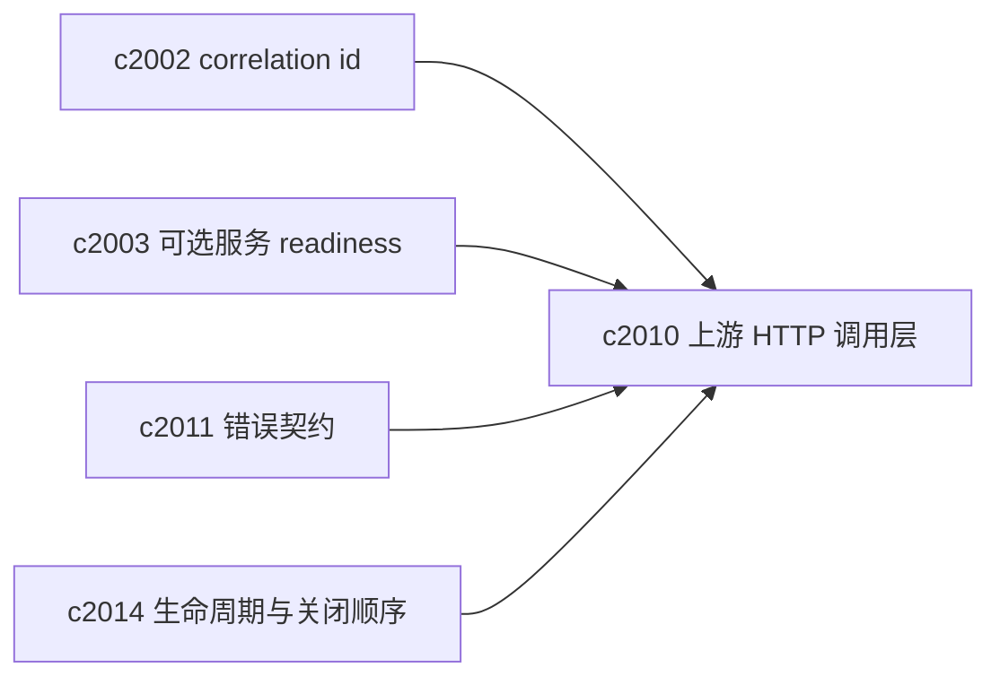
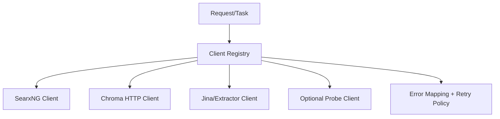

## Why

后端现在会在多个地方直接创建 `httpx.Client/AsyncClient`：有的用上下文管理器每次新建，有的长期持有；timeout、重试、连接池参数也各不相同。短期看都能跑，长期会积累成三类问题：

- 性能抖动：连接无法复用、DNS/握手成本重复
- 行为不一致：同样是上游超时，有的报 503，有的报 500，有的直接吞掉细节
- 资源泄漏风险：某些异常路径下 client 没能被正确 close（尤其在长期 SSE/后台任务场景）

我想把“能发 HTTP 请求”升级成“有统一策略的上游调用层”：连接池可控、timeout 可解释、错误可归类、关闭顺序稳定。

## What Changes

- 引入统一的 Upstream HTTP client registry（或 client pool）：
  - 以 `service_key`（openai/searxng/chroma/jina/optional_probe/…）命名
  - 每个 key 有明确的 timeout、max_connections、重试策略、headers 注入（含 `correlation_id`，对齐 `c2002`）
- 统一错误映射：
  - transport/timeout → 标准化的 `ErrorResponse`（对齐 `c2011`）
  - 可选服务类上游失败 → readiness 降级或 blocked（对齐 `c2003`）
- 统一“轻探测”与“重请求”的边界：probe 不应污染主请求的连接池，也不应把一次 probe 变成慢请求的瓶颈。
- 把 client 生命周期纳入 app lifespan：统一创建、统一关闭（对齐 `c2014`），避免背景任务在资源关闭后还在跑。

## Capabilities

### New Capabilities

- `http-client-pooling-and-upstream-timeout-policy`: 定义上游 HTTP 调用的连接池、超时、重试与错误映射策略。

### Modified Capabilities

- `request-context-and-correlation-ids`: 上游调用需要携带 correlation id 并写入日志。（`c2002`）
- `optional-services-readiness-contract`: 可选服务的探测与失败需要统一通过 client 层输出。（`c2003`）
- `openapi-error-contract-and-doc-gates`: 错误响应需要被统一建模。（`c2011`）
- `app-lifespan-resource-lifecycle-and-shutdown-safety`: client registry 的创建/关闭顺序需要被托管。（`c2014`）

## Impact

- Backend：抽取重复的 httpx client 创建逻辑、统一参数来源（Settings）、统一错误映射与日志字段。
- Frontend：间接收益（错误更可解释、重试更可预测），并能通过 correlation id 更快对齐问题。
- Risk：切换为共享连接池可能改变某些上游的并发行为；需要把上游隔离成“分池/分 key”，避免互相拖累。

## Dependency Sketch

