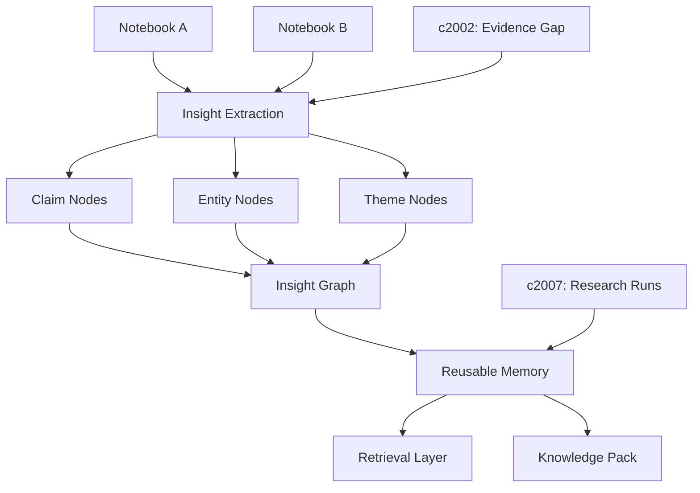

## Why

现在的 notebook 边界很清楚，这对隔离上下文是好事，但副作用也很明显：很多好结论、关键实体和已经验证过的判断会被留在各自的工作区里，时间一长就很难复用。

## What Changes

- 引入 insight graph，把 claim、entity、theme、decision 和 supporting evidence 从单次输出中抽出来，沉淀为可复用对象。
- 支持跨 notebook 聚合洞察，形成“这家公司之前出现过什么风险”“这个主题有哪些稳定结论”这类长期视角。
- 允许用户把高价值 insight 标记为 reusable memory，用于后续检索、研究和打包。
- 让 knowledge pack、研究 run 和后续输出可以引用已有 insight，而不是每次都从零归纳。

## Capabilities

### New Capabilities
- `insight-graph-and-memory`: 定义洞察节点、关系、复用记忆和跨 notebook 引用能力。

### Modified Capabilities
- `multi-notebook-collections`: 需要支持基于 insight graph 的跨 notebook 聚合，而不只是集合式浏览。
- `retrieval-and-cache`: 需要支持把已沉淀 insight 作为可控检索层，而不只检索原始来源分块。
- `publishable-artifacts`: 需要允许 pack 引用稳定 insight，并保留 insight 与来源、证据的关系。
- `output-rendering-and-typing`: 需要支持在结果中展示 insight、关系和回溯来源的可视化承载。
- `data-and-storage`: 需要增加 insight graph 的持久化对象、关系和生命周期约束。

## Impact

- Backend：洞察抽取、关系存储、图谱查询、与检索链路的整合。
- Frontend：Insight Explorer、关系视图、跨 notebook 过滤和复用入口。
- Product：这会把 Crystalith 从“每次产出一份结果”推进到“长期积累一套认知资产”。
- Dependencies：建议接在 `evidence-gap-and-claim-checking`、`publish-and-share-knowledge-packs`、`agentic-research-runs` 之后。

## Dependency Sketch

