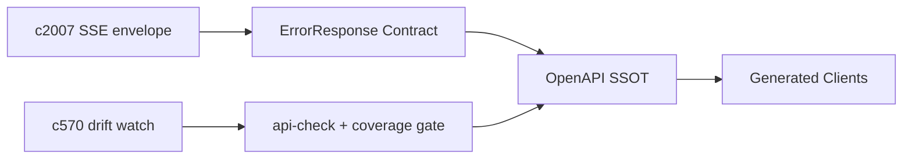

## Why

后端已经有一套不错的 `ErrorResponse` 模型，并且在全局异常处理里开始使用它。但只要接口继续增长，就会出现两种常见漂移：

- 有的 endpoint 返回了统一错误模型，有的仍然返回散装 `detail` 或不稳定结构
- SSE 流式接口的错误处理更容易“各自为政”，前端只能靠字符串判断

结果就是：前端 generated client 的类型越写越保守，错误提示越来越像“出错了请重试”，排障也越来越慢。这个提案想把错误契约升级到 OpenAPI 层，让“错误怎么长”也成为 API contract 的一部分。

## What Changes

- 明确 ErrorResponse 是所有非 2xx 的默认错误体（除了少数明确例外），并统一字段：
  - `error_code`（机器可判断）
  - `message`（用户可读）
  - `hint`（下一步动作）
  - `retry_after`（限流/上游退避）
  - `details`（调试信息，需分层控制）
- 为 SSE 增加标准化 error event：流式失败不再靠“连接断了”，而是明确发出 `event_type=ERROR`（对齐 `c2007` 的 envelope）。
- 把错误契约写进 OpenAPI：
  - 各 endpoint 的错误响应引用统一 schema
  - 关键错误码（例如 optional service unavailable）在文档里有落点与解释
- 增加 doc gate / lint：
  - 生成入口：`just api-export`（SSOT）、`just api-check`（drift gate）
  - 前端生成入口：`just api-sync` / `cd frontend/web && pnpm run api:generate`
  - 增加一层“错误契约覆盖率”检查：至少保证新接口不会绕开 ErrorResponse。

## Capabilities

### New Capabilities

- `openapi-error-contract-and-doc-gates`: 定义错误响应契约、SSE 错误事件与 OpenAPI gate。

### Modified Capabilities

- `openapi-and-client-generation`: 需要把错误响应纳入生成产物的稳定形状与 drift gate。
- `openapi-client-contract-drift-watch`: drift watch 需要把“错误形状漂移”算作高风险变化。（`c570`）
- `sse-event-schema-and-stream-client`: SSE 需要有标准化 error event。（`c2007`）
- `optional-services-readiness-contract`: optional service 的错误码与 hint 需要统一落入 ErrorResponse。（`c2003`）

## Impact

- Backend：统一错误返回、补齐 SSE 错误事件、OpenAPI 注解与覆盖率 gate。
- Frontend：generated client 与 UI 错误提示更稳；同样的错误能统一展示并给出明确 hint。
- Risk：如果把 details 暴露得太多，可能引入信息泄露；需要分层（debug/dev 才能看到细节）。

## Dependency Sketch

