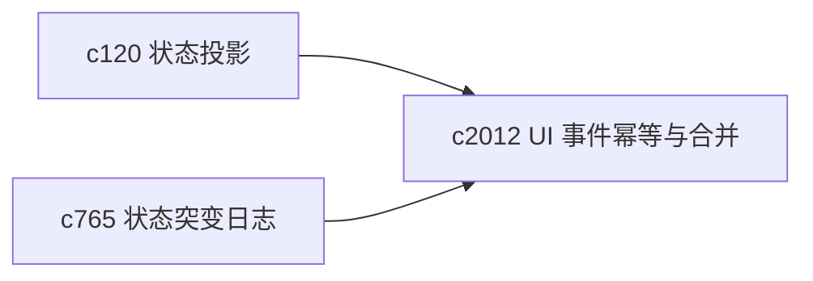
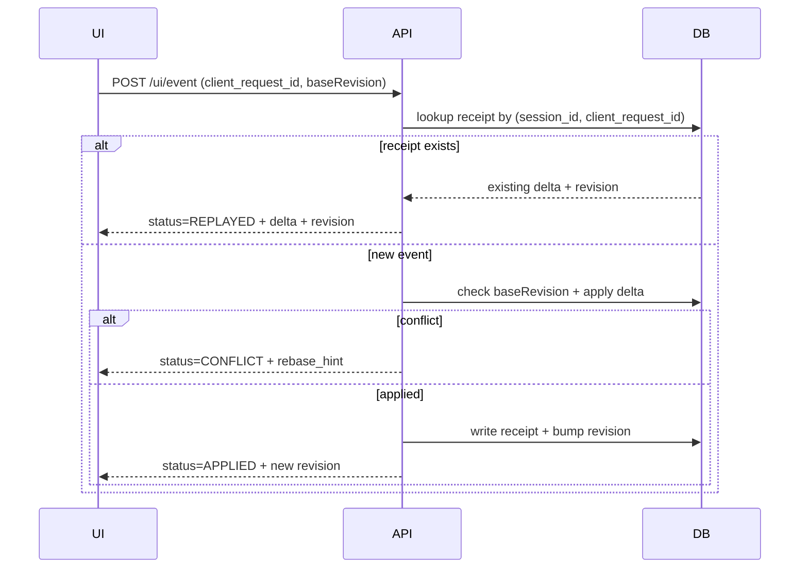

## Why

现在后端已经在做一件很“高级但容易被忽略”的事：把前端 UI 交互事件落盘成可幂等的 receipt（`client_request_id`），并把事件转换为对 session shared_state 的增量（delta + revision）。这对交互式组件、跨面板状态同步非常关键。

但目前这条链路还缺一份“写给未来的自己”的契约：

- `baseRevision` 过期时怎么处理？拒绝还是自动 merge？
- 重复请求（重试/断线重连）如何保证严格幂等？
- receipt 会无限增长吗？什么时候该 compaction/retention？
- 如何把它接到更高层的“状态突变日志/回看”（对齐 `c765`）？

如果这些边界不钉住，后续任何交互复杂化都会把问题放大成“偶现、难复现、靠运气”。

## What Changes

- 定义 UI event processing 的正式响应语义：
  - `status`: `APPLIED | REPLAYED | CONFLICT`
  - `shared_state_revision`: 新 revision
  - `applied_delta`: 这次实际应用的 delta（REPLAYED 时返回历史 delta）
  - `conflict_reason` + `rebase_hint`（仅 CONFLICT）
- 明确 merge 策略：
  - 允许的“无冲突自动 merge”范围（例如只触及不同字段）
  - 必须冲突的情况（例如同字段不同值、或 baseRevision 太旧）
- 强化幂等边界：
  - `client_request_id` 的作用域与唯一性（当前以 session 为 scope，保持）
  - 对 REPLAYED 返回完全一致的结果（让前端可安全重试）
- 引入 receipt retention/compaction：
  - 按时间窗口保留 receipt，或只保留关键事件类型
  - 提供“状态快照 + 之后的 receipts”模式，为调试回放服务（对齐 `c765`）

## Capabilities

### New Capabilities

- `ui-event-idempotency-and-shared-state-merge-contract`: 定义 UI 事件幂等、冲突与合并契约，以及 receipt 的保留与压缩策略。

### Modified Capabilities

- `workspace-shared-ui-state`: shared_state 的 revision 与 delta 语义需要更明确。
- `state-mutation-journal-and-debug-rewind`: mutation journal 需要以 UI receipt 为上游输入之一。（`c765`）
- `workspace-state-projection-and-summary-cache`: 状态投影需要能解释 revision 漂移与冲突。（`c120`）

## Impact

- Backend：UI 事件处理接口的响应结构、冲突检测、receipt 归档/压缩策略与调试入口。
- Frontend：重试策略更简单（可以“大胆重试”），冲突时也能给出明确 rebase 路径，而不是静默丢更新。
- Risk：merge 规则必须足够保守；宁愿早期多冲突，也不要错误地“自动合并”。

## Dependency Sketch

