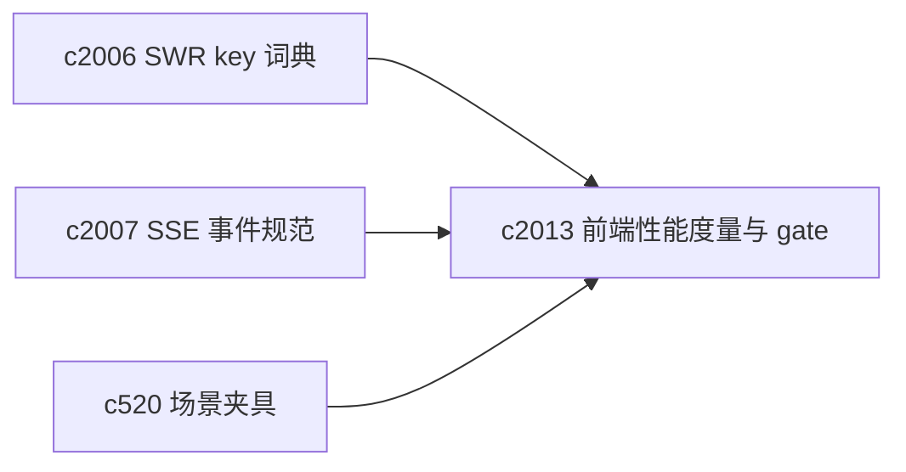
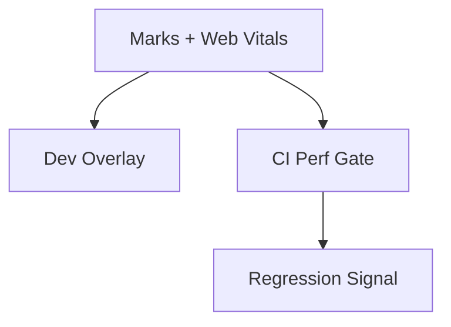

## Why

当 workspace 变复杂后，体验变差往往不是“功能坏了”，而是：

- 首屏慢了（LCP 变大）
- 交互卡了（INP 变差）
- SSE 首个事件来的很晚（用户以为没反应）

这些问题如果没有度量，很容易在重构/加功能时被悄悄带进来，直到用户抱怨才发现。这个提案想把性能变成“可被回归测试捕捉”的指标，而不是只靠体感。

## What Changes

- 为关键用户路径添加 performance marks：
  - Workspace 进入（壳层 ready）
  - 列表渲染完成（sources/sessions/outputs）
  - SSE 首个事件与首个 token（对齐 `c2007` 的统一事件）
- 采集 Web Vitals（LCP/INP/CLS）并在 dev 模式可见：
  - 本地 overlay 或诊断面显示（不一定上报到服务端，先把“看见”做出来）
- 引入轻量 perf gate：
  - 在 CI/本地可跑的方式（例如固定场景下跑 Lighthouse / Playwright trace）
  - 只对关键页面设预算阈值，避免把 gate 变成阻塞开发的噪音墙
- 把性能指标与数据层策略咬合：SWR 的 revalidate 风暴、SSE 连接重复等要能直接反映在指标上（对齐 `c2006`、`c2007`）。

## Capabilities

### New Capabilities

- `frontend-performance-marks-and-web-vitals-gates`: 定义前端性能标记、Vitals 采集与回归 gate。

### Modified Capabilities

- `frontend-swr-key-registry-and-invalidation`: 数据层稳定性会直接影响性能指标。（`c2006`）
- `sse-event-schema-and-stream-client`: SSE 事件统一后才能稳定度量“首个事件时间”。（`c2007`）
- `workspace-scenario-fixtures-and-regression-harness`: 固定场景夹具能让 perf gate 更可复现。（`c520`）

## Impact

- Frontend：增加标记点与可视化方式；把性能回归从“体感”变成“指标变化”。
- Tooling/CI：新增可选的 perf 检查入口（先非阻塞，成熟后再考虑阻塞）。
- Risk：性能 gate 容易变成噪音；必须从少量关键页面开始，并允许分环境阈值。

## Dependency Sketch

