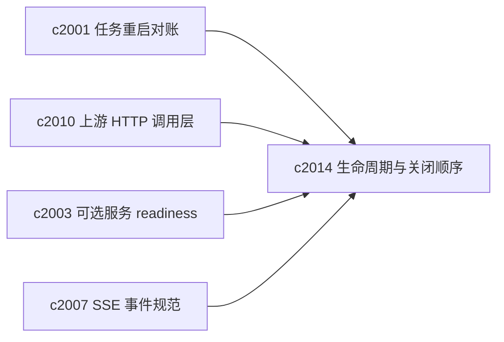
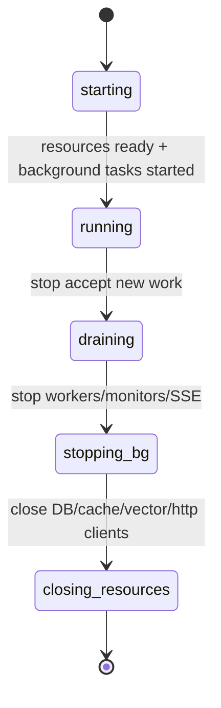

## Why

后端已经进入“有很多后台东西在跑”的阶段：task worker、optional services monitor、SSE 流、外部 client（OpenAI / Chroma HTTP）等。这个时候，资源生命周期顺序如果不稳定，会出现很诡异的问题：

- 关机时 worker 还在跑，但 DB/VectorStore 已经 close 了 → 任务失败、状态写不回去
- monitor 还在 probe，但 http client 已经释放 → 产生噪音错误
- SSE 连接没被优雅收敛 → 前端看到“突然断了”，却没有最后一条解释事件

这类问题一旦出现，往往只在某些时序下发生，很难复现。与其靠运气，不如把生命周期变成一份明确的契约。

## What Changes

- 定义 app lifespan 的分阶段顺序（startup/shutdown）：
  - Startup：先初始化核心资源（DB、cache、vector store、http client registry），再启动后台任务（worker、monitor）。
  - Shutdown：先停止接受新工作（断开/拒绝新 SSE/新 task），再 **停止后台任务**，最后关闭核心资源。
- 收口关闭顺序：
  - `task_queue.stop_worker()` 必须发生在 DB/VectorStore close 之前
  - optional monitor 必须可快速取消，并有明确的 shutdown timeout
  - 上游 client registry 统一 close（对齐 `c2010`）
- 加入 shutdown observability：
  - 记录每个阶段耗时、是否超时、是否有 in-flight 任务被强制取消
  - 在 debug 模式可以输出“上一次 shutdown 为什么慢/为什么被强杀”
- 为重启对账留口子：shutdown 时如果有 RUNNING task，写入可恢复/可对账信息（对齐 `c2001`）。

## Capabilities

### New Capabilities

- `app-lifespan-resource-lifecycle-and-shutdown-safety`: 定义资源生命周期阶段、关闭顺序与可观测性。

### Modified Capabilities

- `task-runtime-durability-and-restart-reconciliation`: shutdown 与重启对账需要互相咬合。（`c2001`）
- `http-client-pooling-and-upstream-timeout-policy`: client registry 的创建/关闭需要被 lifespan 托管。（`c2010`）
- `optional-services-readiness-contract`: monitor 的生命周期需要更可控。（`c2003`）
- `sse-event-schema-and-stream-client`: shutdown 时 SSE 的“最后一条解释事件”需要统一。（`c2007`）

## Impact

- Backend：lifespan 重构、后台任务停止策略、资源 close 顺序与超时控制、shutdown 日志。
- Frontend：间接收益（更少“突然断线/突然失败”），并能在必要时看到解释事件。
- Risk：改变关闭顺序可能暴露隐藏的竞态；需要配合场景测试与回归 harness（对齐 `c520`）。

## Dependency Sketch

