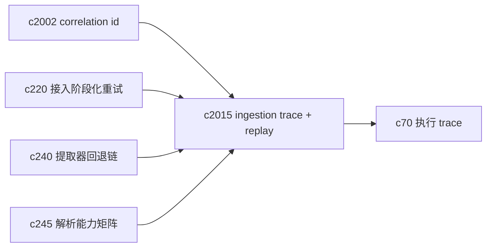
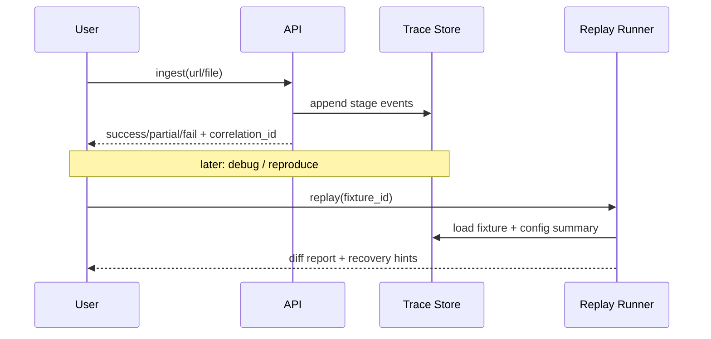

## Why

来源接入链路已经很丰富了：URL 抓取、网页提取、文件上传、解析器、去重、切块、向量写入、索引刷新。它的麻烦点也很“真实”：同一个 URL 今天能抓，明天可能就 403；一次解析失败的原始输入很难再拿到；更别说“用户那边复现不了，但我这边也复现不了”的尴尬。

我们已经有 `c220`（阶段化失败与局部重试）、`c240/c245`（提取器/解析能力边界）、`c70`（执行 trace）这几条线，但 ingestion 仍缺一个贴近工程的抓手：**把一次接入的关键证据记录下来，并能在离线环境把它重放出来**。不然每次修 bug 都像在追鬼。

## What Changes

- 定义 ingestion trace：一次接入生成一条 trace，至少包含阶段事件（fetch/extract/parse/normalize/chunk/embed/index/persist）、耗时、关键参数摘要与失败分类。
- 定义 replay fixture：把“可复现所需的最小输入”打包成 fixture（例如规范化后的 HTML/文本、解析后的中间表示、chunk 列表、关键配置摘要），并且能标记敏感内容的脱敏策略。
- 明确可存与不可存边界：
  - 默认只存摘要与结构，不存原始大文本（除非显式开启 debug/本地模式）
  - token/headers/cookie 等敏感字段永不落盘
- 提供 replay runner：用 fixture 重新跑解析/切块/索引等阶段，产出一致性 diff（例如 chunk 数量变化、锚点漂移、向量写入失败原因）。
- 让 trace 与 repair/诊断链路对齐：
  - Sources 面板能看到“失败在哪一步 + 为什么 + 建议怎么补救”（对齐 `c03/c220`）
  - developer diagnostics 能按 `correlation_id` 找到同一次接入的 trace（对齐 `c2002/c525`）

## Capabilities

### New Capabilities

- `ingestion-trace-and-replay-fixtures`: 定义来源接入 trace、replay fixture 与离线重放语义。

### Modified Capabilities

- `source-ingestion-retry-recovery-and-partial-success`: 失败阶段与重试入口需要能引用 trace。（`c220`）
- `extractor-fallback-chain-and-capture-provenance`: 提取器选择与回退原因需要写入 trace。（`c240`）
- `parser-capability-matrix-and-format-fallbacks`: 解析能力与降级结果需要写入 trace。（`c245`）
- `request-context-and-correlation-ids`: trace 必须挂上 `correlation_id`。（`c2002`）
- `execution-trace-and-replay-lab`: ingestion trace 是执行 trace 的一类上游素材。（`c70`）

## Impact

- Backend：新增 trace/fixture 存储模型或对象存储约定；在 ingestion 关键阶段补事件；提供 replay runner 与 diff 输出。
- Frontend：来源详情/诊断面增加“接入轨迹”入口；能直接定位到失败阶段与恢复动作。
- Risk：fixture 很容易变成“又大又敏感”；必须把默认策略做得非常克制，先服务开发排障，再考虑用户可见面。

## Dependency Sketch

