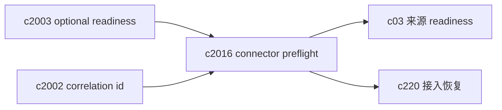
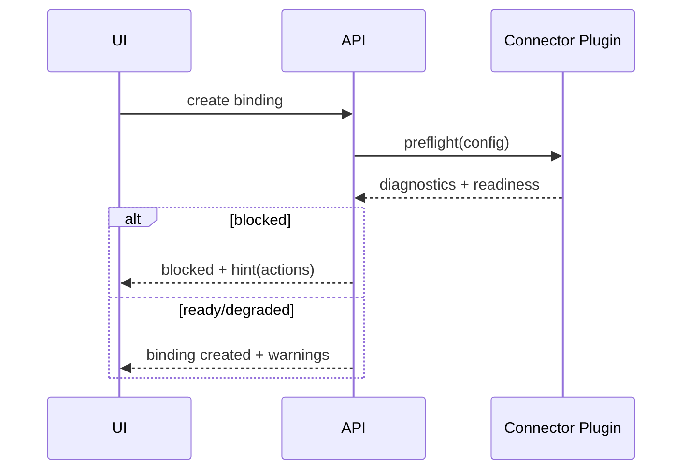

## Why

连接器这条链路最磨人的是“它看起来配置对了，但就是不同步”。尤其是本地路径类（Obsidian vault）、需要网络的（网页抓取/搜索）、或者需要 token 的（未来的 SaaS 连接器）。如果每个连接器都自己吐一套报错，用户只能靠猜；开发者也会被迫在日志里翻半天。

现在代码里已经有 `diagnostics`、`capabilities`、`sync_check` 这些结构，但缺少一个统一的 preflight 和诊断契约：同步前先检查什么、失败怎么分层、哪些是“可恢复”、哪些是“配置问题”、哪些是“服务没起来”。这条线想把连接器从“能跑”推进到“好排查、好恢复”。

## What Changes

- 定义 connector preflight：在创建 binding、执行 snapshot、执行 sync_check 前，先跑一组轻量检查：
  - config schema 校验（字段齐不齐、值是否合理）
  - 连接可达性（本地路径/网络端点/权限）
  - 可选依赖 readiness（例如需要搜索或提取服务时，先给出 readiness 结论与恢复动作）
- 统一 diagnostics 模型：
  - error_code 分层（CONFIG / PERMISSION / NETWORK / UPSTREAM / DATA / INTERNAL）
  - message 面向人类，hint 面向下一步动作（可直接落到 UI 按钮）
  - details 只在 debug 模式返回（避免把内部结构外露）
- 统一 sync_check 的状态机：`READY / DEGRADED / BLOCKED`，并且必须给出原因与可执行动作（例如“先确认 snapshot”“先更新 import_scope”“先修复 token”）。
- 让诊断可关联：所有 connector 相关请求带 `correlation_id`，并能落进 dev diagnostics（对齐 `c2002/c525`）。

## Capabilities

### New Capabilities

- `source-connectors-preflight-and-sync-diagnostics`: 定义连接器 preflight、诊断分层与同步前检查契约。

### Modified Capabilities

- `source-connectors`: 连接器宿主需要统一 preflight 与 diagnostics 输出。
- `source-readiness-and-freshness`: readiness 视图需要消费连接器诊断与同步状态。（`c03`）
- `optional-services-readiness-contract`: 连接器诊断需要复用可选服务 readiness。（`c2003`）
- `request-context-and-correlation-ids`: 连接器链路需要带上 correlation id。（`c2002`）
- `source-ingestion-retry-recovery-and-partial-success`: connector 导入失败需要更细的恢复入口。（`c220`）

## Impact

- Backend：连接器 API 增加 preflight endpoint/步骤；统一 error_code 与 hint；对不同 connector plugin 输出做规范化包装。
- Frontend：binding 创建/同步流程增加“预检结果”展示；错误不再是红字一行，而是“原因 + 下一步”。
- Risk：preflight 不能变成阻塞；需要能在 degraded 模式继续做“低风险操作”（例如只看 snapshot，不做导入）。

## Dependency Sketch

