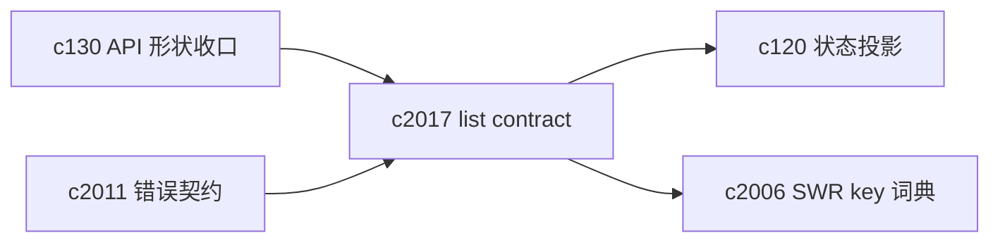
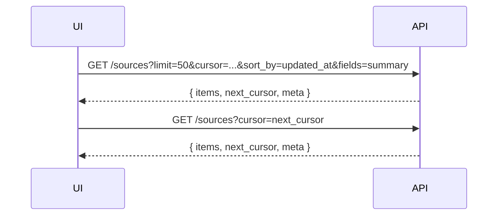

## Why

Workspace 类产品最常见的 API 其实不是“做一件大事”，而是“列出来、筛出来、点进去”。sources/sessions/outputs/tasks/template 这些对象一多，列表接口如果没有统一契约，就会出现一堆隐性成本：

- 前端每个面板都要自己猜分页、排序、筛选怎么拼
- 列表项字段时多时少，导致 generated client 很难稳定使用
- 后端为了兼容不同页面，慢慢堆出一堆“几乎一样但不完全一样”的 endpoint

`c130` 已经在谈 API 形状收口，但“列表契约”值得单独钉一次：它直接决定了 UI 的稳定性，也决定了我们能不能在不破坏前端的情况下做性能优化（索引、缓存、投影）。

## What Changes

- 定义统一 list contract（适用于 sources/sessions/outputs/tasks/…）：
  - 游标分页：`limit` + `cursor`（不依赖 offset，避免大表退化）
  - 稳定排序：明确 `sort_by` + `sort_order`，并保证返回顺序可复现
  - 统一过滤：按对象共同维度（notebook_id、status、type、updated_at 范围等）给出规范字段名
- 定义 field sets（字段集合）：
  - `fields=summary|detail` 或 `include=…` 机制，避免列表默认塞入详情字段
  - 对应到 generated client：让“列表项对象”和“详情对象”边界更清楚
- 统一返回形状：
  - `{ items: [...], next_cursor: string | null, meta: { sort, filters, generated_at } }`
  - 错误统一走 `ErrorResponse`（对齐 `c2011`），并带 `correlation_id`（对齐 `c2002`）
- 明确“列表缓存/投影”的接入点：列表契约稳定后，`c120` 的状态投影与摘要缓存更容易落地，后端也能放心做索引与缓存优化。

## Capabilities

### New Capabilities

- `api-list-contracts-pagination-filtering-and-field-sets`: 定义列表 API 的分页/排序/过滤与字段集合契约。

### Modified Capabilities

- `api-shape-consolidation-and-generated-client-slimming`: 形状收口需要包含 list contract。（`c130`）
- `workspace-api-contract`: workspace 相关列表接口需要统一迁移到新契约。
- `workspace-state-projection-and-summary-cache`: 投影接口需要能复用 list contract 的过滤与字段集合。（`c120`）
- `openapi-error-contract-and-doc-gates`: 错误体与文档 gate 需要覆盖 list endpoints。（`c2011`）

## Impact

- Backend：统一 query builder、索引策略与返回 DTO；减少重复 endpoint；让缓存与投影更容易插入。
- Frontend：SWR key 与 invalidation 更容易标准化（对齐 `c2006`），列表页不再“某个角落永远旧数据”。
- Risk：这是典型的“看起来是重构、实际上会影响到处”的工作；需要明确迁移顺序与 deprecate 策略，避免一次性把前端打崩。

## Dependency Sketch

