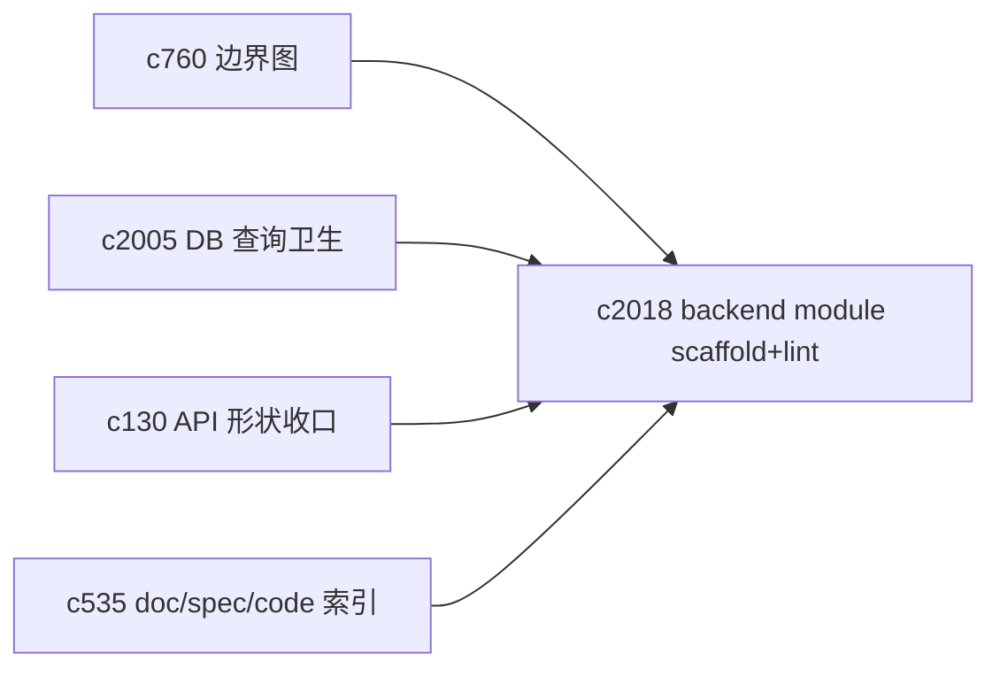
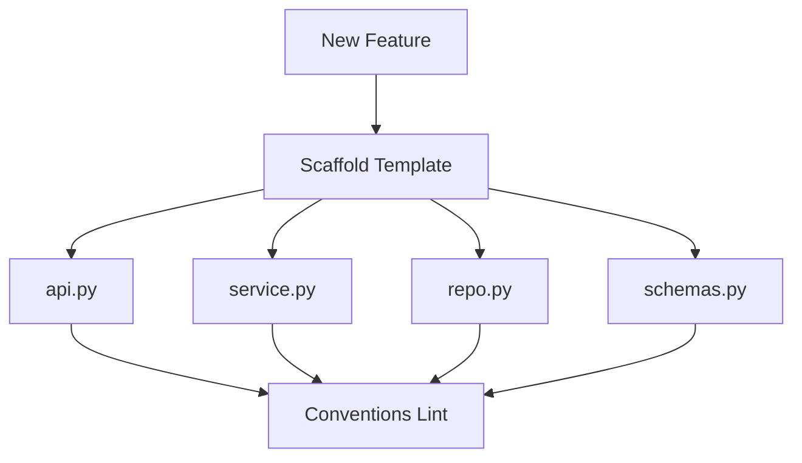

## Why

后端现在的 feature 组织方式其实挺清晰：大多有 `api_*.py`、`service.py`、`repo.py`、`schemas.py`，也能看出“路由层/业务层/数据层”的意图。但项目一旦继续扩展，最容易发生的不是写不出功能，而是“每个新功能都换一种组织法”。到最后，排查 bug 和做重构会越来越靠熟悉代码的人。

`c760` 提的是宏观边界图；这条提案更务实：把 backend 的 feature module 约定落成一套可执行的 scaffolding + lint，让“保持一致”不靠口头提醒。

## What Changes

- 明确 backend feature module 的最小结构与职责边界：
  - `api.py`：只做路由组合与依赖注入，不做业务逻辑
  - `service.py`：业务逻辑与事务边界
  - `repo.py`：查询与持久化（把查询形状集中管理，对齐 `c2005`）
  - `schemas.py`：Pydantic/DTO 与 OpenAPI 形状（对齐 `c130/c2017`）
- 提供 scaffold（模板生成）：
  - 生成上述文件骨架、路由注册片段、基础测试占位
  - 生成时必须写入 capability 名称与 OpenSpec change 引用（对齐 `c535` 的 doc/spec/code link）
- 增加 conventions lint：
  - 禁止 api 层直接 import repo（必须通过 service）
  - 禁止跨 feature 的“直接摸模型”（需要通过明确的 service 或 shared contract）
  - 对明显的“共享逻辑漂移”给出重构建议（比如应该下沉到 `shared/` 或 workspace package）
- 把结果接到日常 guardrails：不追求一口气全量改造，先对新增/改动模块强制，旧模块渐进迁移。

## Capabilities

### New Capabilities

- `backend-feature-module-conventions-and-scaffolding`: 定义后端 feature 结构约定、模板生成与约束 lint。

### Modified Capabilities

- `module-boundary-map-and-dependency-pruning`: 边界图需要能落到“可执行规则”。（`c760`）
- `database-constraints-indexes-and-query-hygiene`: repo 层是落地查询卫生的天然位置。（`c2005`）
- `api-shape-consolidation-and-generated-client-slimming`: schemas/DTO 的组织需要配合 API 形状收口。（`c130`）
- `doc-spec-code-link-index-and-coverage-map`: scaffold 生成时需要写入映射，减少后续补文档成本。（`c535`）

## Impact

- Backend：新功能更容易按同一套路写；重构时更少“牵一发而动全身”；代码 review 更专注在逻辑而不是结构争论。
- Tooling：需要新增一个轻量 scaffold/lint 工具（不一定是大而全的框架）。
- Risk：规则太严会让人烦；需要从“最痛的几条”开始，尽量给出可读的报错与修复建议。

## Dependency Sketch

