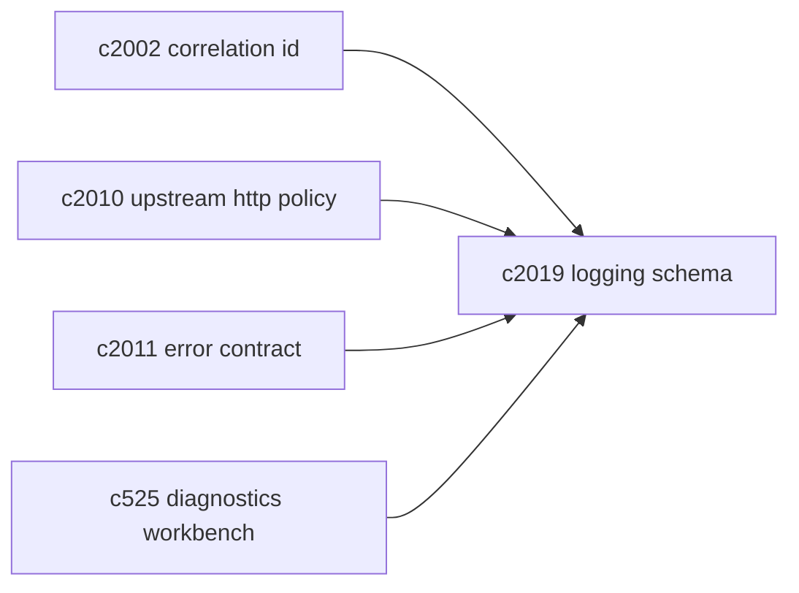
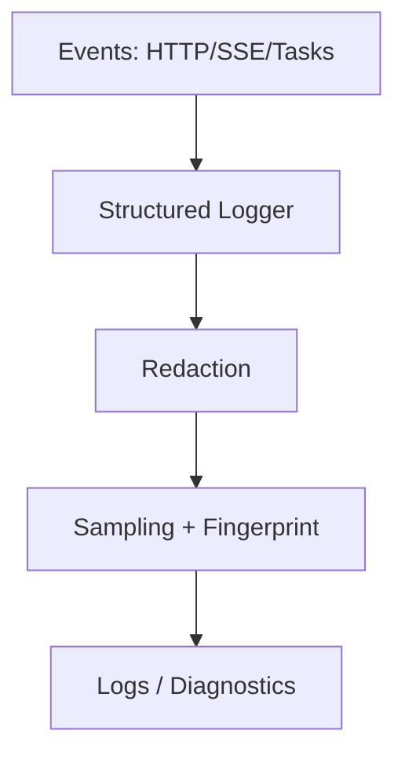

## Why

系统越复杂，越容易出现一种“日志很多但用不上”的状态：字段名不统一、缺少上下文键、偶发错误被海量噪音淹没；更糟的是，偶尔还会把不该写进日志的东西写进去（token、headers、长文本）。

我们在 `c2002` 里把 `correlation_id` 钉住了，但它只是第一步。接下来需要一套更稳的日志契约：哪些字段必须有、哪些字段禁止出现、哪些错误该采样、哪些必须完整保留。否则诊断能力会随着功能增长被稀释。

## What Changes

- 定义统一的结构化日志 schema（backend 为主）：
  - 必填：`timestamp`、`level`、`logger`、`correlation_id`
  - 常用维度：`notebook_id/session_id/task_id/source_id/output_id`
  - 上游维度：`service_key`（openai/searxng/chroma/…）、`http_status`、`timeout_ms`
- 定义 redaction policy：
  - 禁止字段清单（token、cookie、Authorization、原始 prompt、原始来源大文本）
  - 允许字段清单（hash 后的标识、长度、摘要、分类码）
  - 在 debug 模式也要明确边界（不能“debug 就啥都打”）
- 定义 error sampling 与聚合：
  - 对重复、可预期错误做采样（例如某类上游超时）
  - 对首次出现/高风险错误完整保留（包含 stacktrace 与关键上下文）
  - 产出“错误指纹”（fingerprint）用于快速聚类（可对齐 `c780` 的 failure fingerprint 方向）
- 把日志契约与响应契约对齐：
  - `ErrorResponse` 的 `error_code` 与日志里的分类码一致（对齐 `c2011`）
  - SSE/任务事件也能引用同一组字段（对齐 `c2007/c330`）

## Capabilities

### New Capabilities

- `structured-logging-schema-redaction-and-error-sampling`: 定义日志字段契约、脱敏与采样策略。

### Modified Capabilities

- `request-context-and-correlation-ids`: context 字段需要被日志稳定消费。（`c2002`）
- `openapi-error-contract-and-doc-gates`: 错误码需要与日志分类对齐。（`c2011`）
- `http-client-pooling-and-upstream-timeout-policy`: 上游失败需要带上统一字段，方便聚类。（`c2010`）
- `dev-diagnostics-workbench-and-state-dumps`: 诊断工作面可以按 fingerprint/correlation 直达关键日志。（`c525`）

## Impact

- Backend：日志注入与字段标准化、脱敏实现、采样策略；并对关键模块（ingestion、retrieval、tasks、SSE）优先接入。
- Frontend：间接收益（更可解释的错误 + correlation_id），并能在 debug 面中复制“排障码”。
- Risk：采样如果做错会丢线索；需要从“只采样明确可预期的噪音”开始，保守推进。

## Dependency Sketch

