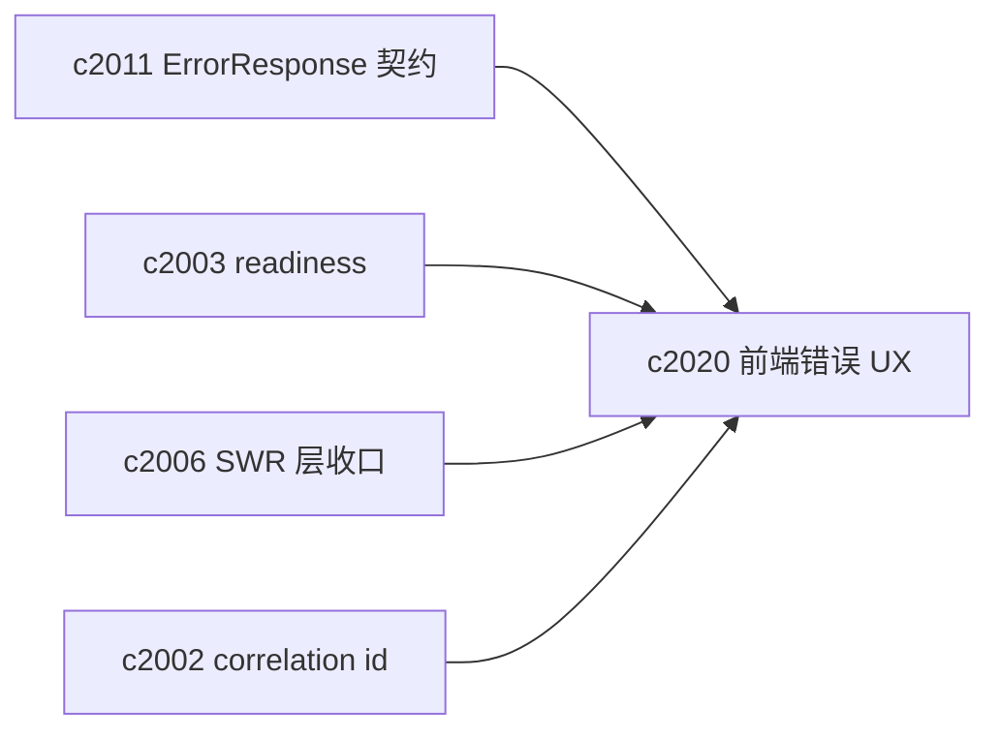
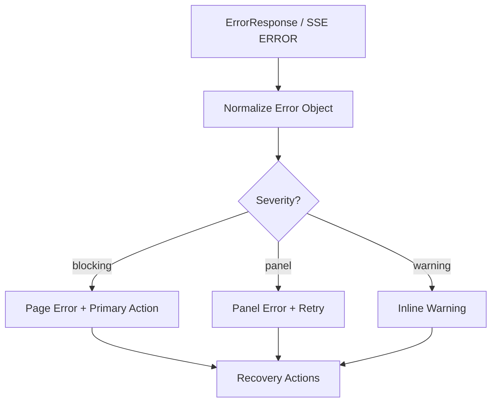

## Why

当系统开始有“可选服务”“降级路径”“可恢复失败”之后，前端最怕的不是报错，而是报错方式不统一：有的地方是一行红字，有的地方是 silent fail，有的地方一直 spinner。用户最后得到的反馈往往只有一句“失败了”，但完全不知道下一步该做什么。

后端已经在往统一错误模型靠（`ErrorResponse`），也开始有 readiness/诊断的雏形。现在缺的是前端这边的一套收口：**同样的错误码、同样的 hint，在任何面板都能以一致方式呈现，并且能直接触发恢复动作**。

## What Changes

- 统一 error surface：
  - 页面级：阻断主路径的错误（带 primary action，例如“重试/打开诊断/切换配置”）
  - 面板级：局部失败（例如某个列表加载失败），不影响其他面板
  - 轻提示：非阻断 warning（例如 degraded 模式、fallback 已生效）
- 统一错误展示数据源：
  - 只要后端返回 `ErrorResponse`，前端就按 `error_code/message/hint/retry_after` 渲染
  - 如果是 SSE error event，同样走一套 UI（对齐 `c2007`）
  - 所有错误都能显示/复制 `correlation_id`（对齐 `c2002`）
- 统一 recovery actions：
  - 把“hint 里的建议”收成可点击动作（例如打开依赖诊断、跳到配置页面、触发 revalidate、降级到 sqlite）
  - 对需要等待的情况（`retry_after`）提供明确倒计时/禁用提示，避免用户狂点
- 在 SWR 层做统一映射：
  - fetcher 把错误转换成同一种 Error 对象（对齐 `c2006`）
  - mutation 失败时能按 error_code 精准 invalidation 或停止重试

## Capabilities

### New Capabilities

- `frontend-error-ux-and-recovery-actions-unification`: 定义前端错误呈现层级、恢复动作与统一映射。

### Modified Capabilities

- `openapi-error-contract-and-doc-gates`: 需要保证错误体稳定，前端才能统一消费。（`c2011`）
- `optional-services-readiness-contract`: readiness 的 degraded/blocked 需要有一致的 UI 落点。（`c2003`）
- `request-context-and-correlation-ids`: correlation id 需要贯穿 UI 错误提示。（`c2002`）
- `frontend-swr-key-registry-and-invalidation`: SWR fetcher/invalidation 与错误处理需要协同。（`c2006`）
- `dev-diagnostics-workbench-and-state-dumps`: 错误卡片要能一键跳到诊断工作台。（`c525`）

## Impact

- Frontend：减少重复的 error handling 代码；用户更少“我只知道它坏了”的时刻；debug 也更快。
- Backend：间接收益（错误码更有价值，hint 更能落地）；并推动错误契约更一致。
- Dependencies：这套错误呈现与恢复动作也会被“工具配置 UI”（`c2121`）和 “bundle fallback 提示”（`c2123`）复用，建议在实现时优先做出可复用的组件与映射层。
- Risk：如果把所有错误都做成“弹窗大提示”，会打断工作；需要分层，优先把阻断类错误做清楚，warning 类保持克制。

## Dependency Sketch

