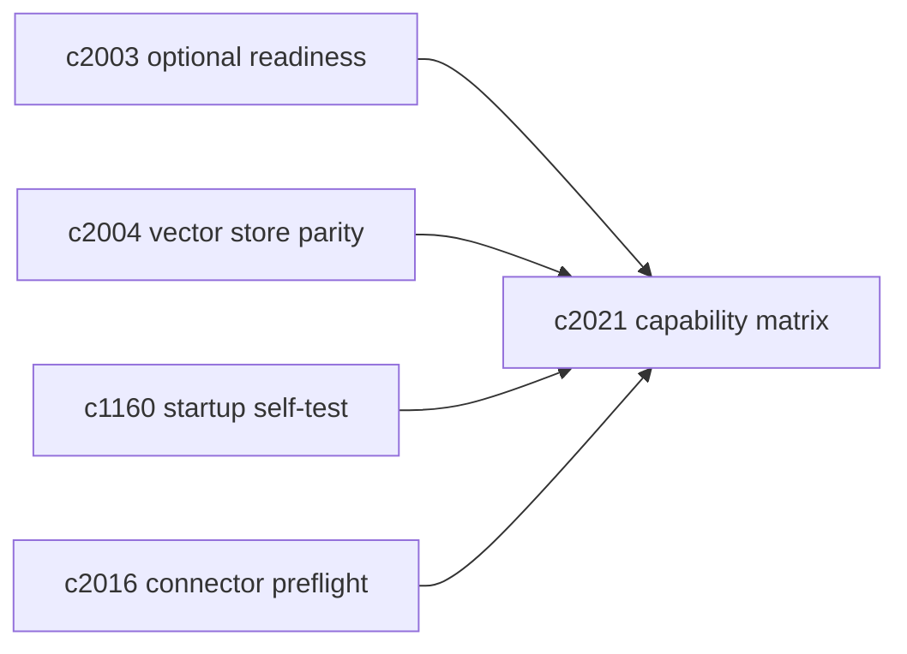
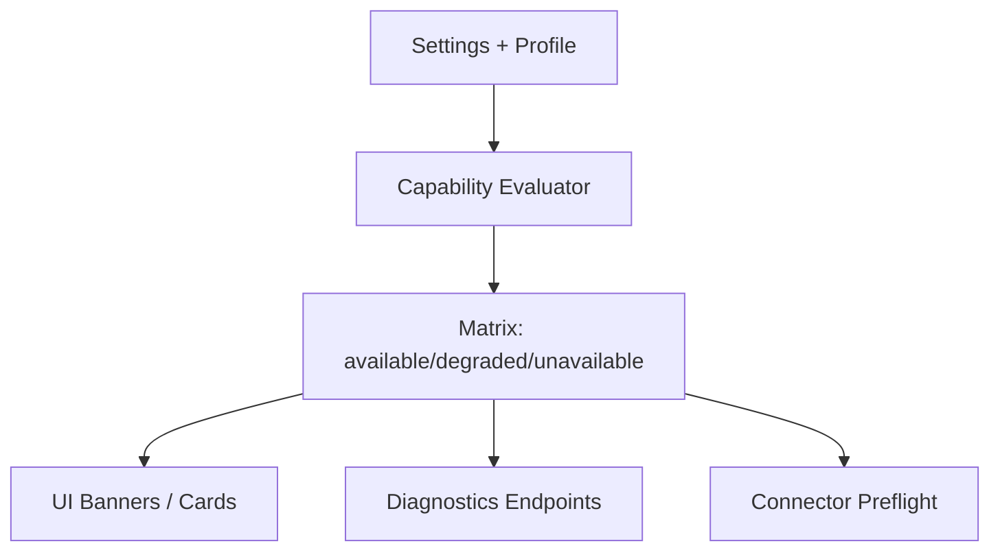

## Why

Crystalith 现在支持多种运行方式（local/hybrid/docker/full），也有不少“可选但影响很大”的依赖（Chroma/Redis/Ollama/SearxNG…）。这对工程很友好，但对用户来说很容易变成困惑：为什么这台机器上“能用”，那台机器上“也能打开但怪怪的”？为什么某个按钮点了没反应？为什么生成速度忽快忽慢？

我们已经有 `c1160`（启动自检）、`c565`（配置漂移解释）、`c2003`（可选服务 readiness），但还缺一个更直观的东西：**一张“能力矩阵”**。它告诉你：当前 profile 能做什么、哪些能力处于 degraded、如何一键补齐。

## What Changes

- 定义 profile capability matrix：
  - 以 profile（local/hybrid/docker/full）+ settings（provider/feature flags）为输入
  - 产出 capability 状态：`available / degraded / unavailable` + 原因码 + 建议动作
- 把 capability matrix 作为一等诊断输出：
  - `GET /health/dependencies` 或专用 endpoint 返回“能力视角”的摘要（不只是服务探测）
  - 前端首页/工作区 banner 可以直接消费（对齐 `c01/c108/c1160`）
- 明确 degraded mode 的行为边界：
  - 不只是提示“缺少 Redis/Chroma”，而是说明“哪些功能会变慢/会关闭/会降级”
  - 对关键能力给出替代路径（例如 chroma 不可用时是否可切 sqlite；search 不可用时是否可用基础检索）
- 让矩阵可复用：
  - 连接器 preflight（对齐 `c2016`）能引用同一套 capability 输出
  - 向量存储 parity（对齐 `c2004`）能把 provider 差异纳入解释

## Capabilities

### New Capabilities

- `profile-capability-matrix-and-degraded-mode-explainer`: 定义 profile 级能力矩阵与降级解释语义。

### Modified Capabilities

- `operational-baseline-checklists-and-startup-self-test`: 启动自检需要从“服务是否可用”升级为“能力是否可用”。（`c1160`）
- `optional-services-readiness-contract`: readiness 需要提供“能力影响面”的映射。（`c2003`）
- `vector-store-contract-and-provider-parity`: provider 差异需要能被矩阵解释。（`c2004`）
- `first-run-success-path`: onboarding 需要能按 profile 给出最短路径建议。（`c01`）
- `workspace-home-and-operating-cockpit`: 首页卡片需要能展示能力状态与一键修复入口。（`c108`）

## Impact

- Backend：新增 capability 评估器、原因码与建议动作；把结果挂到健康检查/诊断接口。
- Frontend：把“缺服务”从技术概念翻译成“你会遇到什么 + 你现在能做什么 + 下一步怎么补齐”。
- Risk：能力矩阵如果太大，会变成新的文档负担；需要从最关键的 10-20 个 capability 开始，逐步扩展。

## Dependency Sketch

