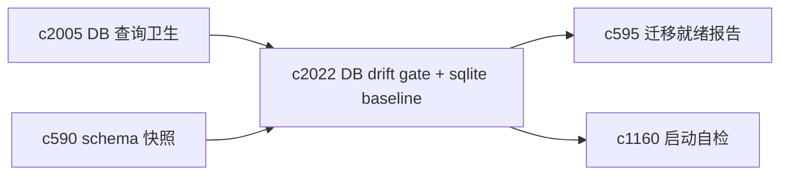
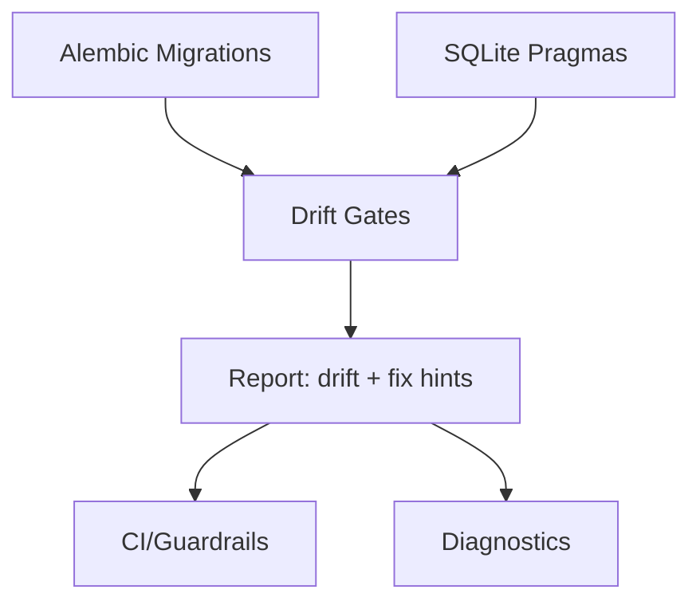

## Why

我们本地开发和默认运行很大概率是 SQLite。它的好处是轻，但坏处也很明显：很多“迁移没写好/索引忘了加/约束不一致”的问题不会立刻爆炸，而是悄悄积累，直到某次升级或某个大工作区才开始疼。

现在后端已经有 Alembic 和启动时 `upgrade_head` 的逻辑，但缺少一套更硬的 drift gate：代码变了、模型变了、迁移没跟上时，能不能在 CI 或本地 guardrail 里直接抓到？另外，SQLite 还有 WAL、foreign key、busy timeout 等一堆 pragma 细节，如果没有“基线”，每个人机器上可能都不一样。

## What Changes

- 定义 migration drift gates：
  - “有没有未应用迁移”“head 是否一致”“是否出现不可回滚的危险操作”等检查项
  - 在 `just check` 或 backend guardrail 中给出稳定入口（不要求跑全量测试）
- 定义 SQLite baselines：
  - 明确必须启用的 pragma（例如 foreign_keys、journal_mode/WAL 策略、busy_timeout）
  - 明确哪些 pragma 只在本地生效、哪些必须被记录进诊断与自检（对齐 `c1160`）
- 把 DB 结构纳入快照体系：
  - schema snapshot（表/索引/约束摘要）进入 `c590` 的 catalog
  - drift gate 能直接给出“哪张表/哪个索引/哪条约束漂了”
- 与更大的迁移治理对齐：
  - drift gate 是日常护栏
  - `c595` 的 readiness report 是中等/大迁移的前置检查单

## Capabilities

### New Capabilities

- `db-migration-drift-gates-and-sqlite-baselines`: 定义迁移漂移检查、SQLite pragma 基线与结构快照。

### Modified Capabilities

- `database-constraints-indexes-and-query-hygiene`: 约束/索引清单需要能被 drift gate 验证。（`c2005`）
- `schema-snapshot-catalog-and-regression-baselines`: DB 结构快照需要进入 catalog。（`c590`）
- `migration-readiness-report-and-rollback-checkpoints`: readiness report 需要复用 drift gate 的结果。（`c595`）
- `operational-baseline-checklists-and-startup-self-test`: 启动自检需要能提示“DB 基线是否符合预期”。（`c1160`）

## Impact

- Backend/Tooling：新增 drift 检查命令、SQLite pragma 初始化与诊断输出；让“迁移缺了/不一致了”更早被抓住。
- Frontend：主要是诊断/维护视图能消费更清晰的 DB 状态（不要求普通用户关心细节）。
- Risk：如果 gate 太严格，会影响迭代速度；需要分层（warning vs blocking），并给出明确修复指令。

## Dependency Sketch

