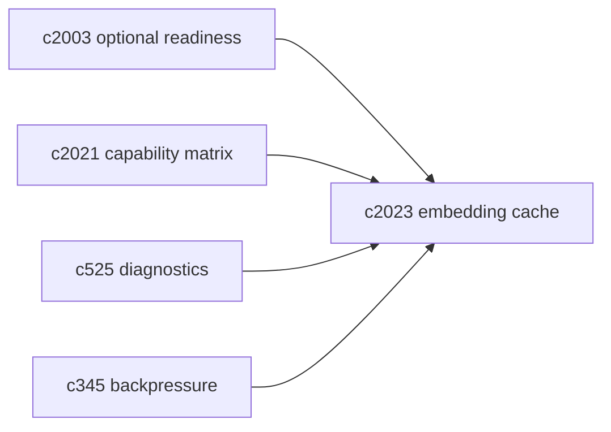

## Why

Embedding 这件事在系统里非常“基础但贵”：来源接入要用，检索/重排要用，很多时候同一段文本会被重复 embed（尤其在重试、局部重跑、或多次导入相似来源时）。代码里已经有 `CachedEmbeddingProvider`，也做了很克制的 guardrail（限制 batch 大小、限制文本长度、用 SHA256 做 key），说明我们已经踩过“缓存一开就把 Redis 打爆”的坑。

问题是：它目前更像一段内部实现——用户不知道它有没有生效，开发者也很难判断“到底省了多少、是不是命中了错误的东西、Redis 不可用时是不是默默退化”。这条提案想把 embedding cache 从“黑箱优化”变成“可解释的工程能力”。

## What Changes

- 定义 embedding cache policy（写进 spec，而不是只在代码里）：
  - key 组成（provider + model + text hash）
  - TTL 与命中边界
  - guardrail：`max_texts`、`max_chars`、批量/长文本直接 bypass 的原因码
- 定义 degraded 行为：
  - Redis 不可用时明确 `cache_status=BYPASS(reason=redis_unavailable)`，不影响主路径
  - 在诊断面能看见“缓存没开/没命中/被 guardrail 跳过”的原因
- 暴露可用的统计信号：
  - hit/miss、unique key 数量、cache get/set 耗时、估算节省时延
  - 这些信号可挂到 task/run 的事件时间线（对齐 `c330`）或 dev diagnostics（对齐 `c525`）
- 与可选服务 readiness 打通：
  - embedding cache 明确依赖 Redis；readiness 提示里要能说明“不开 Redis 会有什么影响”（对齐 `c2003/c2021`）

## Capabilities

### New Capabilities

- `embedding-cache-policy-and-visibility`: 定义 embedding 缓存策略、降级语义与可观测输出。

### Modified Capabilities

- `optional-services-readiness-contract`: Redis readiness 需要能映射到 embedding cache 的能力影响。（`c2003`）
- `profile-capability-matrix-and-degraded-mode-explainer`: capability matrix 需要包含 embedding cache。（`c2021`）
- `dev-diagnostics-workbench-and-state-dumps`: 诊断工作台需要能看到缓存统计与 bypass 原因。（`c525`）
- `concurrency-budgets-and-backpressure-visibility`: 高并发 ingestion 下缓存命中率会影响背压。（`c345`）

## Impact

- Backend：补配置与状态输出、补指标采集与诊断入口；必要时把缓存统计挂到任务事件。
- Frontend：诊断面/性能提示更直观（不要求普通用户理解 Redis，只要知道“为什么慢、怎么变快”）。
- Risk：缓存很容易被滥用；必须坚持 guardrail，宁愿少命中，也不要把 Redis 变成系统瓶颈。

## Dependency Sketch



```mermaid
flowchart TD
  T[Texts] --> K[Keys (hash)]
  K --> G[get_many]
  G --> HIT{Hit?}
  HIT -->|Yes| OUT[Return vectors]
  HIT -->|No| EMB[Embed missing]
  EMB --> SET[set_many + TTL]
  SET --> OUT
```
