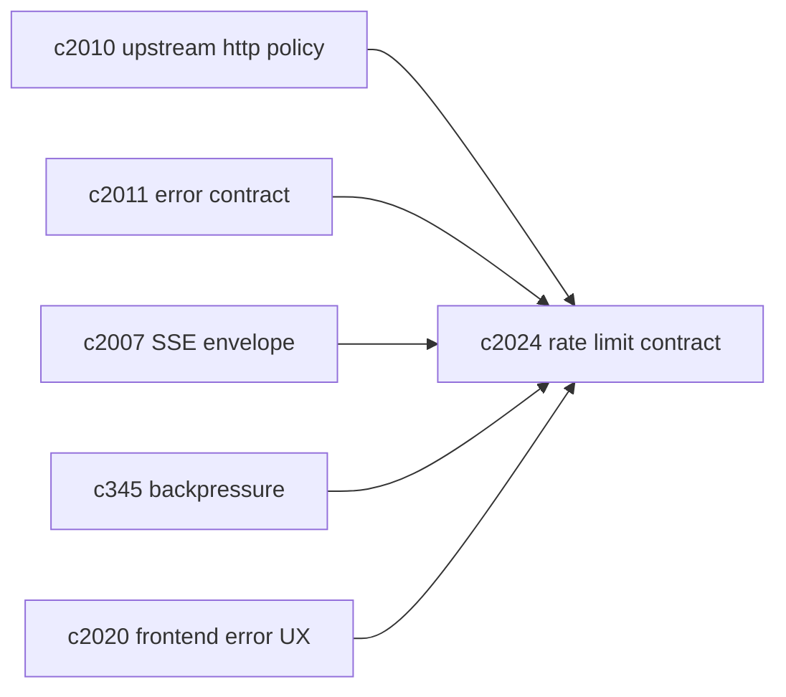
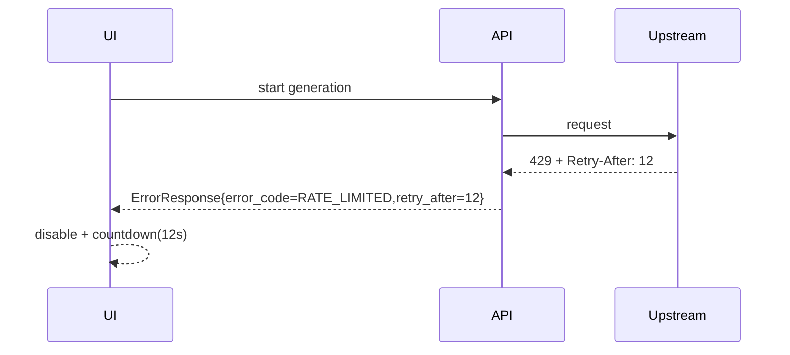

## Why

只要系统开始跑长任务、批量接入或频繁检索，迟早会撞上限流：OpenAI 的 429、搜索上游的 429、甚至是本地服务的资源限额。现在代码里已经有 `retry_after` 的解析和 `ErrorResponse` 字段，但限流这件事仍缺一份“统一说法”：

- 什么时候算 rate limited？哪些上游信号要映射为 429？
- `Retry-After` 到底该怎么传递给前端？SSE 断了时怎么办？
- 用户在 UI 上看到的应该是什么：立刻重试？排队？等待多久？

如果不把这一层钉住，限流会被表现成各种“偶发失败”，既伤体验，也让排障变慢。

## What Changes

- 定义 rate limit contract：
  - 标准化 `RATE_LIMITED` 错误码与细分原因（upstream_429 / local_budget / queue_pressure）
  - 统一 `retry_after` 的来源与优先级（上游 header > 本地策略）
- 统一传播路径：
  - 普通 HTTP：`ErrorResponse.retry_after` + response header `Retry-After`
  - SSE：标准化 error event（对齐 `c2007`），并携带 `retry_after`，避免“连接断了就当作失败”
- 统一退避策略：
  - 后端对上游调用做 jitter backoff（对齐 `c2010`）
  - 前端对用户动作做“可见等待”（倒计时 + 禁用按钮），避免狂点
- 与背压/预算打通：
  - 本地并发预算触发的等待也走同一套“可解释等待”语义（对齐 `c345`）

## Capabilities

### New Capabilities

- `upstream-rate-limit-handling-and-retry-after-contract`: 定义限流分类、Retry-After 传播与退避行为。

### Modified Capabilities

- `http-client-pooling-and-upstream-timeout-policy`: 上游 429/限流需要统一映射与退避。（`c2010`）
- `openapi-error-contract-and-doc-gates`: `retry_after` 必须成为稳定契约。（`c2011`）
- `sse-event-schema-and-stream-client`: SSE error event 需要带 retry_after。（`c2007`）
- `concurrency-budgets-and-backpressure-visibility`: 背压等待与限流等待需要统一解释。（`c345`）
- `frontend-error-ux-and-recovery-actions-unification`: 前端要能显示倒计时与建议动作。（`c2020`）

## Impact

- Backend：统一 429 映射、Retry-After 解析与回写；对上游调用与任务执行做一致的 backoff。
- Frontend：统一的“等待/重试”交互；错误不再像随机失败。
- Risk：退避策略如果过于激进，会拖慢吞吐；如果过于保守，会制造更多 429。需要可配置，并在诊断面可见。

## Dependency Sketch

