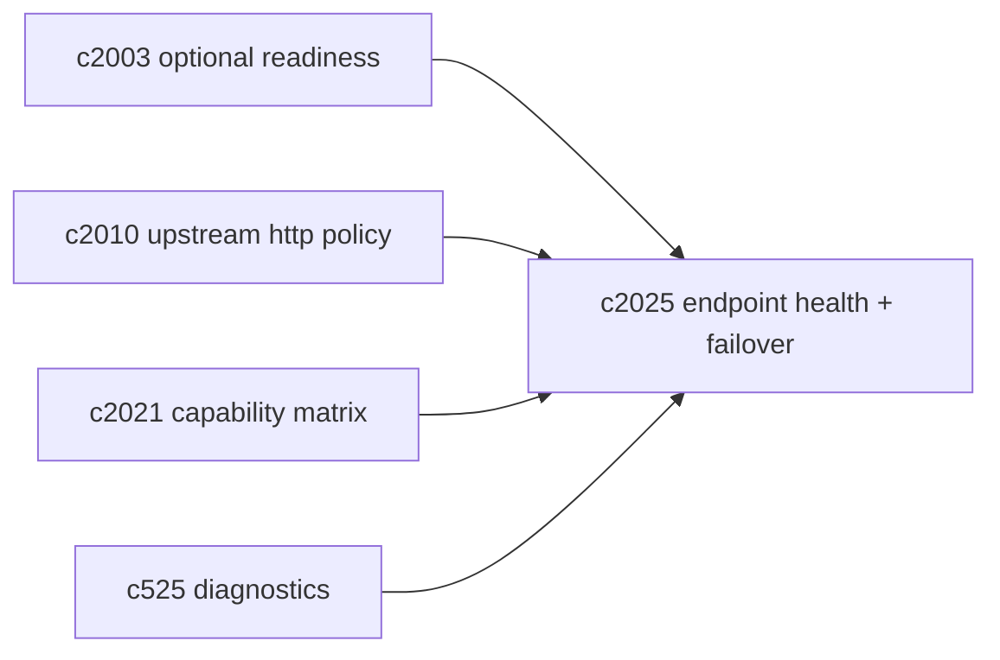
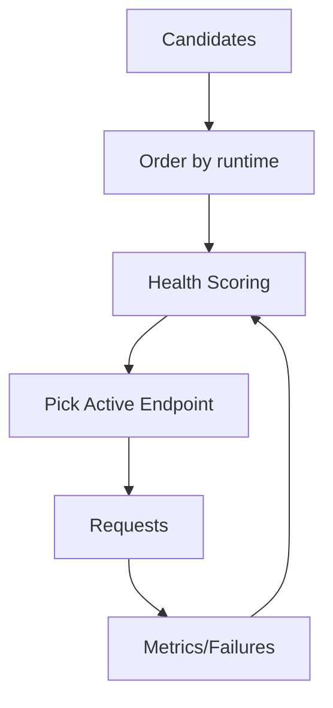

## Why

现在配置里已经大量使用 “endpoint candidates” 的模式：Redis、Chroma、Ollama、SearxNG，甚至模型 provider 也会有多端点/多宿主可选。代码里也有一套按运行环境排序的候选选择（host vs docker internal），还有零散的 probe 与 monitor。

但“能选出来一个端点”只解决了最开始那一步。真正会让系统变稳的，是后面两件事：

1) 端点开始不稳定时，能不能自动切到更好的候选
2) 切换这件事能不能被解释（不然就是玄学：为什么突然慢、为什么突然失败）

这条提案想把 endpoint candidates 从“静态列表”升级成“带健康评分的可解释路由”。

## What Changes

- 定义 endpoint health model：
  - `last_success_at/last_failure_at`
  - `recent_success_rate`（滚动窗口）
  - `p50/p95 latency`（轻量估算即可）
  - `cooldown_until`（失败后短暂冷却，避免反复打同一个坏端点）
- 定义 failover routing：
  - 先按 `order_endpoint_candidates` 得到默认优先级
  - 再叠加 health score，把“最近稳定”排到前面
  - 对同一 service_key（redis/chroma/ollama/searxng/…）保持独立评分，避免互相污染
- 统一 probe/观测入口：
  - readiness monitor 复用健康模型（对齐 `c2003`）
  - 上游 http client 复用失败/延迟统计（对齐 `c2010`）
- 暴露解释面：
  - 状态接口返回“当前选中端点 + 为什么选它 + 备用候选情况”
  - 前端诊断能看到“切换发生在什么时候、切换前后的错误码/延迟”（对齐 `c525/c2021`）
  - 具体的 UI 落点与 pin/unpin 的交互契约可以在 `c2127` 里收口，避免解释面只停在后端描述。

## Capabilities

### New Capabilities

- `model-endpoint-health-scoring-and-failover-routing`: 定义端点健康评分、failover 路由与可解释输出。

### Modified Capabilities

- `optional-services-readiness-contract`: readiness 探测需要消费健康模型，而不是只做一次性 probe。（`c2003`）
- `http-client-pooling-and-upstream-timeout-policy`: 上游失败与时延需要回写到健康评分。（`c2010`）
- `profile-capability-matrix-and-degraded-mode-explainer`: capability matrix 需要能解释端点选择与降级。（`c2021`）
- `dev-diagnostics-workbench-and-state-dumps`: 诊断工作台需要能看到端点健康与切换记录。（`c525`）

## Impact

- Backend：新增健康评分存储（可先内存，后续可持久化）、统一统计采集、路由选择器与状态输出。
- Frontend：诊断面更可解释；当某个端点不稳时，用户更少被“偶发失败”折磨。
- Risk：自动切换如果做得太聪明，会制造更难理解的行为；必须提供解释，并允许在配置里固定端点（用于排障或特殊环境）。

## Dependency Sketch

