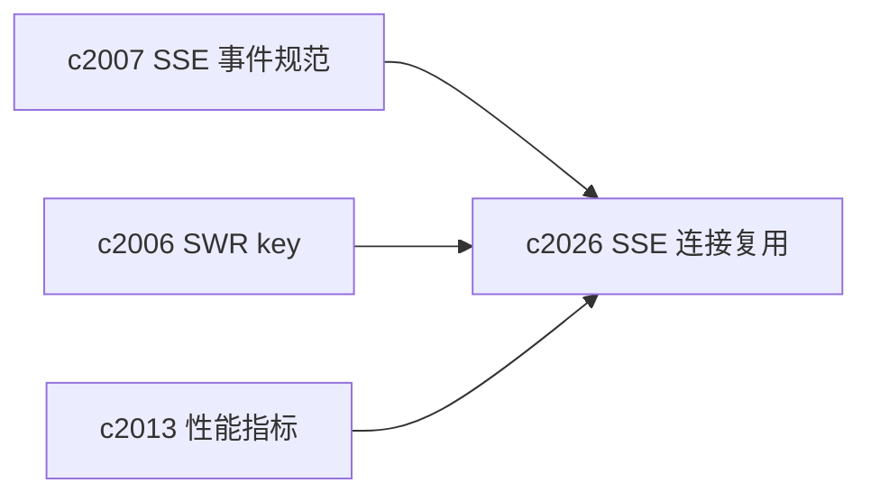
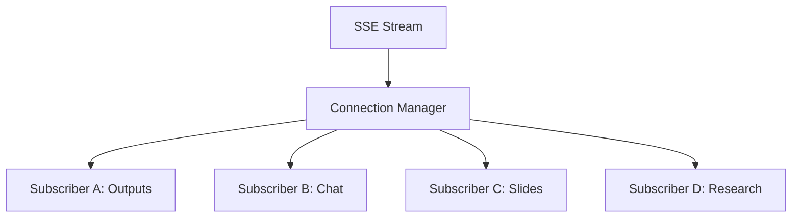

## Why

现在前端已经有多处在开 SSE：输出队列、chat、slides、research 等。每个功能都自己管理一条连接，短期没问题，等面板变多、同屏内容变多，就会出现一些典型“前端工程债”：

- 连接数悄悄变多（同一个 session 开了好几条 SSE）
- 断线重连策略不一致，有的疯狂重连，有的直接挂死
- 页面切换/对话框关闭时，连接未必能可靠回收

这类问题最后表现出来通常很隐蔽：浏览器占用变高、服务端连接数飙升、SSE 事件到达变慢、甚至用户以为“系统卡住了”。我们已经在 `c2007` 里把 SSE 协议与 client 统一了，但还需要在前端更进一步：**把连接管理从“每个功能自己开”变成“共享、可复用、可限额”。**

## What Changes

- 定义 SSE connection manager（前端侧）：
  - 同一 `notebook_id/session_id` 下，复用同一条底层连接（或可控的少量连接）
  - 按 channel/topic 分发事件给不同订阅者（multiplex）
  - 统一关闭时机：页面卸载、面板隐藏、对话框关闭、用户显式停止
- 加入 resource guards：
  - 最大连接数上限（超出时给出可见提示/自动降级）
  - 静默超时检测（长时间没 event 的连接判定为“可能挂了”并重建）
  - 断线重连有全局 backoff，避免局部 hook 自己乱重试
- 与数据层/性能层对齐：
  - SSE 事件优先做 SWR cache patch（对齐 `c2006`）
  - performance marks 能度量“首事件时间/重连次数/连接数”（对齐 `c2013`）

## Capabilities

### New Capabilities

- `frontend-sse-connection-multiplexing-and-resource-guards`: 定义前端 SSE 连接复用、事件分发与资源护栏。

### Modified Capabilities

- `sse-event-schema-and-stream-client`: 统一的事件 envelope 与 client 是复用的前置。（`c2007`）
- `frontend-swr-key-registry-and-invalidation`: SSE patch 策略需要稳定落到 SWR 层。（`c2006`）
- `frontend-performance-marks-and-web-vitals-gates`: 需要新增 SSE 相关指标与回归信号。（`c2013`）

## Impact

- Frontend：减少重复 EventSource/stream client 代码；更少连接泄漏；事件更快更稳；性能更可控。
- Backend：间接受益（连接数更少、压力更稳定、debug 更容易）。
- Risk：multiplex 如果设计不好，会让事件路由更难理解；需要清晰的 channel 命名与订阅生命周期规则。

## Dependency Sketch

