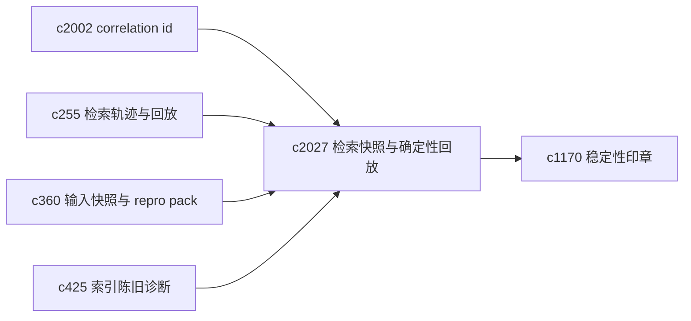
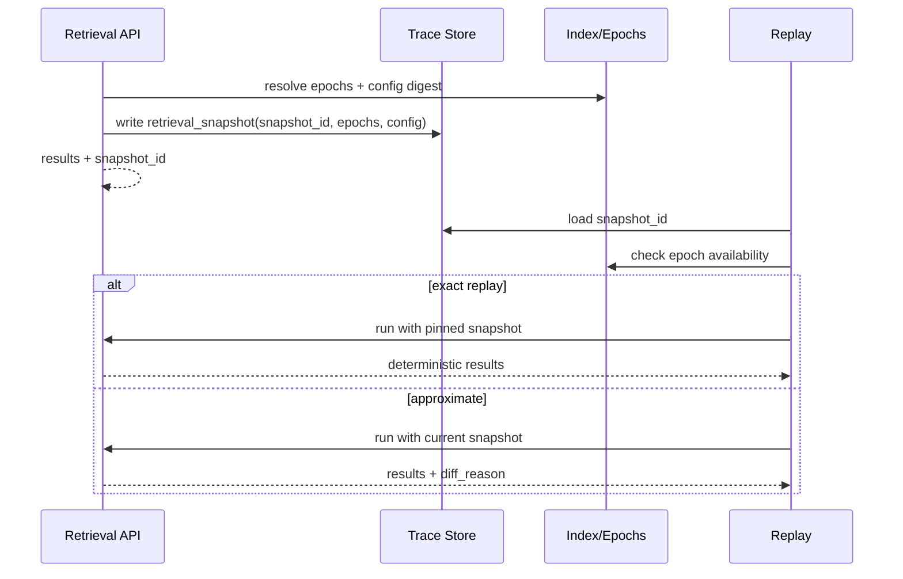

## Why

现在我们能拿到一组检索结果，但“这次检索到底基于哪个数据时点”仍然不够清晰。

代码里其实已经有暗示：检索装配缓存 key 里带了 `sources_epoch` / `vector_epoch`。问题是这些信息停留在内部实现，没法被 query trace、replay、回归测试直接消费。

只要来源在刷新、切块策略在调、向量在重建，用户就会遇到同一句话：为什么这次和上次不一样。我要把“检索时点”变成一个正式对象：能写进 trace、能用于回放、能参与稳定性校验。

## What Changes

- 定义 `retrieval_snapshot`（检索快照）：
  - `snapshot_id`：稳定标识（可用于回放、诊断、bug 报告）
  - `sources_epoch` / `vector_epoch`：来源与向量索引时点
  - embedder / model 版本摘要（用于解释“为什么 embedding 变了”）
  - retrieval 配置摘要（lens、top_k、min_score、fusion、seed_digest、预算等）
  - `created_at`
- 检索链路在返回结果时同时返回 `retrieval_snapshot`（或至少返回 `snapshot_id` + 关键字段），并写入：
  - `c255` 的 retrieval query trace
  - `c360` 的 run input snapshot / repro pack
- 定义 deterministic replay 语义：
  - **可精确回放**：snapshot 依赖的 epochs 仍可定位（或可映射到同一份索引快照）
  - **只能近似回放**：epochs 已变化，必须返回“差异原因 + 影响范围”，避免制造假一致性
- 让 staleness diagnostics 能直接消费 snapshot：一旦结果来自旧 snapshot，要能解释“旧在哪里、会影响什么”。

## Capabilities

### New Capabilities

- `retrieval-snapshot-ids-and-deterministic-replay`: 定义检索快照、snapshot_id 与可回放边界。

### Modified Capabilities

- `retrieval-query-trace-and-search-replay`: trace/replay 需要记录并消费 snapshot。（`c255`）
- `search-index-incremental-refresh-and-staleness-diagnostics`: staleness 需要能基于 snapshot 解释。（`c425`）
- `run-input-snapshots-and-repro-packs`: repro pack 需要带上 snapshot。（`c360`）
- `reproducibility-seals-and-result-stability-checks`: 稳定性检查需要拆出“检索侧波动”。（`c1170`）
- `request-context-and-correlation-ids`: snapshot 与回放要能串到同一次请求。（`c2002`）

## Impact

- Backend：需要把 epochs、embedder/model 摘要、检索配置摘要统一打包，并在 trace/replay/诊断里贯通。
- Frontend：在搜索解释、运行详情与回放视图里展示 snapshot 与“可否精确回放”的提示。
- Risk：如果 snapshot 语义定义得太“像承诺一致性”，会反过来伤信任；所以必须把“近似回放”讲清楚。

## Dependency Sketch

