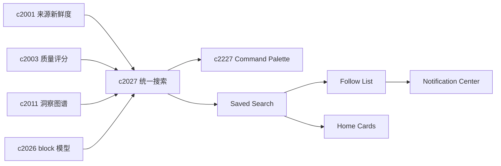

## Why

现在来源、Notebook、输出、模板都在长，但检索入口还没有正式收口。用户一旦开始积累内容，产品体验很快会被一句话定义：搜得到还是搜不到。没有统一搜索，前面做的 readiness、质量、图谱和模板都很难真正复利。

真正有价值的搜索，很多不是一次搜完就结束，而是会反复回来。没有保存搜索和关注列表，用户每次都得重新拼一遍条件，时间一长就会放弃那些本来很有复利的筛选。

> 合并说明：本提案合并了原 `saved-searches-smart-filters-and-follow-lists` 的全部内容。

## What Changes

- 为 sources、chunks、notebooks、artifacts、templates 提供统一搜索入口和统一结果模型。
- 引入 rerank、过滤和结果解释，让搜索不只是“列出命中项”，而是能说明为什么排在前面。
- 支持按标签、时间、新鲜度、可信度、状态等信号组合筛选。
- 搜索结果要能稳定跳到具体 block、来源片段或产物节点。
- 定义 saved search，保存稳定可复用的搜索条件、排序和过滤组合：
  - 每条 saved search 有唯一 ID、名称、条件表达式和创建时间
  - 支持参数化搜索（如日期占位符 `$today - 7d`），让同一搜索随时间自动滚动
  - 搜索可标记为"私人"或"团队共享"，团队搜索可被他人 fork 后修改
- 支持 smart filter，让搜索具备结构化过滤能力：
  - 时间范围、来源质量分、标签和工作桶、对象类型
  - 多个 smart filter 可组合为 filter preset，一键切换常用筛选视角
- 增加 follow list，让用户关注一组主题、实体或对象集合：
  - 关注列表自动追踪变化（新增、更新、删除），按变化频率汇总
  - 变化通知可配置推送到 notification center 或仅在首页展示
- 让保存搜索既能服务全局搜索页，也能作为首页卡片和每日回看的数据源

## Capabilities

### New Capabilities

- `unified-search-query-and-rerank`: 定义工作区内统一检索、排序和结果跳转语义。
- `saved-searches-smart-filters-and-follow-lists`: 定义保存搜索、智能筛选和关注列表语义。

### Modified Capabilities

- `source-readiness-and-freshness-hub`: 搜索需要消费来源健康和新鲜度信号。
- `workspace-eval-center`: 质量信号需要能影响排序和过滤。
- `cross-notebook-insight-graph`: 图谱关系可以作为 rerank 的辅助因子。
- `notebook-content-model-and-block-editor`: 结果跳转需要落到具体 block。
- `workspace-home-and-operating-cockpit`: 首页需要能挂接保存搜索结果。
- `workspace-notification-center-and-snooze-rules`: 关注列表变化需要能进入提醒流。

## Impact

- Backend：需要统一查询面、索引策略和 rerank 装配。
- Frontend：需要新建全局搜索入口、结果页和 block 级跳转体验。
- Product：这是把内容积累真正变成资产的关键一步。

## Dependency Sketch

