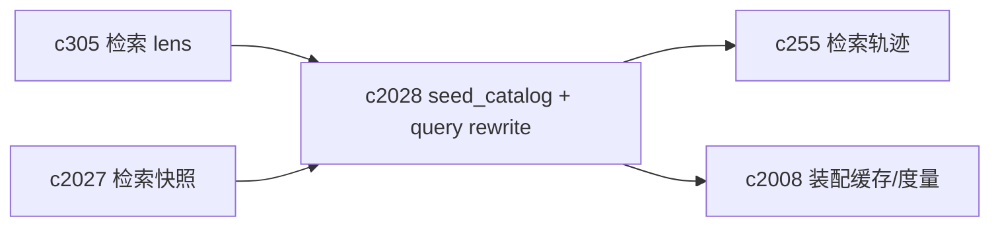
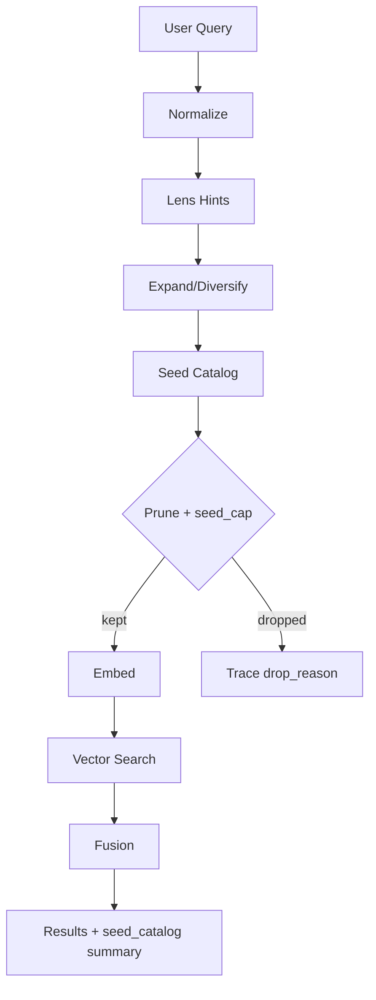

## Why

我们现在的检索已经在做“多查询”了（代码里会把 seed 拆成多条 query 去 embed，再把结果融合）。但用户看到的仍然是一句“我搜到了这些”，中间发生了什么完全不可见。

这会带来两个很实际的问题：

1) **体验上不踏实**：用户不知道系统到底搜了几次、搜的是什么、为什么这次结果偏向某一类。
2) **工程上不好控**：我们想调 multi-query 的策略，只能靠结果感觉；出了问题也缺少可解释的证据链。

我希望把“query 改写 / seed 选择”正式化：既能被 lens（意图预设）复用，也能被 query trace 和回放记录下来。

## What Changes

- 定义 `seed_catalog`：把一次检索可能用到的 seed 统一收口成可解释清单
  - `seed_id` / `seed_type`（user_prompt / output_type_hint / lens_hint / auto_rewrite / negative_query 等）
  - `text`（实际送去 embedding 的文本）
  - `reason`（为什么生成它、为什么选中它）
  - `enabled`（是否被策略启用）
- 定义 query rewrite pipeline（不要求“每次都改写”，重点是把阶段和边界说清楚）：
  - normalize（语言/大小写/空白/噪声）
  - expand（同义、别名、实体展开）
  - diversify（按 lens 生成不同角度：概览/证据/反例/时间变化）
  - prune（去重与 seed_cap 策略）
- 把 `seed_catalog` 写入 `c255` query trace，并作为 replay 的输入之一（对齐 `c2027` snapshot 语义）。
- 前端在“解释检索结果”时可选择展示：本次用了哪些 seed、哪几条被裁掉、为什么。

## Capabilities

### New Capabilities

- `query-rewrite-seed-catalog-and-explainability`: 定义 seed_catalog、query 改写链路与可解释字段。

### Modified Capabilities

- `retrieval-intent-presets-and-query-lens`: lens 需要声明默认 seed 策略。（`c305`）
- `retrieval-query-trace-and-search-replay`: trace/replay 需要记录 seed_catalog。（`c255`）
- `unified-search-query-and-rerank`: 搜索解释层需要能展示 seed。（`c43`）
- `retrieval-context-assembly-cache-and-metrics`: 缓存 key/命中解释需要对齐 seed_digest。（`c2008`）

## Impact

- Backend：需要把 seed 生成逻辑从“隐式拼字符串”升级为可枚举对象，并把选择/裁剪过程记录下来。
- Frontend：需要一个轻量的“本次检索怎么搜的”展示面（默认可折叠，别吓到普通用户）。
- Risk：seed 如果记录得太细，会让 trace 变大；需要明确采样/截断策略。

## Dependency Sketch

