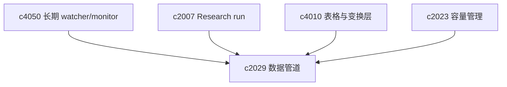

## Why

`c4050` 已经把长期监测和增量简报打开了，但它更偏“有变化就提醒”。如果后面要接结构化数据、计算和图表，就还需要一层正式的数据管道语义：什么时候跑，失败了怎么办，回填怎么算，哪些结果是物化产物。

## What Changes

- 引入 pipeline 对象，明确输入、步骤、调度、物化结果和失败恢复语义。
- 支持定时运行、事件触发和 backfill，不让“补历史数据”继续靠手工重跑。
- 让 pipeline 与 Notebook、table、chart、briefing 共享同一套产物挂接方式。
- 把成本、容量和失败原因纳入正式状态，而不是只留在后台日志里。

## Capabilities

### New Capabilities

- `data-pipelines-scheduling-and-backfills`: 定义数据管道、调度、回填和物化结果语义。

### Modified Capabilities

- `recurring-monitoring-and-delta-briefings`: 监测结果需要能触发正式 pipeline。
- `agentic-research-runs`: run 需要与 pipeline 协同，而不是互相平行。
- `table-view-dataframes-and-transformations`: 表格结果需要支持被物化和重放。
- `large-workspace-performance-and-capacity-management`: 需要把 pipeline 负载纳入容量视图。

## Impact

- Backend：需要调度器、运行历史、backfill 编排和物化存储。
- Frontend：需要 pipeline 列表、运行历史、失败重试和成本提示。
- Product：这条线会把“研究工作流”往“持续数据工作流”再推一步。

## Dependency Sketch

