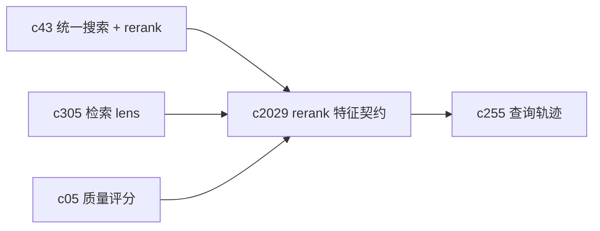

## Why

`c43` 里已经写过“要有 rerank 和结果解释”，但如果不把 rerank 的特征、权重和解释做成契约，最后很容易变成：

- 代码里悄悄加了几个 if/else，排序变了，但没人能说明白“为什么”；
- 调参只能靠体感，回归也不知道应该盯哪些维度。

对检索来说，“能解释排序”不是锦上添花，是让用户愿意信它的底线。尤其当我们引入 lens、multi-query、去重折叠之后，结果的形成过程会越来越复杂。

## What Changes

- 定义 rerank feature contract：
  - `feature_name`（例如 similarity、freshness、quality、source_ready、dedup_penalty、lens_match）
  - `value` / `normalized_value`
  - `weight`（策略权重）
  - `contribution`（对最终分数的贡献，允许为空）
  - `reason_code`（用于 UI 文案：为什么加分/扣分）
- 定义 `rerank_explain`：
  - top reasons（只挑 3~5 条最“解释得动”的理由）
  - dropped reasons（为什么某条结果被过滤/折叠/降权）
- 把 rerank 的关键输出写入 `c255` query trace，并能被 replay 回放对齐。
- 前端提供 debug/解释面：
  - 默认只显示“主要理由”，不把用户拖进特征工程
  - 高级模式可展开看 feature 明细（用于调试与评测）

## Capabilities

### New Capabilities

- `rerank-feature-contract-and-debug-explanations`: 定义 rerank 特征、解释载荷与前端呈现边界。

### Modified Capabilities

- `unified-search-query-and-rerank`: 搜索结果需要能带上 rerank 解释。（`c43`）
- `retrieval-intent-presets-and-query-lens`: lens 需要声明它影响哪些 feature/weight。（`c305`）
- `retrieval-query-trace-and-search-replay`: trace/replay 需要记录 rerank 摘要。（`c255`）
- `quality-scorecards-and-eval-center`: 质量信号需要能作为 feature 输入。（`c05`）
- `request-context-and-correlation-ids`: rerank 解释要能按同一次请求串起来。（`c2002`）

## Impact

- Backend：需要把“排序策略”从隐式逻辑抽出来，形成可记录的 feature 向量与解释摘要。
- Frontend：需要在搜索/检索结果页加一个可折叠的解释入口，并能链接到 query trace。
- Risk：解释如果和实际排序不一致，会更伤信任；所以要么自动从 feature 输出生成解释，要么强约束两者同源。

## Dependency Sketch



```mermaid
flowchart TD
  R[Raw retrieval results] --> FE[Feature Extract]
  FE --> RS[Rerank Score]
  RS --> EX[Explain (top reasons + drops)]
  RS --> OUT[Ranked results]
  EX --> OUT
  OUT --> TR[Query trace record]
```
