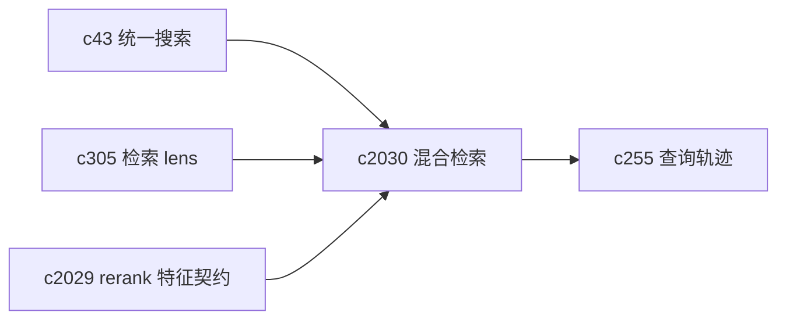
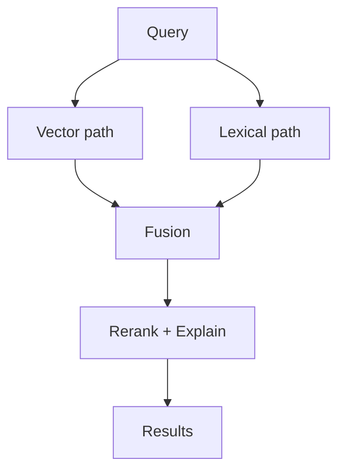

## Why

向量检索很强，但它有两个天然短板：

- **精确匹配**：人名、编号、代码片段、罕见缩写，有时候就需要“字面命中”。
- **故障兜底**：embedder 限流、上游抖动、向量库临时不可用时，我们现在很容易直接变成“没检索到”。

我不想把系统变成“为了混合而混合”，但至少应该有一个可控的 lexical fallback；同时把 fusion 与解释也收口进契约（否则 debug 会非常痛苦）。

## What Changes

- 引入 lexical retrieval（可实现为 SQLite FTS / Postgres tsvector / 其他组件，先在契约层收口语义）：
  - 支持关键词、短语、AND/OR、可选的字段限定（title/url/text）
  - 返回 chunk 命中与片段高亮（用于 UI 预览与引用）
- 定义 hybrid fusion：
  - 支持 vector-only / lexical-only / hybrid 三种模式（可由 lens 或系统策略决定）
  - 融合策略：RRF / 加权归一化 / 先 lexical 召回再向量 rerank（不强绑实现）
  - 输出需要能解释“这条结果是被哪种引擎推上来的”
- 定义 fallback policy：
  - vector 失败或被限流时，自动降级 lexical（并返回 reason_code）
  - lexical 结果不足时，补 vector（并返回 coverage_hint）
- 与 `c2029` 对齐：无论哪种引擎，最后都走统一 feature/rerank/解释出口。

## Capabilities

### New Capabilities

- `hybrid-retrieval-lexical-vector-fusion-and-fallbacks`: 定义 lexical 检索、混合融合与降级兜底语义。

### Modified Capabilities

- `unified-search-query-and-rerank`: 搜索需要能选择检索引擎并解释来源。（`c43`）
- `retrieval-intent-presets-and-query-lens`: lens 需要能表达“精确查找/引用查证”这类意图。（`c305`）
- `retrieval-query-trace-and-search-replay`: trace/replay 需要记录引擎选择与融合策略。（`c255`）
- `rerank-feature-contract-and-debug-explanations`: 混合检索需要统一解释出口。（`c2029`）

## Impact

- Backend：需要新增 lexical 索引/查询能力，以及与向量结果的融合与解释；并把失败降级变成“可见的策略”，不是隐藏的 if。
- Frontend：结果列表可以在必要时展示“vector/lexical/hybrid”标记与简短解释（默认可隐藏）。
- Risk：双引擎会引入更多不可控变量；所以第一步要把 trace/解释/回放接好，别先上复杂 UI。

## Dependency Sketch

