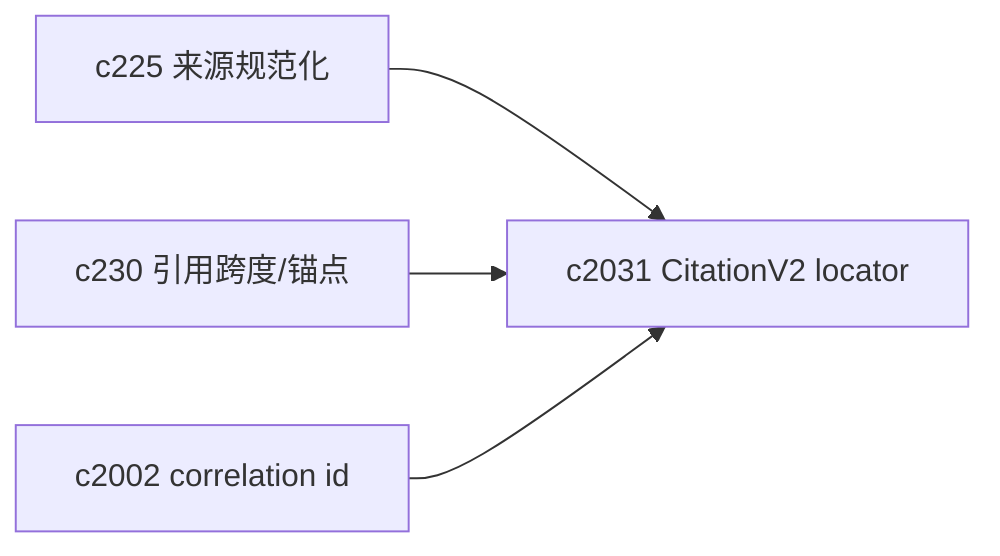
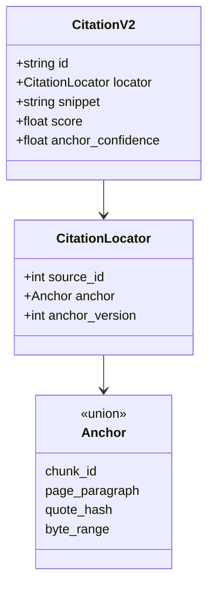

## Why

当前引用以 chunk 为主（`chunk_id` / `chunk_index`），这在“同一次检索到同一份切块”里很好用，但只要经历下面任意一种变化，引用就容易开始飘：

- 来源重新抓取、解析器升级、切块策略调整；
- 近似重复来源合并（canonicalization）之后，原来的 source/chunk 被替换；
- 向量重建导致检索命中换了一批 chunk（但其实还是同一段话）。

`c230` 已经提出了 citation span 与 source anchoring 的方向。我想把“锚点定位能力”再往前推一步：让引用不仅有“指向哪里”，还要带上“我对这个锚点有多确定”。

## What Changes

- 定义 `CitationV2`，把“定位”从一组散字段收敛成 `locator`：
  - `locator.source_id`（或 canonical_source_id）
  - `locator.anchor`（union）：
    - `chunk_id`（强定位）
    - `page_number + paragraph_index`（适用于可分页/可段落化来源）
    - `quote_hash + around_hash`（文本锚：引用短句 + 周边上下文的指纹）
    - `byte_range` / `dom_path`（适用于 HTML/结构化来源，可选）
  - `anchor_confidence`：0~1（0.9+ 才认为“基本稳”）
  - `anchor_version`：用于后续 remap（对齐 `c2032`）
- 让引用装配阶段同时产出 `anchor_confidence`（不要只给一个 `chunk_id` 就算完事）。
- 明确“最小可用引用”的边界：当只能给低置信度锚点时，UI 要有明确提示，并引导进入 backfill/remap。

## Capabilities

### New Capabilities

- `citation-locator-v2-and-anchor-confidence`: 定义 CitationV2、locator union 与 anchor_confidence 语义。

### Modified Capabilities

- `citation-span-normalization-and-source-anchoring`: span/anchoring 需要以 locator 为基座。（`c230`）
- `source-deduplication-and-canonicalization-pipeline`: canonical_source 需要为 locator 提供稳定映射。（`c225`）
- `workspace-api-contract`: 引用查询/跳转接口需要升级为 locator。（可能 **BREAKING**）
- `request-context-and-correlation-ids`: 引用问题排障要能串到同一次 run。（`c2002`）

## **BREAKING**

- `Citation` 合同升级为 `CitationV2`，建议一次性升级前后端与存量输出（通过迁移把旧 `chunk_id` 等字段映射到 `locator`）。
- 旧 → 新（示例）：
  - `chunk_id` + `chunk_index` → `locator.anchor=chunk_id`（并补 `quote_hash/around_hash` 作为弱锚）
  - `page_number` / `paragraph_index` → `locator.anchor=page+paragraph`

## Impact

- Backend：需要生成文本锚指纹、置信度评估，并把 locator 作为引用的 SSOT。
- Frontend：引用 popover/跳转逻辑会更清晰：先按强锚跳；弱锚就展示提示并引导修复。
- Risk：locator 设计如果过度复杂，会变成实现负担；所以要定义清楚“必须支持的 anchor”与“可选增强”。

## Dependency Sketch

