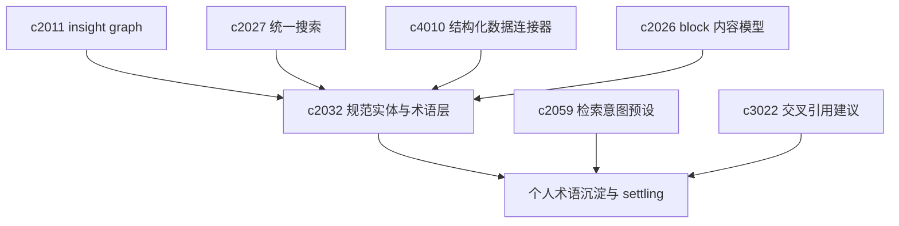

## Why

项目深入后，难管的是**同一实体到底叫什么**：别名、简称、身份与指标口径若长期靠临时字符串，检索、复用与洞察沉淀易冲突。`c2011` 等已在推进 insight graph，仍需先把实体与术语钉成稳定语义底座。另一方面，个人研究久了，主题会逐渐形成**自有术语与习惯说法**；若不能沉淀，用户会反复解释同一概念，检索、笔记与输出之间易出现叫法漂移——需在规范层之上支持**工作区级积累**与**叫法逐步稳定（settling）**，并保留历史叫法以利追溯。

> 合并说明：本提案合并了原 `personal-glossary-growth-and-term-settling` 的全部内容。

## What Changes

1. **规范实体与术语解析**：引入 canonical entity 与 glossary term，统一别名、说明、上下位与来源锚点；支持从来源、Notebook block、structured data、insight 抽取候选，并提供 merge/split/disambiguation；搜索、引用、比较与生成优先围绕 canonical id；为高价值术语补定义、适用范围与口径说明；定位为 insight graph 的语义地基，而非再造独立图谱产品面。
2. **个人术语表与叫法稳定**：定义 personal glossary，长期积累术语、别名、缩写与常用解释；term settling 将一段时间内稳定下来的叫法收口为优先表达；glossary 同时服务检索、摘录、论证骨架与输出；保留历史叫法，避免演化后旧内容不可追溯。

## Capabilities

### New Capabilities

- `canonical-entities-and-semantic-resolution`：实体注册表、术语表、别名解析、消歧与稳定语义引用。
- `personal-glossary-growth-and-term-settling`：个人术语表、别名沉淀与稳定叫法规则。

### Modified Capabilities

- `insight-graph-and-memory`：entity 节点与 canonical entity 对齐。
- `unified-search-query-and-rerank`：实体别名扩展、口径提示、按 canonical id 聚合；消费个人术语偏好。（与 `c2027` 等对齐）
- `structured-data-connectors-and-sql-workflows`：字段到实体/术语映射。（`c4010`）
- `notebook-content-model-and-block-editor`：block 级实体链接、术语提示与回跳。（`c2026`）
- `retrieval-and-cache`：实体感知检索与实体级缓存键语义。
- `retrieval-intent-presets-and-query-lens`：检索意图消费个人术语偏好。（`c2059`）
- `notebook-cross-reference-suggestions-and-link-inference`：交叉引用识别术语别名。（`c3022`）

## Impact

- **Backend**：实体与术语对象、别名解析、消歧流水线、引用存储、术语索引与工作区语义缓存。
- **Frontend**：实体卡片、术语提示、候选合并与冲突处理、搜索提示与编辑器链接建议。
- **Product**：将长期认知资产从结果层下压；搜索、图谱、structured data、scenario 更稳；个人知识积累更有连续性。
- **Dependencies**：建议接在 `cross-notebook-insight-graph`、`unified-search-query-and-rerank`、`structured-data-connectors-and-sql-workflows`、`notebook-content-model-and-block-editor` 之后；个人术语线承接 `c2059`、`c3022`。

## Dependency Sketch

