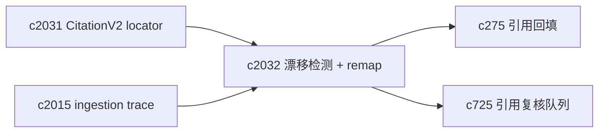
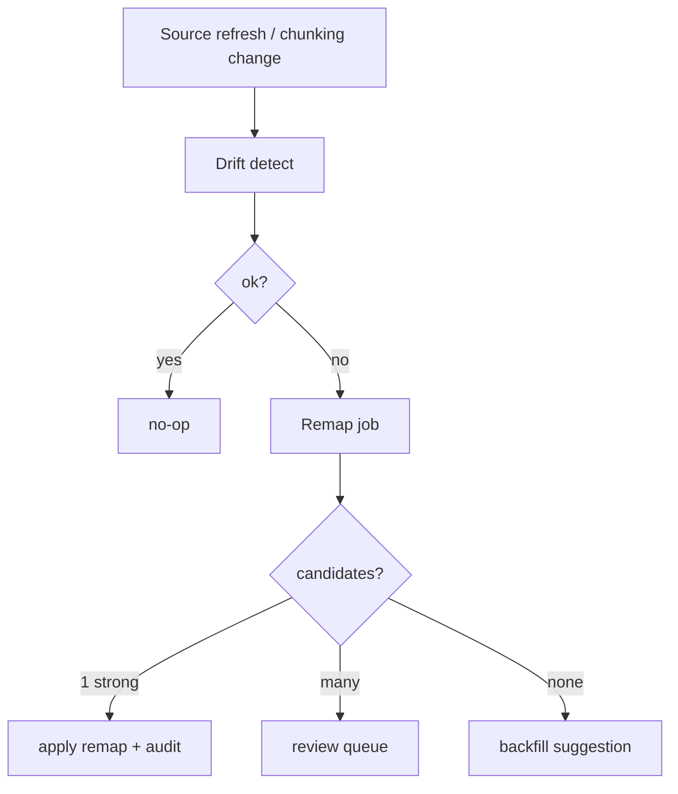

## Why

引用锚点漂移这件事，迟早会发生。问题不在“会不会漂”，而在“漂了以后我们有没有一条体面的修复路径”。

现在如果 chunk 变了、source 合并了、解析器重跑了，最常见的结果是：引用跳不过去，用户只能整段重跑，或者在一堆来源里手动找同一句话。这很消耗人，而且会让系统看起来不可靠。

有了 `c2031` 的 locator/置信度，我们就可以把漂移当成一个可检测、可排队、可批量修的工程问题。

## What Changes

- 定义 anchor drift detection：
  - 对存量输出/引用定期或按事件触发检查（来源刷新、去重合并、切块策略变更等）
  - 产出 drift status：`ok` / `missing` / `ambiguous` / `stale_source` / `low_confidence`
  - 给出 drift reason_code（用于 UI 和回归统计）
- 定义 remap job：
  - 优先用强锚（chunk_id/page+paragraph）定位
  - 失败则用文本锚（quote_hash + around_hash）做候选匹配
  - 多候选时返回候选集（让用户确认），不要暗中替换
- 与修复链路打通：
  - remap 失败或置信度过低 → 引导 `c275` citation backfill
  - 需要人工确认 → 进入 `c725` 引用复核队列
- 把 remap 过程写入 trace/diagnostics，支持“为什么系统说它漂了”的复盘。

## Capabilities

### New Capabilities

- `citation-anchor-drift-detection-and-remap-jobs`: 定义引用漂移检测、remap job 与候选确认语义。

### Modified Capabilities

- `citation-locator-v2-and-anchor-confidence`: drift 与 remap 需要基于 locator/置信度。（`c2031`）
- `ingestion-trace-and-replay-fixtures`: 解析/切块重跑的证据应能辅助 remap。（`c2015`）
- `citation-backfill-and-missing-evidence-repair`: remap 失败需要能直接转 backfill。（`c275`）
- `inline-citation-review-queue-and-fix-sweeps`: remap 候选确认需要进入队列。（`c725`）
- `request-context-and-correlation-ids`: remap/drift 要可按同一次变更串联。（`c2002`）

## Impact

- Backend：需要 drift 检查器、remap 任务队列、候选生成与审计记录；并控制好成本（采样/按事件触发）。
- Frontend：需要在引用 UI 里明确标出“可能失效/需要确认”，并给出一条顺手的修复路径。
- Risk：remap 只要做错一次就很伤；所以必须默认“给候选 + 让用户点确认”，而不是自动替换。

## Dependency Sketch

