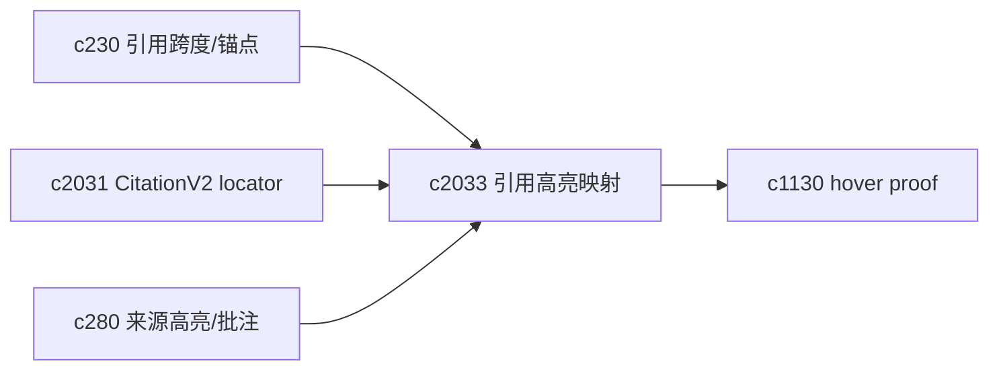
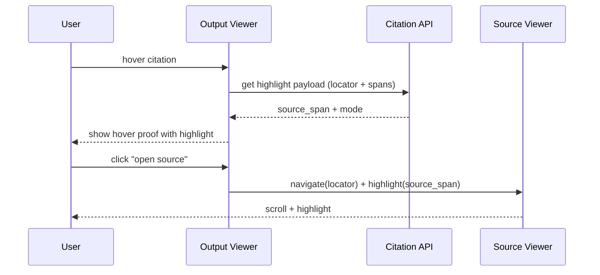

## Why

用户看引用时，不只是想“跳到来源”，更想一眼确认：**到底是哪一句在支撑这段话**。

现在我们的引用更像“指向某个 chunk”，这足够让系统工作，但对阅读体验不够友好：

- chunk 里往往有多句话，用户要自己找“哪一句”；
- 输出里引用和来源之间缺少一条“可视化的高亮连线”，导致 hover proof 很难做顺。

`c230` 解决的是数据模型（span/anchoring）。我希望这一条把“怎么高亮、怎么跳转、怎么降级”也收口成契约，避免每个 UI 自己猜。

## What Changes

- 定义 span 映射契约（在 `CitationV2` / `c230` 基础上）：
  - `output_span`：引用覆盖的输出范围（字符/段落/块级）
  - `source_span`：来源侧高亮范围（能给就给；给不了就降级到 chunk 高亮）
  - `highlight_mode`：exact / fuzzy / chunk-only
- 定义“引用高亮降级顺序”：
  1) source_span 精确高亮
  2) 以 quote_hash 做模糊高亮（在 chunk 内找匹配）
  3) 只高亮 chunk（并提示“定位较粗”）
- 让 hover proof 与 sidecar 证明层复用同一份高亮数据：
  - 输出阅读 hover → 直接显示来源高亮片段
  - 点击展开 → 跳到来源阅读器并定位高亮

## Capabilities

### New Capabilities

- `citation-span-mapping-and-source-viewer-highlights`: 定义引用 span 映射、高亮与降级语义。

### Modified Capabilities

- `citation-span-normalization-and-source-anchoring`: span/anchoring 需要能产出 source_span。（`c230`）
- `claim-to-source-sidecars-and-hover-proofs`: hover proof 需要复用统一高亮输出。（`c1130`）
- `source-segment-highlighting-and-inline-notes`: 来源阅读器需要能承载系统高亮与用户高亮。（`c280`）
- `citation-locator-v2-and-anchor-confidence`: 高亮需要依赖 locator 的强/弱锚信息。（`c2031`）

## Impact

- Backend：需要产出 source_span 或可用于高亮的弱锚信息（quote_hash/around_hash），并明确降级策略。
- Frontend：引用 popover、hover proof、来源阅读器可以共享一套高亮交互，不再各自猜锚点。
- Risk：不同来源类型（PDF/HTML/纯文本）高亮能力不一致，必须把“可支持的最小集合”讲清楚。

## Dependency Sketch

