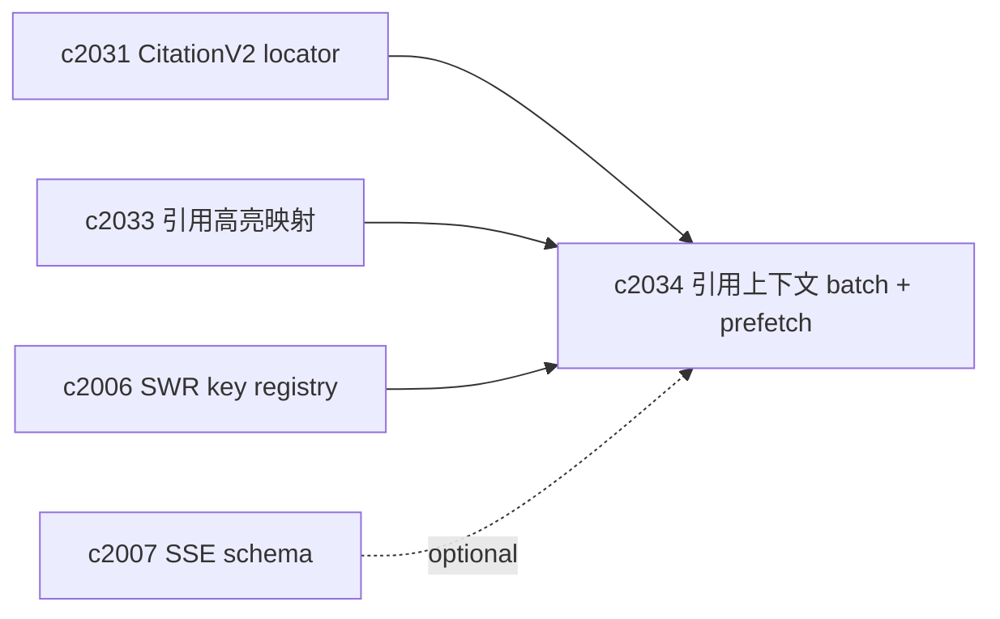
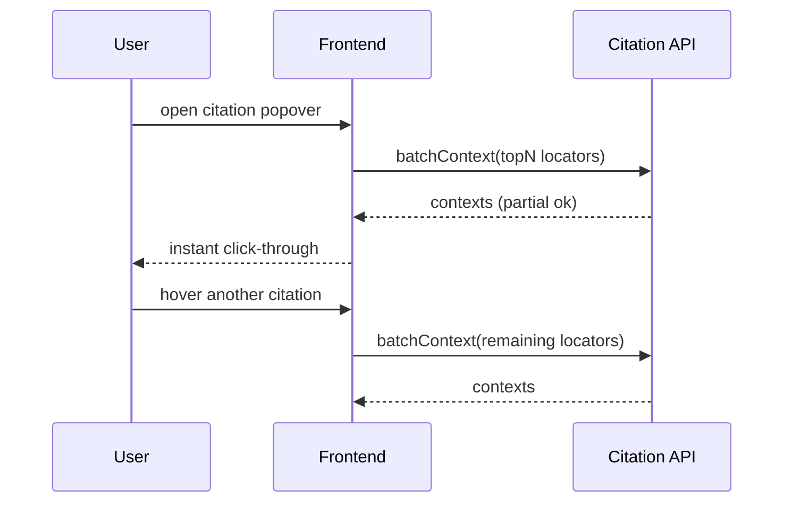

## Why

引用 popover 里常见的动作是：点开一组引用 → 连点几条 → 来回看上下文。现在如果每点一次都打一个 `/citations/context` 请求，很容易出现两种体验问题：

- 慢：网络 RTT 叠加，用户会觉得“引用怎么这么卡”。
- 碎：一次阅读被打断成很多小等待，注意力被切得很散。

我更希望引用上下文像“预读好的卡片”：打开 popover 时就先把最可能看的几条上下文取回来，点的时候是秒开的。

## What Changes

- 定义 citation context batch API：
  - 支持一次请求提交多个 locator（对齐 `c2031`）
  - 返回每条引用的 before/chunk/after window（允许部分失败）
  - 支持 `max_window`、`max_total_tokens` 等保护参数，避免一次拉爆
- 定义客户端 prefetch 策略：
  - popover 打开时预取 topN（比如前 5 条）
  - hover 时按需补齐剩余
  - 与 SWR key registry 对齐缓存与失效（对齐 `c2006`）
- 可选：对大窗口支持 SSE 分段返回（对齐 `c2007`），但不强制第一步就上。

## Capabilities

### New Capabilities

- `citation-context-batch-api-and-ui-prefetch`: 定义引用上下文批量读取与前端预取策略契约。

### Modified Capabilities

- `citation-span-mapping-and-source-viewer-highlights`: prefetch 的单位需要与高亮/跳转一致。（`c2033`）
- `request-context-and-correlation-ids`: batch 请求需要可定位到同一次用户动作。（`c2002`）
- `frontend-swr-key-registry-and-invalidation`: 引用上下文缓存需要统一失效。（`c2006`）
- `sse-event-schema-and-stream-client`: 可选的上下文分段返回需要事件 schema。（`c2007`）

## Impact

- Backend：需要一个 batch 入口与合理的限额；并考虑缓存（按 locator + window 参数）。
- Frontend：popover 能更“像阅读器”，少打断；同时统一缓存键，避免同一引用到处重复请求。
- Risk：batch 很容易把接口做成“万能但不可控”；所以必须把限额策略写进契约里。

## Dependency Sketch

