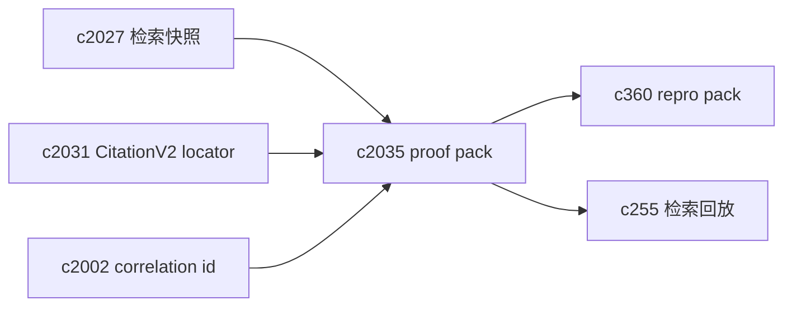
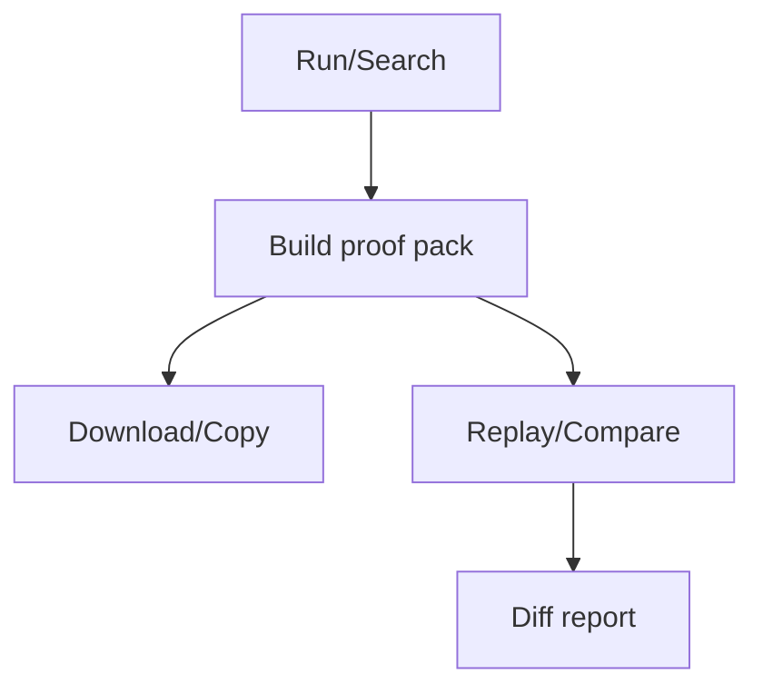

## Why

检索/引用相关的 bug，最难的是复现：你需要同一批来源、同一套检索参数、同一份索引时点，还要知道当时引用到底指向哪段文本。

`c360` 已经提出 run input snapshot / repro pack，但检索与引用这块还有一个缺口：**缺一份“足够复现检索与引用”的最小证据包**。没有它，排查要么靠猜，要么靠把整套 workspace 打包，成本太高。

我想补一个面向工程协作的“proof pack”：既能用于内部 debug，也能作为用户提交问题时的 bug report 附件（当然要有脱敏边界）。

## What Changes

- 定义 `retrieval_proof_pack`（可嵌入 `c360` 的 repro pack，也可独立导出）：
  - `snapshot_id`（对齐 `c2027`）
  - seed_catalog 摘要（对齐 `c2028`）
  - 检索配置摘要（lens、fusion、top_k、min_score、预算等）
  - resolved_chunk_ids + 每个 chunk 的 `quote_hash/around_hash`（对齐 `c2031`）
  - 引用列表（locator + anchor_confidence）
  - 最小文本材料：snippet / 高亮片段（有明确截断和脱敏策略）
  - `correlation_id`（对齐 `c2002`）
- 定义“可分享/不可分享”边界：
  - 默认只允许本地/自用导出
  - 进入共享或上传前必须显式确认脱敏策略
- 支持 replay 入口：proof pack 能直接喂给 `c255` 的 replay 或回归 harness 做对比。

## Capabilities

### New Capabilities

- `retrieval-proof-packs-and-evidence-bug-reports`: 定义检索/引用 proof pack、脱敏边界与回放入口。

### Modified Capabilities

- `run-input-snapshots-and-repro-packs`: repro pack 需要能挂载 proof pack。（`c360`）
- `retrieval-snapshot-ids-and-deterministic-replay`: proof pack 需要 snapshot_id。（`c2027`）
- `retrieval-query-trace-and-search-replay`: proof pack 应可被 replay 消费。（`c255`）
- `citation-locator-v2-and-anchor-confidence`: proof pack 的引用需要用 locator 表达。（`c2031`）
- `request-context-and-correlation-ids`: bug report 要能串回日志与 trace。（`c2002`）

## Impact

- Backend：需要定义 pack 的结构、截断/脱敏策略、导出与回放入口。
- Frontend：提供“生成 proof pack / 复制到剪贴板 / 下载 JSON”这类工程向按钮（可以藏在高级菜单里）。
- Risk：proof pack 一旦把敏感信息带出去就是事故；所以必须默认克制、显式确认、可审计。

## Dependency Sketch

