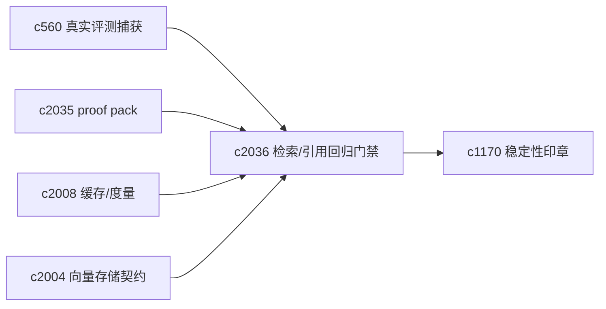
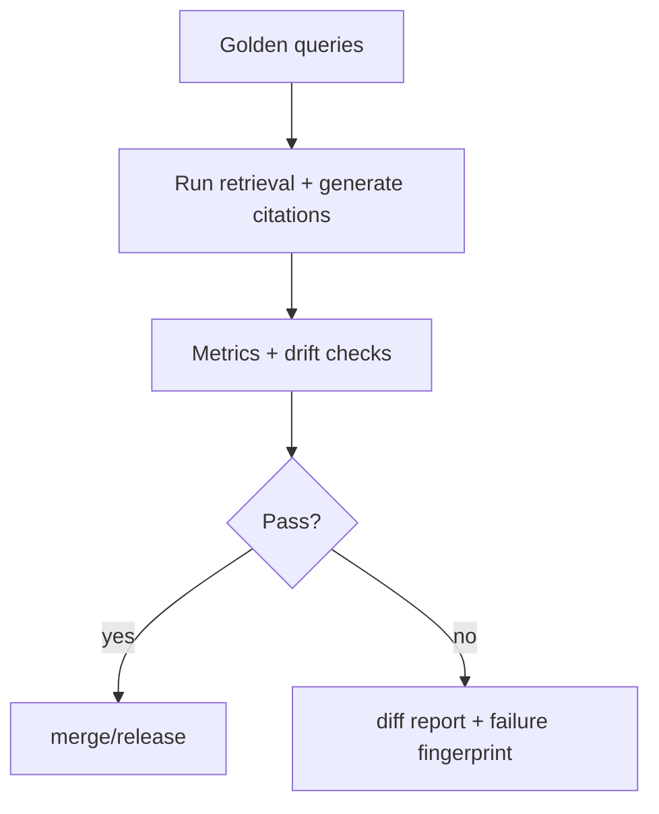

## Why

检索和引用的问题，最怕“今天改了一个小参数，明天一堆引用突然变弱”。没有专门盯检索/引用的回归门禁，我们很难稳住质量曲线。

仓库里已经有一些基础（例如引用索引校验、eval/replay 的方向），也有 `c560`（真实工作区评测捕获）和 `c1170`（稳定性印章）。但检索与引用需要更贴近工程的门禁指标：不仅是“能不能跑”，还要看“引用稳不稳、锚点漂不漂、解释是否一致”。

## What Changes

- 定义 retrieval/citation regression suite：
  - golden queries（按 notebook 场景组织：概览/证据/反例/时间变化）
  - 期望约束（不要求结果完全一致，重点盯住“不可接受的漂”）：
    - citation valid（索引合法、locator 可解析）
    - anchor_confidence 分布（低置信度比例不能无故飙升）
    - drift rate（与 `c2032` 对齐）
    - top sources stability（前几名来源不能频繁大换血，除非 snapshot 变化有解释）
    - 性能指标（p95 检索时延、缓存命中等，对齐 `c2008`）
- 与数据捕获对齐：
  - 可从 `c560` 捕获真实片段生成 golden query 候选
  - 回归运行产出稳定性结果，回接 `c1170` 印章
- 形成 drift gate：
  - PR/版本升级时跑一组最小回归
  - 超阈值直接失败，并给出可读的 diff 报告（优先把“为什么变了”讲清楚）

## Capabilities

### New Capabilities

- `retrieval-citation-regression-suite-and-quality-gates`: 定义检索/引用回归集、门禁指标与 diff 报告。

### Modified Capabilities

- `real-workspace-eval-dataset-capture-and-replay`: 真实片段需要能转成检索回归样本。（`c560`）
- `reproducibility-seals-and-result-stability-checks`: 稳定性印章需要吸收检索/引用维度。（`c1170`）
- `retrieval-proof-packs-and-evidence-bug-reports`: proof pack 可作为失败样本的最小输入。（`c2035`）
- `retrieval-context-assembly-cache-and-metrics`: 回归指标需要消费缓存/时延度量。（`c2008`）
- `vector-store-contract-and-provider-parity`: provider 差异需要被回归识别出来。（`c2004`）

## Impact

- Backend：需要回归 runner、指标计算与 diff 报告格式；并把“允许波动”与“禁止波动”写成明确阈值。
- Frontend：可选地提供回归结果浏览（不强制第一步就做 UI）。
- Risk：门禁如果设得太死，会阻碍迭代；所以一开始要先抓住最痛的几项（引用合法性、漂移率、明显退化）。

## Dependency Sketch

