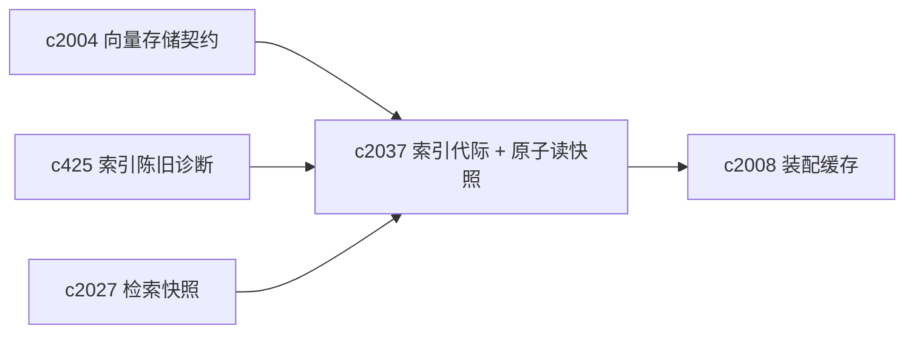
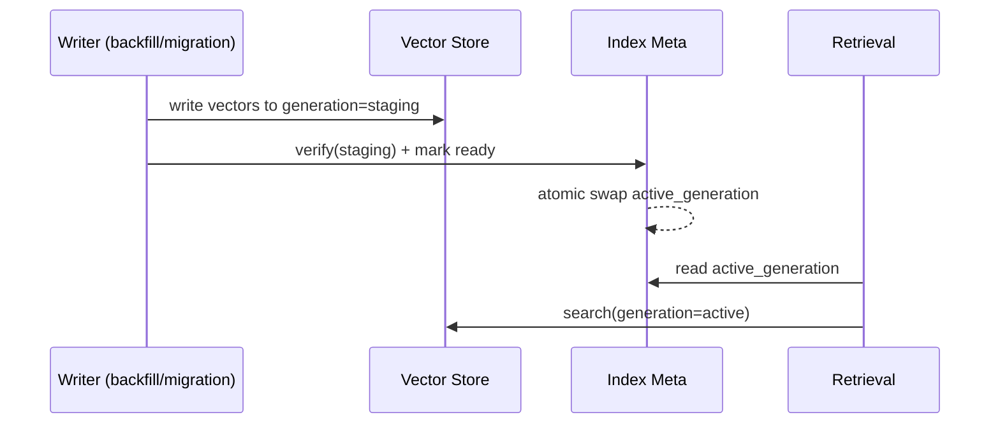

## Why

现在“向量索引”在逻辑上只有一个状态：写进去了就算生效。对日常小规模写入没问题，但一旦遇到下面场景，就会开始出现一致性裂缝：

- 我们要给整个 notebook 重建向量（embedding 升级、chunking 变化、provider 切换）。
- 某些 source 写向量失败/半成功，索引里混着新旧数据。
- 想做检索回放（`c2027`）时，结果会被“正在写入的索引”污染。

代码里已经有 `vector_epoch` / `sources_epoch` 的概念，但它们主要服务缓存失效，不等同于“读快照”。我想补一个更接近数据库事务语义的概念：**索引代际（index generation）**，让读取始终落在一个明确的 generation 上。

## What Changes

- 定义 `index_generation_id`（每个 notebook 一个 active generation）：
  - 新写入可以落在 `active` 或 `staging` generation（按任务类型决定）
  - 只有当 `staging` 校验通过，才允许原子切换为新的 `active`
- 定义 atomic read snapshot：
  - 检索请求必须绑定一个 generation（默认是当前 active）
  - `c2027` 的 `retrieval_snapshot` 必须包含 `index_generation_id`
  - replay 时优先用同一 generation，否则明确降级为“近似回放”
- 定义 generation switch 的可解释输出：
  - 切换原因（embedder 升级 / 修复回填 / provider 迁移）
  - 切换时间、涉及的 source 范围、校验结果摘要
- 与 cache epoch 对齐（不替代它）：
  - generation 负责一致性读
  - epoch 负责缓存失效与性能优化

## Capabilities

### New Capabilities

- `vector-index-generation-ids-and-atomic-read-snapshots`: 定义索引代际、原子切换与一致性读快照。

### Modified Capabilities

- `vector-store-contract-and-provider-parity`: provider 需要声明是否支持 generation / swap。（`c2004`）
- `search-index-incremental-refresh-and-staleness-diagnostics`: staleness 需要能解释 generation 差异。（`c425`）
- `retrieval-snapshot-ids-and-deterministic-replay`: snapshot 要绑定 generation。（`c2027`）
- `retrieval-context-assembly-cache-and-metrics`: 装配缓存 key 需要纳入 generation。（`c2008`）

## Impact

- Backend：向量层需要能写入/查询时带 generation；并提供安全的 swap（哪怕实现上是“新 collection + 切指针”）。
- Frontend：诊断与回放视图能显示“你现在看的结果来自哪个 generation”。
- Risk：如果 generation 设计得过重，会拖慢日常写入；所以必须让“小写入”仍然轻量。

## Dependency Sketch

