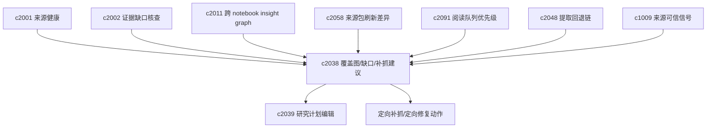

## Why

来源多起来以后，常见的问题不是“有没有资料”，而是“这些资料到底覆盖了哪些问题，哪里还是空的”。如果看不到 coverage，用户就只能凭感觉继续补来源、继续跑结果，最后不是冗余很多，就是关键缺口一直没补上。

用户真正不怕“来源少”，怕的是“不知道缺在哪”：到底是哪个子问题、哪个时间段、哪类来源类型还缺材料。更麻烦的是，有些“缺口”并不是真的缺，而是来源坏掉/太薄/提取失败造成的假缺口——这时需要更定向的修复与替代路径，而不是重新把整条抓取链路走一遍。

## What Changes

- 增加 source coverage 和 evidence map，把问题域、来源集合、证据块和结论之间的覆盖关系画清楚。
- 支持查看某个问题已经有哪些来源支撑、哪些来源质量一般、哪些关键结论还没有足够依据。
- 定义 coverage hole（覆盖缺口），把缺口细分到主题、问题、时间段和来源类型，并区分硬缺口/软缺口：
  - 硬缺口：关键结论缺证据、关键时间段缺材料等
  - 软缺口：当前足够，但可以补强（避免把研究推成无止境补料）
- 增加 targeted fetch suggestions（定向补抓/补证建议），把“再搜一些”变成下一步动作：
  - 与阅读队列、来源包刷新差异、run 模板协同（围绕缺口排序/提示“先补哪类”）
  - 缺口收窄时能在 coverage 视图与来源包 diff 中可见
- 定义 targeted recapture（定向补抓修复），把“坏掉或太薄的来源”变成可最小代价修复的问题：
  - 针对缺页、提取失败、正文过薄、锚点断裂等情况做定向补抓
  - 提供候选修复路径比较（重新抓取原来源 vs 寻找等价替代来源）
  - 修复结果可回接来源包、引用队列和主张链，并用于消除由坏来源造成的假缺口
- 把 coverage 结果和来源健康、证据核查、主动推荐接起来，让系统知道“缺的不是更多资料，而是某一类资料”。
- 为长期监测提供覆盖面快照，方便比较这次比上次多掌握了什么、还缺什么。

## Capabilities

### New Capabilities
- `source-coverage-and-evidence-map`: 定义问题覆盖、来源分布、证据映射和缺口可视化能力。
- `source-coverage-holes-and-targeted-fetch-suggestions`: 定义覆盖缺口与定向补抓建议。
- `targeted-recapture-for-broken-or-thin-sources`: 定义薄弱来源定向补抓与替代修复路径。

### Modified Capabilities
- `knowledge-curation-and-freshness`: 需要暴露来源质量、新鲜度和可用性信号给 coverage 视图。
- `evidence-review-workflow`: 需要支持从 claim / evidence 关系回写到覆盖地图。
- `workspace-ui-panels`: 需要提供覆盖面视图、缺口入口和问题域切换。
- `workspace-api-contract`: 需要增加 coverage 计算结果、证据映射和缺口摘要接口。
- `reading-queue-prioritization-and-guided-order`: 队列需要能围绕缺口排序。
- `source-pack-refresh-diff-and-brief`: 来源包刷新后需要标记缺口是否收窄，并产出重读建议。
- `extractor-fallback-chain-and-capture-provenance`: 提取回退需要暴露可再次尝试的路径，供 recapture 选择。
- `source-trust-signals-and-quality-hints`: 质量提示需要能触发定向补抓/替代建议，并区分“真实缺口 vs 假缺口”。

## Impact

- Backend：需要补 coverage 计算、问题到来源的映射索引、缺口聚合和快照逻辑；并提供缺口/建议/recapture 的结构化输出与 action 接口。
- Frontend：需要新增 evidence map 视图、缺口高亮、问题切换和回链交互；并提供“定向补抓/修复”的可解释建议卡片与批量入口。
- Product：这条线夹在 `c2001` 和 `c2002` 中间，既不只是看来源状态，也不只盯结论核查，而是把“覆盖情况”作为独立视角补出来。
- Dependencies：建议接在 `source-readiness-and-freshness-hub`、`evidence-gap-and-claim-checking`、`cross-notebook-insight-graph` 之后；并与 `c2058`（来源包刷新差异）、`c2091`（阅读队列优先级）、`c2048`（提取回退链）和 `c1009`（来源可信信号）对齐。

## Dependency Sketch

