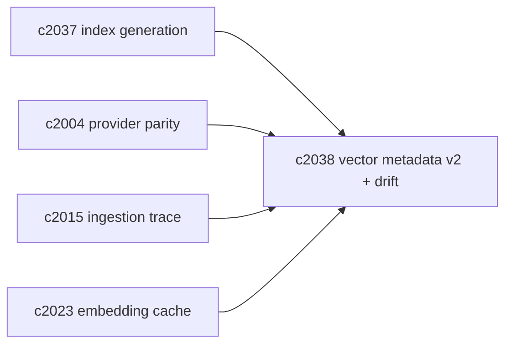
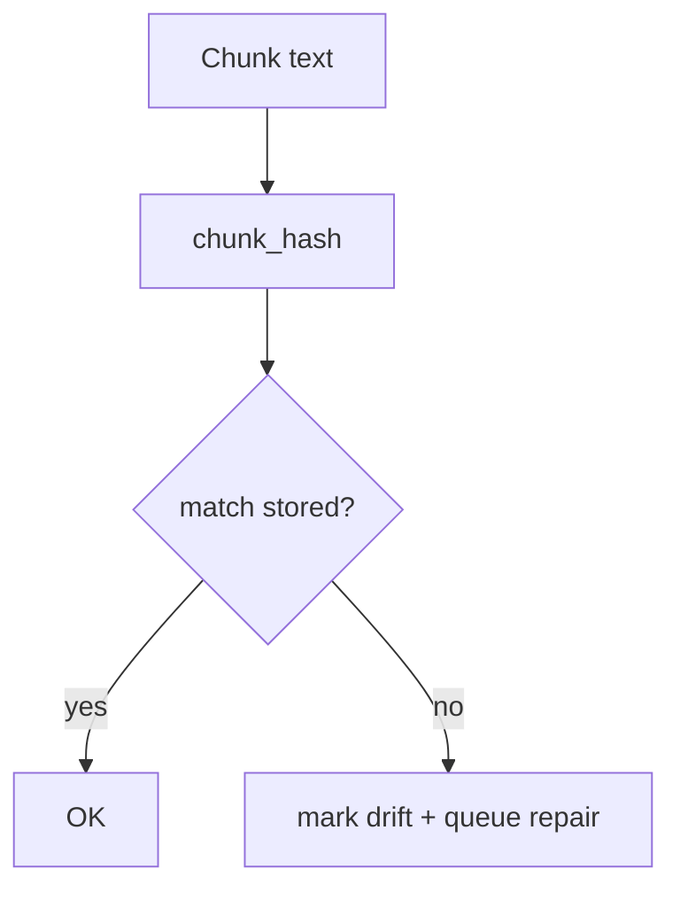

## Why

向量条目现在只稳定绑定了 `notebook_id/source_id/chunk_id`。这对“能搜到”够用，但对一致性排障不够：

- embedding 模型换过没？维度是多少？这条向量是哪个代际写出来的？
- chunk 文本改了但向量没更新，系统怎么知道它已经漂了？
- provider 迁移时，怎么确认新索引确实对应同一批 chunk？

我想把向量条目补齐“能解释的元数据”，并且把 drift detection 从“靠怀疑”变成“靠字段对账”。

## What Changes

- 定义 `VectorEntryMetadataV2`（最小必需字段）：
  - `index_generation_id`（对齐 `c2037`）
  - `embedding_model_id` + `embedding_dim`
  - `chunk_hash`（chunk 文本指纹，避免只靠 chunk_id）
  - `embedded_at`
  - 可选：`parser_version` / `chunking_version`（用于解释“为什么这次切块变了”）
- 定义 drift detection：
  - 当 chunk_hash 与向量条目的 chunk_hash 不一致 → 标记 `VECTOR_DRIFTED`
  - 当 embedding_model_id 不一致 → 标记 `EMBEDDING_GENERATION_MISMATCH`
  - 标记不直接影响读取（避免误伤），但会进入审计/修复队列（对齐 `c2041`）
- 规定 provider 行为：
  - 需要支持写入与查询 metadata（能力不够就必须显式声明降级）
  - parity suite 必须覆盖 metadata round-trip（对齐 `c2004`）

## Capabilities

### New Capabilities

- `vector-entry-metadata-v2-and-drift-detection`: 定义向量条目元数据 v2 与漂移识别语义。

### Modified Capabilities

- `vector-index-generation-ids-and-atomic-read-snapshots`: 元数据必须包含 generation。（`c2037`）
- `vector-store-contract-and-provider-parity`: parity suite 需要覆盖 metadata。（`c2004`）
- `embedding-cache-policy-and-visibility`: 模型 id 与缓存策略要一致。（`c2023`）
- `ingestion-trace-and-replay-fixtures`: trace/fixture 需要能记录版本摘要。（`c2015`）

## **BREAKING**

这条变更会触发向量存储层的 schema/metadata 变化（SQLite 表字段、Chroma metadata）。建议一次性升级全部 provider，并提供迁移/回填路径。

## Impact

- Backend：需要计算 chunk_hash、贯通 embedding_model_id，并把 drift 结果写入诊断/修复。
- Frontend：可以在诊断面上明确显示“这条索引是哪个模型/哪次代际生成的”，排障更直观。
- Risk：metadata 一旦变成“想塞什么塞什么”，会很难维护；所以必须先定义最小集合。

## Dependency Sketch

