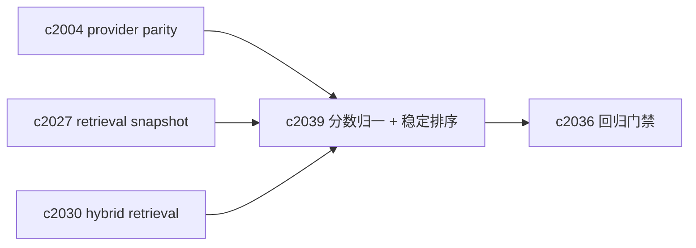

## Why

检索回放（`c2027`）和回归门禁（`c2036`）想站得住，有一个前提：**同样输入在同一索引快照下，结果排序必须尽量稳定**。

但向量检索天生会遇到两类“不稳定”：

- score 细微差异导致排序抖动，尤其是近似索引（ANN）或不同 provider；
- 分数含义不统一（distance vs similarity），`min_score` 在不同 provider 下变成“看天吃饭”。

我希望把“分数语义 + 排序确定性”写成契约，并把 tie-breaker 明确下来。

## What Changes

- 定义 score normalization：
  - 统一对外暴露 `similarity_score`（0~1，越大越相似）
  - provider 如果内部是 distance，必须在适配层转换
  - `min_score` 解释必须绑定 `similarity_score`
- 定义 deterministic ordering：
  - 排序键：`(-score, source_id, chunk_id)`（或等价的稳定键）
  - 当 provider 返回顺序不稳定时，必须在应用层二次排序
- 定义 determinism notes（写入 trace）：
  - 是否为 ANN 结果（可能有近似波动）
  - 是否触发 fallback（对齐 `c2030`）
  - 采样/随机种子（如果 provider 需要）

## Capabilities

### New Capabilities

- `vector-search-determinism-and-score-normalization`: 定义分数归一、稳定排序与 trace 记录字段。

### Modified Capabilities

- `vector-store-contract-and-provider-parity`: parity suite 需要覆盖 score 语义与排序。（`c2004`）
- `retrieval-snapshot-ids-and-deterministic-replay`: replay 需要记录 determinism notes。（`c2027`）
- `retrieval-citation-regression-suite-and-quality-gates`: 回归需要把排序抖动纳入指标。（`c2036`）
- `hybrid-retrieval-lexical-vector-fusion-and-fallbacks`: 混合检索也要统一 score 语义。（`c2030`）

## Impact

- Backend：需要统一 score 字段命名与归一逻辑，并明确 tie-break；这会直接降低“看起来随机”的体验问题。
- Frontend：在 debug 面里可以更实在地提示“这一组结果存在 ANN 波动风险”。
- Risk：强行追求排序绝对一致会和性能冲突；我们只把“同分/近分的抖动”控制住。

## Dependency Sketch



```mermaid
flowchart TD
  RAW[Provider raw score] --> N[Normalize to similarity_score]
  N --> S[Stable sort (-score, source_id, chunk_id)]
  S --> OUT[Deterministic results]
```
