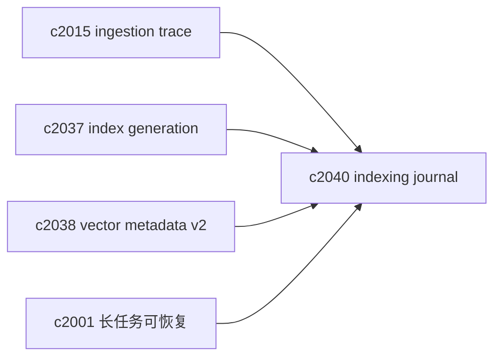
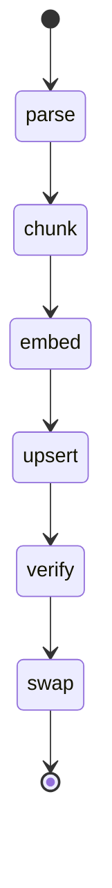

## Why

索引构建是典型的长链路：解析、切块、embedding、写向量、刷新索引、校验……任何一步抖一下，都可能留下“半套索引”。现在我们能做失败分类，但缺一份更工程化的抓手：**索引日记（journal）**。

它解决的不是“怎么更聪明”，而是更朴素的事：

- 这次 backfill 跑到哪一步了？
- 失败后能不能从中间继续，而不是整条重跑？
- 写入是不是幂等？重复跑会不会把索引搞脏？

## What Changes

- 定义 `indexing_journal`：
  - 以 notebook/source 为维度记录 stage（parse/chunk/embed/upsert/verify/swap）
  - 记录 stage 版本摘要（embedding_model_id、chunking_version、provider）
  - 记录耗时、失败分类与 recovery_hint（对齐 `c2015` 的 trace 语义）
- 定义 resumable backfill：
  - 支持从某个 stage 继续（前提是版本摘要一致）
  - 明确哪些阶段必须重跑（例如 chunking_version 变了就不能复用旧 chunk_hash）
- 幂等写入边界：
  - 对齐 `c2037` generation：写入先落 staging，再 swap
  - 对齐 `c2038` metadata：允许验证“写入的向量确实对应这一版 chunk”

## Capabilities

### New Capabilities

- `indexing-journal-and-resumable-backfills`: 定义索引日记、续跑与幂等写入边界。

### Modified Capabilities

- `ingestion-trace-and-replay-fixtures`: ingestion trace 需要能链接到 indexing journal。（`c2015`）
- `vector-index-generation-ids-and-atomic-read-snapshots`: backfill 需要 staging+swap。（`c2037`）
- `vector-entry-metadata-v2-and-drift-detection`: journal 需要记录 metadata 版本摘要。（`c2038`）
- `task-runtime-durability-and-restart-reconciliation`: 长任务重启对账可复用 journal。（`c2001`）

## Impact

- Backend：需要一个轻量的 journal 存储与状态机；以及“从中间继续”的安全条件。
- Frontend：诊断/来源详情可以看到“索引构建进度条”和失败原因，减少黑箱感。
- Risk：journal 如果变成“另一个复杂系统”会拖累开发；先把字段做小，把流程做清楚。

## Dependency Sketch

