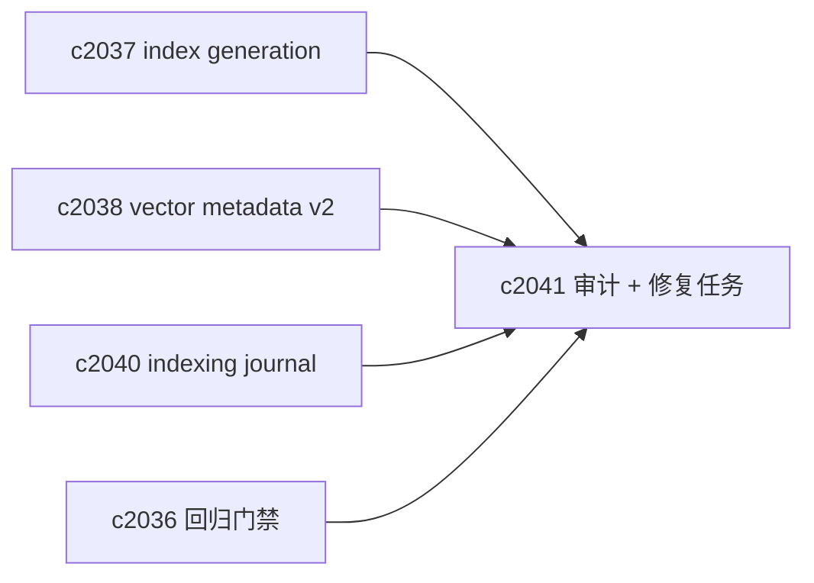

## Why

“索引不一致”往往不是一次大故障，而是一堆小缺口：某个 source 少了几条向量、某批 chunk_hash 漂了、某个 provider 迁移时漏了一部分。用户看到的表现只有一句：搜不到、引用跳不稳、结果忽上忽下。

我们需要一个专门面向向量索引的体检与修复面：能跑审计、能给出缺口清单、能生成修复任务，而且成本可控。

## What Changes

- 定义 index consistency audit（按 notebook 或 source）：
  - 预期：READY source 的 chunk 集合
  - 实际：active generation 的向量条目集合（对齐 `c2037`）
  - 对账：missing / extra(orphan) / drifted（对齐 `c2038`）
  - 输出：缺口摘要 + 修复建议
- 定义 repair jobs：
  - missing vectors → 走 backfill（对齐 `c2040`）
  - orphan vectors → 清理（需谨慎，先 dry-run）
  - drifted vectors → 重新 embed/upsert（带版本摘要）
- 提供“按事件触发”的轻量审计：
  - provider 切换、embedding 升级、解析器升级后，自动抽样审计

## Capabilities

### New Capabilities

- `vector-index-consistency-audits-and-repair-jobs`: 定义索引一致性审计、缺口分类与修复任务。

### Modified Capabilities

- `indexing-journal-and-resumable-backfills`: repair job 需要复用 backfill/journal。（`c2040`）
- `vector-entry-metadata-v2-and-drift-detection`: 审计需要消费 drift 信号。（`c2038`）
- `vector-index-generation-ids-and-atomic-read-snapshots`: 审计需要按 generation 对账。（`c2037`）
- `retrieval-citation-regression-suite-and-quality-gates`: 回归失败时可落到审计/修复。（`c2036`）

## Impact

- Backend：需要审计器、缺口分类与 repair runner；并确保不会把系统跑到过载（采样/限流）。
- Frontend：诊断面能从“症状”直接跳到“缺口清单 + 一键修复”。
- Risk：自动修复必须谨慎，尤其是删除 orphan；默认走 dry-run + 人工确认。

## Dependency Sketch



```mermaid
flowchart TD
  EXP[Expected chunks] --> DIFF{Diff}
  ACT[Actual vectors] --> DIFF
  DIFF --> M[Missing]
  DIFF --> O[Orphan]
  DIFF --> D[Drifted]
  M --> J[Backfill job]
  D --> J
  O --> CL[Cleanup plan (dry-run)]
```
